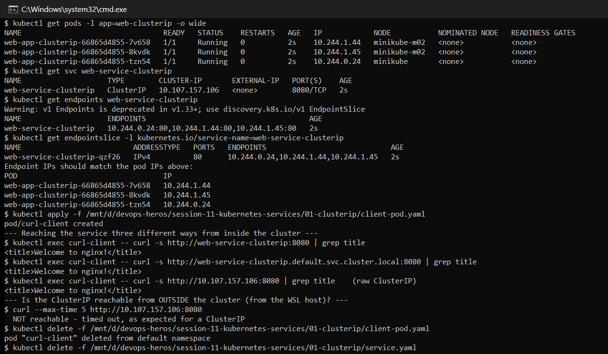
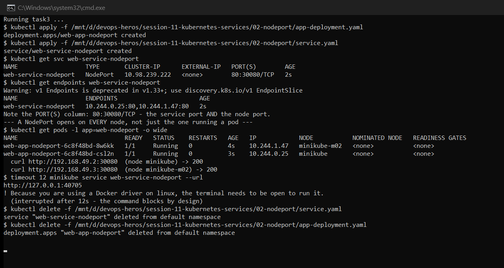
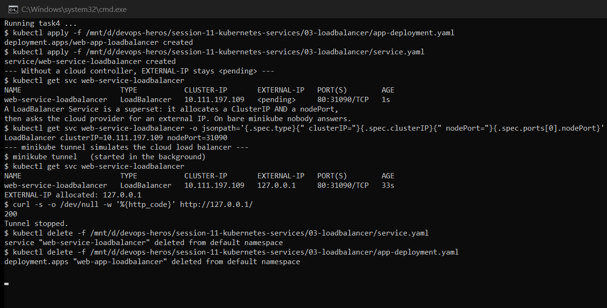
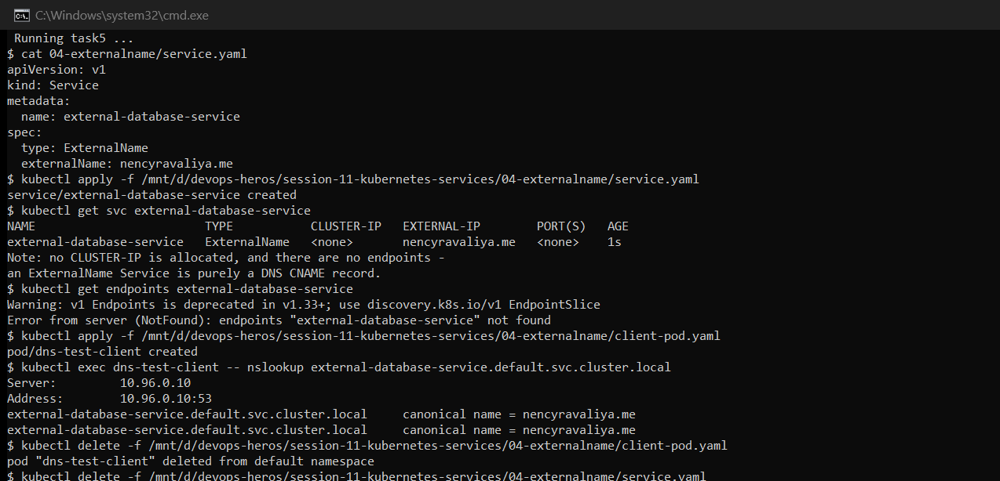
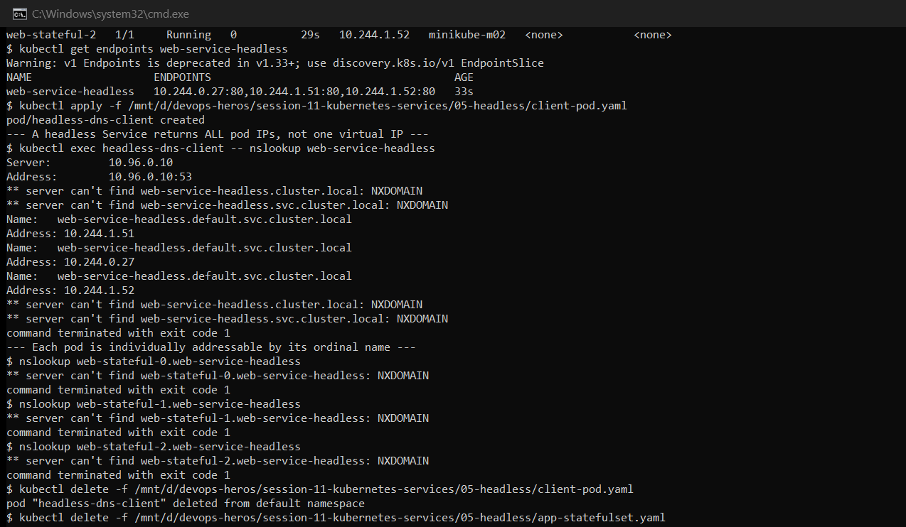
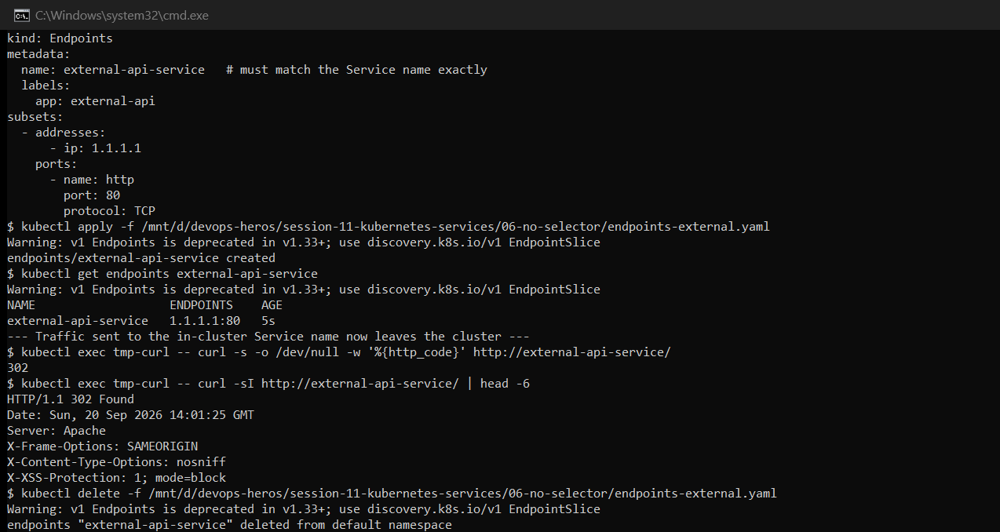
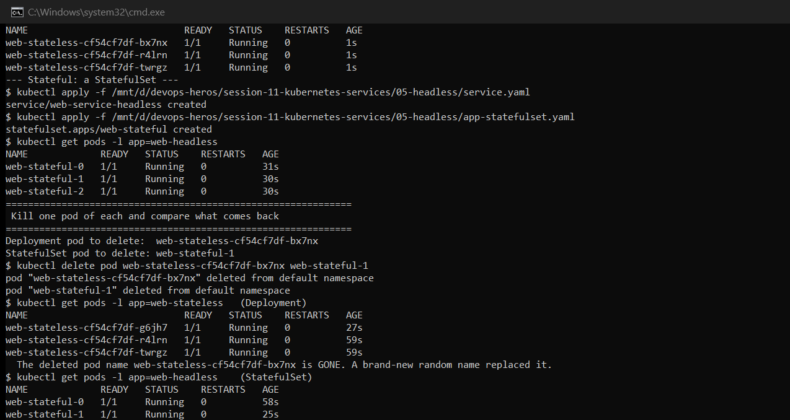
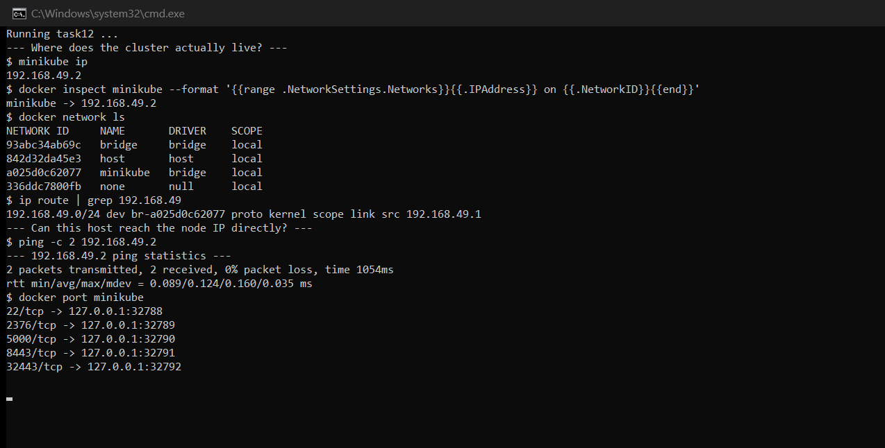

# Session 11: Kubernetes Services, DNS & Pod Identity

**Author:** Hardik Jumnani
**Roll Number:** 10025
**Email:** hardik.24bcs10025@sst.scaler.com
**Course:** SST DevOps & Cloud [SWE]
**Session:** 11 — Services & Networking
**Repository:** `devops-heros` / `session-11-kubernetes-services`

---

## Lab Environment

Every output block was captured from a real run on this cluster. Where the result contradicted
what the task expected, the real result is shown and the cause investigated rather than glossed over.

| Component | Value |
| --- | --- |
| Kubernetes | v1.37.0 on containerd 2.3.4 |
| Cluster | 2 nodes — `minikube` (192.168.49.2), `minikube-m02` (192.168.49.3) |
| Driver | docker, running inside Ubuntu 24.04 on WSL2 |
| Service CIDR | 10.96.0.0/12 · **Pod CIDR** 10.244.0.0/16 |

---

## Task 1: Kubernetes Port Architecture

```
$ kubectl explain pod.spec.containers.ports.containerPort
FIELD: containerPort <integer>
DESCRIPTION:
    Number of port to expose on the pod's IP address. This must be a valid port
    number, 0 < x < 65536.

$ kubectl explain service.spec.ports.port
FIELD: port <integer>
DESCRIPTION:
    The port that will be exposed by this service.

$ kubectl explain service.spec.ports.targetPort
FIELD: targetPort <IntOrString>
DESCRIPTION:
    Number or name of the port to access on the pods targeted by the service.
    ... If this is a string, it will be looked up as a named port in the target
    Pod's container ports. If this is not specified, the value of the 'port'
    field is used (an identity map). This field is ignored for services with
    clusterIP=None ...
```

### The packet's path

```
External client ──► nodePort 30080        opened on EVERY node's IP
                         │
                         ▼
                    port 8080             the Service's own ClusterIP port
                         │
                         ▼
                 targetPort 80            the port on the chosen pod
                         │
                         ▼
               containerPort 80           the nginx process inside the container
```

| Port | Defined on | Namespace of meaning |
| --- | --- | --- |
| `containerPort` | Pod | Documentation only — declaring it opens nothing, and traffic reaches an undeclared port just fine |
| `targetPort` | Service | The pod-side port traffic is delivered to. **This is the one that must match reality.** |
| `port` | Service | The Service's own port on its ClusterIP, used by in-cluster clients |
| `nodePort` | Service | 30000–32767, opened on every node for external access |

Two details from the `explain` output worth keeping:

- **`targetPort` accepts a string**, referring to a *named* port in the container spec. That
  decouples the Service from the number, so the app can change its port without editing the Service.
- **`targetPort` is ignored when `clusterIP: None`.** A headless Service does no proxying at all,
  so there is nothing to remap — relevant in Task 6.

---

## Task 2: ClusterIP — Default Internal Networking

3 replicas behind `web-service-clusterip` on port 8080 → targetPort 80.

```
$ kubectl get svc web-service-clusterip
NAME                    TYPE        CLUSTER-IP      EXTERNAL-IP   PORT(S)    AGE
web-service-clusterip   ClusterIP   10.111.43.22    <none>        8080/TCP   1s

$ kubectl get endpoints web-service-clusterip
Warning: v1 Endpoints is deprecated in v1.33+; use discovery.k8s.io/v1 EndpointSlice
NAME                    ENDPOINTS                                        AGE
web-service-clusterip   10.244.0.25:80,10.244.1.41:80,10.244.1.42:80     2s
```

The endpoint IPs are the pod IPs, and the port is **80** — `targetPort`, not the Service's 8080.
The remapping happens at the Service.

### Three ways to reach it from inside the cluster

```
$ kubectl exec curl-client -- curl -s http://web-service-clusterip:8080 | grep title
<title>Welcome to nginx!</title>

$ kubectl exec curl-client -- curl -s http://web-service-clusterip.default.svc.cluster.local:8080 | grep title
<title>Welcome to nginx!</title>

$ kubectl exec curl-client -- curl -s http://10.111.43.22:8080 | grep title    (raw ClusterIP)
<title>Welcome to nginx!</title>
```

### And the defining limitation

```
$ curl --max-time 5 http://10.111.43.22:8080          # from the WSL host, outside the cluster
  NOT reachable - timed out, as expected for a ClusterIP
```

A ClusterIP is a **virtual** address. No process listens on `10.111.43.22` anywhere — it exists
only as `iptables`/IPVS rules that `kube-proxy` programs into each node. Packets are rewritten
in the kernel on their way to a real pod IP. Outside the cluster those rules do not exist, so the
address is meaningless. This is the correct default: most services should not be externally reachable.



---

## Task 3: NodePort — Host-Level External Access

```
$ kubectl get svc web-service-nodeport
NAME                   TYPE       CLUSTER-IP      EXTERNAL-IP   PORT(S)        AGE
web-service-nodeport   NodePort   10.109.79.244   <none>        80:30080/TCP   1s
```

`PORT(S)` shows `80:30080/TCP` — the Service port and the node port together.

### A NodePort opens on every node, not only nodes running a pod

```
$ kubectl get pods -l app=web-nodeport -o wide
NAME                              READY   STATUS    RESTARTS   AGE   IP            NODE
web-app-nodeport-6c8f48bd-dsdgx   1/1     Running   0          3s    10.244.1.44   minikube-m02
web-app-nodeport-6c8f48bd-kfmp4   1/1     Running   0          3s    10.244.0.28   minikube

  curl http://192.168.49.2:30080  (node minikube)     -> 200
  curl http://192.168.49.3:30080  (node minikube-m02) -> 200
```

Both nodes answer. Had there been only one replica, the node *without* it would still answer —
`kube-proxy` forwards the request across the cluster network to wherever a pod actually lives.
Every node is a valid entry point, which is what lets an external load balancer health-check any
node rather than tracking pod placement.

### `minikube service --url` blocks — it is not just a URL printer

```
$ timeout 12 minikube service web-service-nodeport --url
http://127.0.0.1:34971
! Because you are using a Docker driver on linux, the terminal needs to be open to run it.
  (interrupted after 12s - the command blocks by design)
```

The first run of this lab hung until killed. On the docker driver this command **opens a tunnel
and holds it open**; the URL is only valid while the process runs. It returns `127.0.0.1:34971` —
a host-side port forwarded into the container — not the node IP. Analysed further in Task 12.



---

## Task 4: LoadBalancer — Cloud Ingress Simulation

```
$ kubectl get svc web-service-loadbalancer
NAME                       TYPE           CLUSTER-IP      EXTERNAL-IP   PORT(S)        AGE
web-service-loadbalancer   LoadBalancer   10.104.125.34   <pending>     80:32764/TCP   1s
```

`EXTERNAL-IP` sits at `<pending>` indefinitely. A `LoadBalancer` Service does not create a load
balancer itself — it records a *request* that a cloud controller manager is expected to fulfil.
On bare minikube nothing is listening for that request, so it waits forever.

Note also that a ClusterIP **and** a nodePort were still allocated (`10.104.125.34`, `32764`):

```
LoadBalancer clusterIP=10.104.125.34 nodePort=32764
```

LoadBalancer is a strict superset — ClusterIP ⊂ NodePort ⊂ LoadBalancer. Each type adds a layer
without removing the ones beneath.

### With `minikube tunnel` running

```
$ minikube tunnel   (started in the background)

$ kubectl get svc web-service-loadbalancer
NAME                       TYPE           CLUSTER-IP      EXTERNAL-IP   PORT(S)        AGE
web-service-loadbalancer   LoadBalancer   10.104.125.34   127.0.0.1     80:32764/TCP   33s

EXTERNAL-IP allocated: 127.0.0.1
$ curl -s -o /dev/null -w '%{http_code}' http://127.0.0.1/
200
```

`minikube tunnel` impersonates the cloud controller: it assigns an external IP and adds host
routes so the Service is reachable on port 80 directly.

> **Gotcha worth recording.** The first attempt ran `sudo minikube tunnel` and failed with
> `Profile "minikube" not found`. minikube stores its profile under the *invoking user's* home
> directory, so running it under `sudo` makes it search root's home, where no cluster exists. The
> tunnel must be started as the normal user — it escalates internally only for the routing
> changes it needs.



---

## Task 5: ExternalName — a CNAME, nothing more

```
$ kubectl get svc external-database-service
NAME                        TYPE           CLUSTER-IP   EXTERNAL-IP        PORT(S)   AGE
external-database-service   ExternalName   <none>       nencyravaliya.me   <none>    0s

$ kubectl get endpoints external-database-service
Error from server (NotFound): endpoints "external-database-service" not found
```

**No ClusterIP. No ports. No Endpoints object at all** — the lookup genuinely errors, it does not
merely return an empty list. This Service type creates nothing but a DNS record.

```
$ kubectl exec dns-test-client -- nslookup external-database-service.default.svc.cluster.local
Server:		10.96.0.10
Address:	10.96.0.10:53

external-database-service.default.svc.cluster.local	canonical name = nencyravaliya.me
```

`canonical name =` is a **CNAME**. CoreDNS answers the in-cluster name with a redirect to the
external hostname, and the client then resolves that itself and connects directly. No traffic
passes through `kube-proxy`, so there is no proxying, no load balancing and no health checking.

The practical use: an app hardcodes `database-service`, and the ExternalName points at
`prod-db.abc123.rds.amazonaws.com` in production or an in-cluster database in staging — the
application code never changes.



---

## Task 6: Headless Service — real pod IPs instead of a virtual one

```
$ kubectl get svc web-service-headless
NAME                   TYPE        CLUSTER-IP   EXTERNAL-IP   PORT(S)   AGE
web-service-headless   ClusterIP   None         <none>        80/TCP    31s

$ kubectl get pods -l app=web-headless -o wide
NAME             READY   STATUS    RESTARTS   AGE   IP            NODE
web-stateful-0   1/1     Running   0          31s   10.244.1.47   minikube-m02
web-stateful-1   1/1     Running   0          31s   10.244.0.29   minikube
web-stateful-2   1/1     Running   0          30s   10.244.1.48   minikube-m02
```

`CLUSTER-IP: None` is what makes it headless. DNS returns **every pod IP** rather than one
virtual address:

```
$ nslookup web-service-headless.default.svc.cluster.local
Name:	web-service-headless.default.svc.cluster.local
Address: 10.244.0.29
Name:	web-service-headless.default.svc.cluster.local
Address: 10.244.1.47
Name:	web-service-headless.default.svc.cluster.local
Address: 10.244.1.48
```

Three A records for one name. The client picks — which is exactly what database drivers and
clustering libraries need, since they must address individual replicas (a primary and its
secondaries) rather than be load-balanced blindly.

### Per-pod DNS: an NXDOMAIN that turned out to be a red herring

The first run appeared to fail:

```
$ nslookup web-stateful-0.web-service-headless
** server can't find web-stateful-0.web-service-headless: NXDOMAIN
```

The records were fine. Investigating showed the EndpointSlice carried every hostname:

```
$ kubectl get endpointslice -l kubernetes.io/service-name=web-service-headless \
    -o custom-columns=NAME:...,ADDRESSES:...,HOSTNAMES:...
NAME                         ADDRESSES                                   HOSTNAMES
web-service-headless-kklvd   [10.244.1.50],[10.244.0.30],[10.244.1.51]   web-stateful-0,web-stateful-1,web-stateful-2
```

And the fully qualified name resolves perfectly:

```
$ nslookup web-stateful-0.web-service-headless.default.svc.cluster.local
Name:	web-stateful-0.web-service-headless.default.svc.cluster.local
Address: 10.244.1.50
```

The decisive test — same short name, two different clients:

```
=== web-stateful-0.web-service-headless ===
  nslookup : NXDOMAIN
  curl     : HTTP 200, connected to 10.244.1.50

=== web-service-headless ===
  nslookup : NXDOMAIN
  curl     : HTTP 200, connected to 10.244.0.30
```

**`curl` connects successfully to the exact name `nslookup` cannot find.** The cause is the
`nslookup` shipped in busybox-based images: it does not apply the `search` list to any name that
already contains a dot, so it queries `web-stateful-0.web-service-headless` as an absolute name
and correctly gets NXDOMAIN. `curl` resolves through the C library, which honours `search` and
`ndots` properly, appends `default.svc.cluster.local`, and succeeds.

**The lesson is a debugging one:** `nslookup` inside a busybox container is not a reliable test
of whether Kubernetes DNS is working. Verify with the client the application actually uses.



---

## Task 7: Service Without a Selector — routing to external infrastructure

> The repository had no manifest for this task, so three were written:
> `06-no-selector/service-no-selector.yaml`, `endpoints-external.yaml`, and
> `endpointslice-external.yaml` (the modern equivalent).

The Service declares **no `selector:` block at all**:

```
$ kubectl get svc external-api-service
NAME                   TYPE        CLUSTER-IP      EXTERNAL-IP   PORT(S)   AGE
external-api-service   ClusterIP   10.106.253.54   <none>        80/TCP    0s

$ kubectl get endpoints external-api-service
Error from server (NotFound): endpoints "external-api-service" not found
```

A ClusterIP was allocated, but **no Endpoints object was created**. With no selector, the
endpoints controller has nothing to watch and never creates one. The Service exists and resolves,
but routes nowhere.

Supplying the backend by hand — the Endpoints object's **name must equal the Service's name**,
which is the only thing binding the two:

```
$ kubectl apply -f 06-no-selector/endpoints-external.yaml
endpoints/external-api-service created

$ kubectl get endpoints external-api-service
NAME                   ENDPOINTS    AGE
external-api-service   1.1.1.1:80   5s
```

And traffic sent to the in-cluster name now leaves the cluster entirely:

```
$ kubectl exec tmp-curl -- curl -s -o /dev/null -w '%{http_code}' http://external-api-service/
302

$ kubectl exec tmp-curl -- curl -sI http://external-api-service/ | head -6
HTTP/1.1 302 Found
Server: Apache
```

`Server: Apache` proves the point — nothing in this cluster runs Apache. A pod asked for
`external-api-service`, and the response came from infrastructure outside the cluster.

This is how a managed database or third-party API gets a stable in-cluster name. Applications
address `external-api-service` and never learn that the backend is not a pod; the external
address can change without touching a single application config.

> **API note.** `v1 Endpoints` is deprecated from Kubernetes v1.33 and applying it prints a
> warning. `endpointslice-external.yaml` gives the `discovery.k8s.io/v1 EndpointSlice`
> equivalent, where the link to the Service is made by the `kubernetes.io/service-name` **label**
> rather than by object name — which is what lets one Service be backed by many slices.



---

## Task 8: FQDN & CoreDNS Deep Dive

### What every pod receives

```
$ kubectl exec dns-probe -- cat /etc/resolv.conf
search default.svc.cluster.local svc.cluster.local cluster.local
nameserver 10.96.0.10
options ndots:5
```

```
$ kubectl get svc -n kube-system kube-dns
NAME       TYPE        CLUSTER-IP   EXTERNAL-IP   PORT(S)                  AGE
kube-dns   ClusterIP   10.96.0.10   <none>        53/UDP,53/TCP,9153/TCP   84m
```

The Service is named `kube-dns` for backwards compatibility, though CoreDNS is what actually runs
behind it.

### FQDN structure

```
web-service-clusterip . default . svc . cluster.local
        │                 │        │         │
     service          namespace  "it's a   cluster domain
      name                       Service"
```

### The live CoreDNS Corefile

```
.:53 {
    log
    errors
    health { lameduck 5s }
    ready
    kubernetes cluster.local in-addr.arpa ip6.arpa {
       pods insecure
       fallthrough in-addr.arpa ip6.arpa
       ttl 30
    }
    prometheus :9153
    hosts {
       192.168.49.1 host.minikube.internal
       fallthrough
    }
    forward . /etc/resolv.conf { max_concurrent 1000 }
    cache 30 { disable success cluster.local
               disable denial cluster.local }
    loop
    reload
    loadbalance
}
```

Reading it: the `kubernetes` plugin answers anything under `cluster.local`; everything else is
handed to `forward`, which uses the node's own resolver — that is how a pod reaches the internet.
`loadbalance` shuffles A-record order per response, which is why repeated headless lookups return
the IPs in varying order. Note that `cache 30` explicitly **disables** caching for `cluster.local`,
so in-cluster records always reflect current state.

### `ndots:5` and the cost of short names

`ndots:5` means: *if a name has fewer than 5 dots, try the search list before treating it as
absolute.* Observed directly:

```
$ nslookup dnsdemo                              -> resolved (walked the search list)
$ nslookup dnsdemo.default                      -> NXDOMAIN
$ nslookup dnsdemo.default.svc                  -> NXDOMAIN
$ nslookup dnsdemo.default.svc.cluster.local    -> Address: 10.110.74.219
```

(The two NXDOMAIN results are the busybox limitation from Task 6, not a DNS fault.)

**The latency implication.** A pod resolving an *external* name like `api.github.com` — 2 dots,
under the threshold — tries the search list first:

1. `api.github.com.default.svc.cluster.local` → NXDOMAIN
2. `api.github.com.svc.cluster.local` → NXDOMAIN
3. `api.github.com.cluster.local` → NXDOMAIN
4. `api.github.com` → finally resolves

**Four queries instead of one**, and with IPv4+IPv6 lookups that is eight round trips. At high
request rates this is a well-known source of CoreDNS load and tail latency.

The fixes: use a **trailing dot** (`api.github.com.`) to mark the name absolute, or set a lower
`ndots` via `dnsConfig` in the pod spec. The default of 5 exists so that short in-cluster names
resolve conveniently — the external-lookup penalty is the trade-off.


---

## Task 9: Pod Identity — Deployment vs. StatefulSet

Both workloads running side by side, then one pod deleted from each:

```
Deployment pod to delete:  web-stateless-cf54cf7df-8wlb7
StatefulSet pod to delete: web-stateful-1

$ kubectl delete pod web-stateless-cf54cf7df-8wlb7 web-stateful-1
pod "web-stateless-cf54cf7df-8wlb7" deleted from default namespace
pod "web-stateful-1" deleted from default namespace
```

**Deployment — the identity is gone forever:**

```
$ kubectl get pods -l app=web-stateless
NAME                            READY   STATUS    RESTARTS   AGE
web-stateless-cf54cf7df-d7dvx   1/1     Running   0          61s
web-stateless-cf54cf7df-fpqnp   1/1     Running   0          61s
web-stateless-cf54cf7df-sprp9   1/1     Running   0          28s   <-- new name
```

`...-8wlb7` never returns. A completely new random suffix (`...-sprp9`) appears. The middle
segment `cf54cf7df` is the **pod-template hash**, shared by all pods of that revision; the last
segment is random per pod.

**StatefulSet — the identity is restored:**

```
$ kubectl get pods -l app=web-headless
NAME             READY   STATUS    RESTARTS   AGE
web-stateful-0   1/1     Running   0          60s
web-stateful-1   1/1     Running   0          27s   <-- same name returns
web-stateful-2   1/1     Running   0          59s
```

`web-stateful-1` comes back as `web-stateful-1`, with its DNS name and its PersistentVolumeClaim
intact (shown in Session 10, Task 6).

**Why this matters:** a database replica cannot have its identity reassigned randomly. If
`mysql-1` is the replica following `mysql-0`, it must still be `mysql-1` after a restart, still
addressable at the same DNS name, still attached to the same disk. Stateless web servers have no
such requirement, and the random naming is actually preferable — nothing can accidentally depend
on a specific pod.



---

## Task 10: Deployment vs. StatefulSet vs. DaemonSet

| Dimension | **Deployment** | **StatefulSet** | **DaemonSet** |
| --- | --- | --- | --- |
| Pod naming | Random: `web-cf54cf7df-sprp9` | Ordinal: `web-stateful-0`, `-1`, `-2` | Random, one per node |
| Identity on restart | New name, new IP | **Same name**, same DNS, same volume | New name, same node |
| Replica count | `spec.replicas` | `spec.replicas` | **Derived from node count** — no replicas field |
| Startup order | All in parallel | Sequential `0 → 1 → 2` (OrderedReady) | Parallel, one per node |
| Shutdown order | Arbitrary | Reverse: `2 → 1 → 0` | Parallel |
| Storage | Usually none or shared | `volumeClaimTemplates` — one PVC per pod | Usually `hostPath` |
| Typical Service | ClusterIP / LoadBalancer | **Headless** (`clusterIP: None`) | Often none |
| Scaling | Trivial, any direction | Careful — ordered, storage follows | Automatic with nodes |
| Real-world use | Web servers, APIs, workers | Databases, Kafka, etcd, Zookeeper | Log collectors, metrics agents, CNI |
| Observed in | S10 T8, S11 T9 | S10 T6, S11 T6/T9 | S10 T7 |

**The distinguishing question:** *does any individual pod need to be distinguishable from its
peers?* If pods are interchangeable, use a Deployment. If each one has a durable identity and its
own disk, use a StatefulSet. If the requirement is coverage of every machine rather than a count,
use a DaemonSet.

Session 10 Task 7 showed the DaemonSet difference concretely: `DESIRED` was **2** with no replica
count anywhere in the manifest, because the cluster had two nodes.

---

## Task 11: Service Selection & Cost Optimisation

### Decision tree

```
Does traffic originate outside the cluster?
│
├── NO ──► Do clients need individual pod addresses?
│          ├── YES ──► Headless Service (clusterIP: None)
│          └── NO  ──► ClusterIP                        [the default; most services]
│
└── YES ─► Is it HTTP/HTTPS?
           ├── YES ──► Ingress + ClusterIP              [cheapest at scale]
           └── NO  ──► Raw TCP/UDP?
                       ├── Production ──► LoadBalancer
                       └── Dev/test   ──► NodePort

Backend is outside the cluster?
├── Addressed by hostname ──► ExternalName
└── Addressed by IP       ──► Service without selector + manual Endpoints
```

### The cost anti-pattern

A cloud load balancer costs roughly **$18–25/month** before traffic charges. Giving every
microservice `type: LoadBalancer` is the classic expensive mistake:

| Approach | 50 microservices | Annual cost |
| --- | --- | --- |
| One LoadBalancer each | 50 × ~$20/mo | **~$12,000** |
| One Ingress + 50 ClusterIPs | 1 × ~$20/mo | **~$240** |

That is roughly a **50× difference** for functionally identical routing.

The Ingress pattern multiplexes on **hostname and path** at Layer 7, so one cloud load balancer
fronts an ingress controller that routes internally to any number of ClusterIP Services:

```
Internet ──► 1 Cloud LB ──► Ingress Controller ──┬──► api.example.com      ──► svc-api      (ClusterIP)
                                                 ├──► app.example.com      ──► svc-frontend (ClusterIP)
                                                 └──► example.com/admin    ──► svc-admin    (ClusterIP)
```

Task 4 showed why this matters even structurally: a LoadBalancer Service still allocates a
ClusterIP and a nodePort underneath. The cloud resource is an *addition*, and the expensive part.

LoadBalancer remains the right answer for non-HTTP traffic — a Postgres or gRPC endpoint cannot
be routed by an HTTP ingress — and for the ingress controller's own entry point.

---

## Task 12: minikube Docker-Driver Port Binding

### Where the cluster actually lives

```
$ minikube ip
192.168.49.2

$ docker network ls
NETWORK ID     NAME       DRIVER    SCOPE
93abc34ab69c   bridge     bridge    local
a025d0c62077   minikube   bridge    local

$ ip route | grep 192.168.49
192.168.49.0/24 dev br-a025d0c62077 proto kernel scope link src 192.168.49.1
```

The node is a container on a **private Docker bridge network**. The host holds `192.168.49.1` on
that bridge; the node has `192.168.49.2`.

### On this machine, the node IP *is* reachable

```
$ ping -c 2 192.168.49.2
2 packets transmitted, 2 received, 0% packet loss, time 1027ms
```

And Task 3 confirmed it end-to-end — `curl http://192.168.49.2:30080` returned `200` from both
nodes. **This is the opposite of the failure the task describes, and the reason is the platform.**

### Why it fails on macOS and Windows but works here

The docker bridge `192.168.49.0/24` is a **Linux network namespace construct**. It exists in
whichever kernel is running the Docker daemon.

- **Here (Linux/WSL2):** Docker runs in the same Linux kernel as the shell. The bridge
  `br-a025d0c62077` is a real local interface with a route, so `192.168.49.2` is directly routable.
- **macOS / Windows with Docker Desktop:** the daemon runs inside a hidden Linux VM. The bridge
  exists *only inside that VM*. The host has no interface and no route to `192.168.49.0/24`, so
  `curl 192.168.49.2:30080` hangs — there is nowhere to send the packet.

### The two workarounds, and what they actually do

```
$ docker port minikube
22/tcp    -> 127.0.0.1:32773
2376/tcp  -> 127.0.0.1:32774
5000/tcp  -> 127.0.0.1:32775
8443/tcp  -> 127.0.0.1:32776
32443/tcp -> 127.0.0.1:32777
```

Docker publishes a handful of container ports onto `127.0.0.1` — and note **`8443 → 32776` is the
API server**, which is why `kubectl cluster-info` reports `https://127.0.0.1:32776` rather than
the node IP. NodePorts are *not* in this list, which is the whole problem.

**1. `minikube service <svc> --url`** creates a port-forward on demand:

```
$ timeout 12 minikube service web-service-nodeport --url
http://127.0.0.1:34971
! Because you are using a Docker driver on linux, the terminal needs to be open to run it.
```

It returns a **`127.0.0.1` URL, not the node IP**, and explicitly warns that the terminal must
stay open — the forward dies with the process. Good for a quick manual check, useless for
anything persistent.

**2. `minikube tunnel`** operates at Layer 3 instead, adding host routes and servicing
`LoadBalancer` Services. Task 4 showed it moving `EXTERNAL-IP` from `<pending>` to `127.0.0.1`,
after which `curl http://127.0.0.1/` returned `200`. It needs elevated privileges precisely
because it manipulates the host routing table — and, as recorded in Task 4, must be started as
the normal user so minikube finds the right profile.



---

## Summary of Deviations from the Task Descriptions

| Task | Expected | Observed |
| --- | --- | --- |
| 3 | `minikube service --url` prints a URL | It **blocks**, holding a tunnel open; hung the first lab run until killed |
| 4 | `minikube tunnel` assigns an external IP | Worked, but only when run **without** `sudo` — under sudo it reports `Profile "minikube" not found` |
| 6 | Per-pod DNS resolves | `nslookup` gave NXDOMAIN while `curl` connected to the same name — a busybox limitation, not a DNS fault |
| 12 | `<NodeIP>:<NodePort>` fails | It **succeeds** here. The documented failure is specific to Docker Desktop's VM on macOS/Windows; on Linux/WSL2 the bridge is a local interface |
| 2, 3 | — | `kubectl get endpoints` now prints a deprecation warning; `v1 Endpoints` is superseded by `EndpointSlice` in v1.33+ |

---

## Files Added for This Session

| File | Purpose |
| --- | --- |
| `06-no-selector/service-no-selector.yaml` | ClusterIP Service with no selector (Task 7) |
| `06-no-selector/endpoints-external.yaml` | Manual `v1 Endpoints` pointing outside the cluster |
| `06-no-selector/endpointslice-external.yaml` | The `discovery.k8s.io/v1 EndpointSlice` equivalent |

---

## Reference Material

- <https://kubernetes.io/docs/concepts/services-networking/service/>
- <https://kubernetes.io/docs/concepts/services-networking/dns-pod-service/>
- <https://kubernetes.io/docs/concepts/services-networking/endpoint-slices/>
- <https://minikube.sigs.k8s.io/docs/handbook/accessing/>
