# Session 12: ConfigMaps, Secrets & Ingress

**Author:** Hardik Jumnani
**Roll Number:** 10025
**Email:** hardik.24bcs10025@sst.scaler.com
**Course:** SST DevOps & Cloud [SWE]
**Session:** 12 — Configuration, Secrets & Layer 7 Routing
**Repository:** `devops-heros` / `session-12-ingress-configmaps-secrets`

---

## Lab Environment

Every output block was captured from a real run on this cluster.

| Component | Value |
| --- | --- |
| Kubernetes | v1.37.0 on containerd 2.3.4 |
| Ingress controller | `registry.k8s.io/ingress-nginx/controller:v1.15.1` |
| minikube IP | `192.168.49.2` |
| OpenSSL | 3.5.7 |

The demo backend (`04-full-demo/backend.yaml`) runs a small Python HTTP server that echoes its
injected environment variables in the response body. That makes configuration injection directly
observable over HTTP rather than only via `printenv`.

---

## Task 1: Non-Sensitive Configuration via ConfigMaps

```
$ kubectl apply -f 01-configmap/app-config.yaml
configmap/yatri-app-config created

$ kubectl describe configmap yatri-app-config
Name:         yatri-app-config
Namespace:    default
Labels:       app=yatri-backend
Annotations:  <none>

Data
====
DEFAULT_CURRENCY:
----
INR

ENVIRONMENT:
----
production

LOG_LEVEL:
----
INFO
...
```

**Querying individual keys with JSONPath:**

```
$ kubectl get configmap yatri-app-config -o jsonpath="{.data.ENVIRONMENT}"
production

$ kubectl get configmap yatri-app-config -o jsonpath="{.data.LOG_LEVEL}"
INFO

$ kubectl get configmap yatri-app-config -o jsonpath="{.data.DEFAULT_CURRENCY}"
INR
```

Note that `describe` prints ConfigMap values **in full**. Compare with Task 3, where the same
command masks a Secret's contents — that difference is the entire security distinction between
the two object types at the display layer.

The purpose is decoupling: the same container image runs in dev, staging and production, with
only the ConfigMap differing. Configuration stops being baked into images.

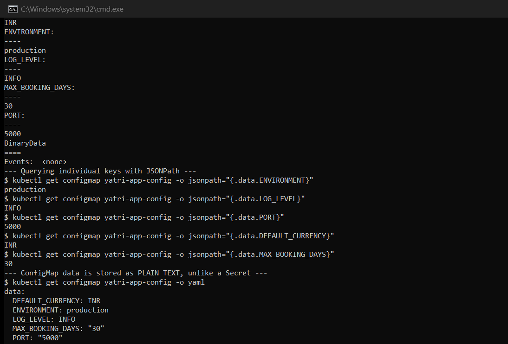

---

## Task 2: ConfigMap Live Update & Pod Immobility

The critical question: if a ConfigMap changes, does a running pod see the new value?

**Before the patch:**

```
Observing pod: yatri-backend-5954896564-bg7qv

$ kubectl exec yatri-backend-5954896564-bg7qv -- printenv LOG_LEVEL
INFO
```

**Patch the ConfigMap while the pod runs:**

```
$ kubectl patch configmap yatri-app-config --type merge -p '{"data":{"LOG_LEVEL":"DEBUG"}}'
configmap/yatri-app-config patched

$ kubectl get configmap yatri-app-config -o jsonpath='{.data.LOG_LEVEL}'
DEBUG
```

**20 seconds later, inside the same running container:**

```
$ kubectl exec yatri-backend-5954896564-bg7qv -- printenv LOG_LEVEL    (20s after the patch)
INFO
```

And the application agrees:

```
$ curl http://yatri-backend-service/
Yatri Backend API
=================
ENVIRONMENT     : production
LOG_LEVEL       : INFO          <-- still the old value
DEFAULT_CURRENCY: INR
POSTGRES_USER   : yatri_admin
POSTGRES_DB     : yatri_production_db
```

**The ConfigMap says `DEBUG`. The running pod says `INFO`.**

The reason is that environment variables are injected **once**, when the container starts. They
are a copy taken at process creation, and the Linux process environment cannot be rewritten from
outside afterwards. Kubernetes has no mechanism to update them, so the pod is genuinely immobile
with respect to config changes.

**Rolling restart to pick the value up:**

```
$ kubectl rollout restart deployment/yatri-backend
deployment.apps/yatri-backend restarted

$ kubectl rollout status deployment/yatri-backend --timeout=300s
Waiting for deployment "yatri-backend" rollout to finish: 1 out of 2 new replicas have been updated...
Waiting for deployment "yatri-backend" rollout to finish: 1 old replicas are pending termination...
deployment "yatri-backend" successfully rolled out

$ kubectl get pods -l app=yatri-backend --sort-by=.metadata.creationTimestamp
NAME                             READY   STATUS        RESTARTS   AGE
yatri-backend-6c58cb99c7-8j7x7   1/1     Terminating   0          33s
yatri-backend-6c58cb99c7-srvf7   1/1     Terminating   0          33s
yatri-backend-676ccc4755-ctk5d   1/1     Running       0          8s
yatri-backend-676ccc4755-zhdzc   1/1     Running       0          6s
```

Note the **pod-template hash changed** (`6c58cb99c7` → `676ccc4755`). `rollout restart` works by
stamping a `kubectl.kubernetes.io/restartedAt` annotation onto the pod template, which produces a
new ReplicaSet and therefore a genuine rolling replacement — not a restart of existing containers.

```
$ kubectl exec yatri-backend-676ccc4755-zhdzc -- printenv LOG_LEVEL
DEBUG

$ curl http://yatri-backend-service/
Yatri Backend API
=================
ENVIRONMENT     : production
LOG_LEVEL       : DEBUG         <-- new value, and zero downtime
DEFAULT_CURRENCY: INR
POSTGRES_USER   : yatri_admin
POSTGRES_DB     : yatri_production_db
```

> **Worth knowing:** ConfigMaps mounted as **volumes** *do* update in place (within a kubelet sync
> period of roughly a minute). Only `env`/`envFrom` injection is frozen at start. If an app can
> re-read a file, volume mounting avoids the restart entirely.

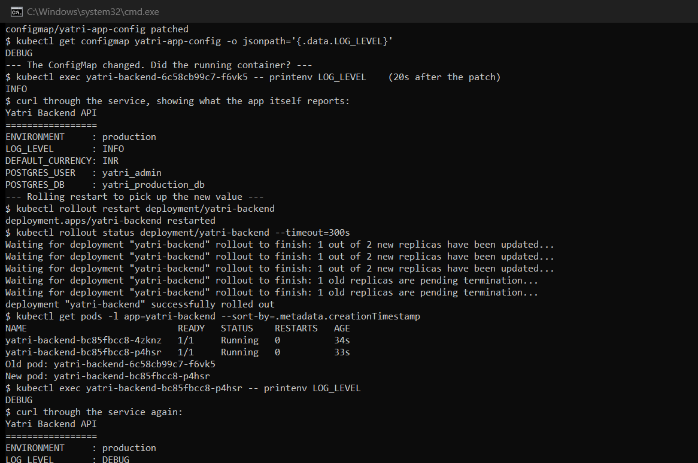

---

## Task 3: Secrets & Base64 Mechanics

```
$ kubectl get secret yatri-db-secret
NAME              TYPE     DATA   AGE
yatri-db-secret   Opaque   3      0s

$ kubectl describe secret yatri-db-secret
Name:         yatri-db-secret
Namespace:    default
Labels:       app=yatri-backend
Type:  Opaque

Data
====
POSTGRES_DB:        19 bytes
POSTGRES_PASSWORD:  14 bytes
POSTGRES_USER:      11 bytes
```

`describe` shows only **byte counts**, never values — the one place Secrets genuinely behave
differently from ConfigMaps in everyday use.

(That `14 bytes` for `POSTGRES_PASSWORD` is itself meaningful — `secretpassword` is exactly 14
characters, confirming no stray trailing newline. See Task 4.)

**But the protection is shallow:**

```
$ kubectl get secret yatri-db-secret -o jsonpath='{.data.POSTGRES_USER}'
eWF0cmlfYWRtaW4=

$ kubectl get secret yatri-db-secret -o jsonpath="{.data.POSTGRES_USER}" | base64 --decode
yatri_admin

$ kubectl get secret yatri-db-secret -o jsonpath="{.data.POSTGRES_PASSWORD}" | base64 --decode
secretpassword

$ kubectl get secret yatri-db-secret -o jsonpath="{.data.POSTGRES_DB}" | base64 --decode
yatri_production_db
```

**Base64 is encoding, not encryption.** It uses no key, and anyone who can read the Secret object
can decode it instantly. Base64 exists so arbitrary binary data (certificates, keystores) can
travel safely inside JSON/YAML — it is a transport format, not a security control.

What actually protects a Secret:

- **RBAC** — restricting who can `get` Secrets at all. This is the real boundary.
- **Encryption at rest** — `EncryptionConfiguration` on the API server, so `etcd` does not hold
  plaintext. **Off by default.**
- **Not committing them to Git** — see Task 5.

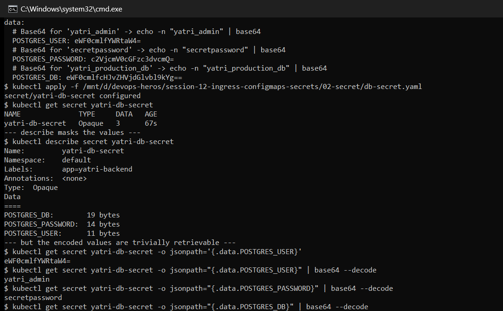

---

## Task 4: The Trailing Newline Gotcha

A subtle bug that produces authentication failures with no obvious cause.

```
$ echo "secretpassword" | base64
c2VjcmV0cGFzc3dvcmQK

$ echo -n "secretpassword" | base64
c2VjcmV0cGFzc3dvcmQ=
```

The encoded strings differ in their final characters — `...d29yZK` versus `...d29yZ=`. Decoding
both and inspecting the raw bytes shows exactly why:

```
$ echo "secretpassword" | base64 | base64 --decode | xxd
00000000: 7365 6372 6574 7061 7373 776f 7264 0a    secretpassword.

$ echo -n "secretpassword" | base64 | base64 --decode | xxd
00000000: 7365 6372 6574 7061 7373 776f 7264       secretpassword
```

**That trailing `0a` is a newline character** — `\n`, byte 10. It is part of the password as far
as the application is concerned.

```
$ echo "secretpassword"    | wc -c  -> 15
$ echo -n "secretpassword" | wc -c  -> 14
```

`echo` appends a newline by default. `echo -n` suppresses it.

**Verifying the repository's manifest is correct:**

```
$ echo -n "c2VjcmV0cGFzc3dvcmQ=" | base64 --decode | xxd
00000000: 7365 6372 6574 7061 7373 776f 7264       secretpassword
```

14 bytes, no `0a`. This matches the `14 bytes` that `kubectl describe secret` reported in Task 3 —
two independent confirmations the value is clean.

### Why this is so hard to debug

The application sends `secretpassword\n` and Postgres rejects it. Every diagnostic looks correct:

- `kubectl describe secret` shows the key exists
- Decoding it prints `secretpassword` — the newline is **invisible in terminal output**
- The manifest looks right on inspection

The failure is a single byte that no ordinary display reveals. `kubectl describe`'s byte count is
the quickest tell: if the count is one higher than the password's length, there is a trailing
newline.

**Safer alternatives that avoid the problem entirely:**

```bash
printf '%s' "secretpassword" | base64                 # printf adds nothing
kubectl create secret generic db --from-literal=password=secretpassword   # no manual encoding
```

The second is strictly better — `kubectl` handles encoding itself, so the class of bug cannot occur.

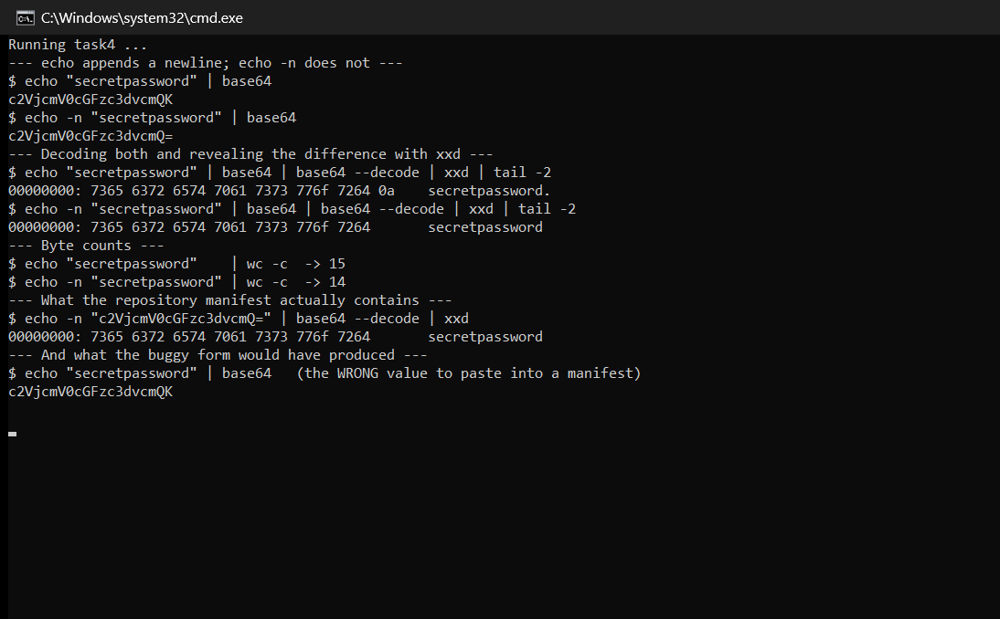

---

## Task 5: Enterprise Secret Management

### The anti-pattern: Base64 secrets committed to Git

`db-secret.yaml` in this repository contains real (if fake) credentials. Since Base64 is
reversible without a key, committing such a file publishes the credentials to:

- every clone of the repository, forever
- the full Git history — **deleting the file later does not remove it**
- CI logs, forks, and any mirror

Git's immutability is what makes this severe. A leaked credential in history requires rotating
the secret *and* rewriting history, and the credential must be assumed compromised regardless.

### External secret managers

| Platform | Service | Integration |
| --- | --- | --- |
| AWS | Secrets Manager / Parameter Store | External Secrets Operator, or IRSA for direct SDK access |
| Azure | Key Vault | Secrets Store CSI Driver; Variable Groups in Azure DevOps |
| HashiCorp | Vault | Vault Agent Injector sidecar, or CSI provider |
| GCP | Secret Manager | External Secrets Operator, Workload Identity |

These share a common shape: **the secret never appears in the manifest.** The manifest holds a
*reference*, and the platform resolves it at deploy or run time.

With the External Secrets Operator, the committed file contains only a pointer:

```yaml
apiVersion: external-secrets.io/v1beta1
kind: ExternalSecret
metadata:
  name: yatri-db-secret
spec:
  secretStoreRef:
    name: aws-secrets-manager
    kind: SecretStore
  target:
    name: yatri-db-secret        # the k8s Secret it will create
  data:
    - secretKey: POSTGRES_PASSWORD
      remoteRef:
        key: prod/yatri/db
        property: password        # a reference, not a value
```

Nothing sensitive is committed. The operator authenticates to AWS, fetches the value and creates
the real Secret in-cluster, re-syncing on a schedule so rotation propagates automatically.

### CI/CD pipeline integration

The repository's `02-secret/azure-pipelines.yml` shows the Azure DevOps shape — a **variable
group** linked to Key Vault, with values referenced as `$(POSTGRES_USER1)`:

```yaml
  group:
   - dev1
  env:
  'name': 'POSTGRES_USER1'
  'value': $(POSTGRES_USER1)
```

The pipeline definition names the variable; the value is injected by the platform at run time and
masked in logs. GitHub Actions expresses the same idea as `${{ secrets.POSTGRES_PASSWORD }}`.

**The rules that generalise:**

1. Commit **references**, never values
2. Scan commits for credentials (`gitleaks`, `git-secrets`) in pre-commit hooks and CI
3. Rotate automatically — short-lived credentials limit the blast radius of any leak
4. Scope narrowly — a pipeline should read only the secrets it needs
5. Audit access — managed services log every retrieval; `etcd` does not
6. Enable encryption at rest on the API server, since it is off by default

---

## Task 6: Combined ConfigMap and Secret Injection

The backend consumes both, using **two deliberately different mechanisms**:

```yaml
          # Bulk import of EVERY key in the ConfigMap
          envFrom:
            - configMapRef:
                name: yatri-app-config

          # Explicit, one named key at a time
          env:
            - name: POSTGRES_USER
              valueFrom:
                secretKeyRef:
                  name: yatri-db-secret
                  key: POSTGRES_USER
```

**Verified inside the running container:**

```
$ kubectl exec yatri-backend-676ccc4755-ctk5d -- printenv | sort | grep -E 'ENVIRONMENT|LOG_LEVEL|CURRENCY|BOOKING|APP_PORT|POSTGRES'
APP_PORT=5000
DEFAULT_CURRENCY=INR
ENVIRONMENT=production
LOG_LEVEL=DEBUG
MAX_BOOKING_DAYS=30
POSTGRES_DB=yatri_production_db
POSTGRES_PASSWORD=secretpassword
POSTGRES_USER=yatri_admin
```

All five ConfigMap keys arrived via `envFrom` without being named individually; the three Secret
keys arrived via explicit `secretKeyRef` entries.

**Why the asymmetry is intentional:**

- `envFrom` for the ConfigMap is convenient — add a key, and every pod picks it up on next restart
  with no manifest edit.
- Explicit `secretKeyRef` for the Secret is deliberate friction. Bulk-importing a Secret would
  inject *every* key into the environment, including ones the container has no business seeing.
  Naming each key keeps the blast radius of a leak small and makes the manifest an audit trail of
  exactly which credentials this workload touches.

Note also that `POSTGRES_PASSWORD` is fully visible in `printenv` — anyone with `kubectl exec` can
read it. That is another argument for mounting secrets as files with restrictive permissions, or
fetching them at runtime from a secret manager.

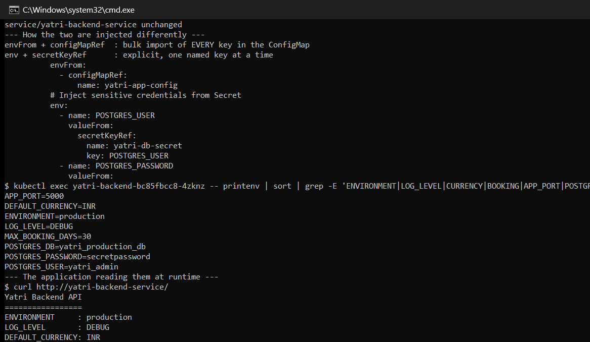

---

## Task 7: Ingress Resource vs. Ingress Controller

The single most common confusion in Kubernetes networking: **creating an Ingress resource does
nothing on its own.**

| | **Ingress resource** | **Ingress controller** |
| --- | --- | --- |
| What it is | An API object — routing rules as data | A running pod (a real reverse proxy) |
| Created by | `kubectl apply -f ingress.yaml` | `minikube addons enable ingress`, Helm, etc. |
| Analogy | A config file | The web server that reads it |
| How many | Many, across namespaces | Usually one per cluster |
| Without the other | Rules are stored and **ignored** | Proxy runs, routes nothing |

The controller **watches the API server** for Ingress objects, translates them into its own
configuration (for NGINX, into `nginx.conf` server and location blocks), and reloads. The Ingress
object is declarative intent; the controller is the thing that implements it.

This is why an Ingress can sit in a cluster looking perfectly healthy and route nothing at all —
a classic symptom when no controller is installed, or when `ingressClassName` does not match any
installed controller.

Common controllers: **ingress-nginx** (used here), Traefik, HAProxy, and cloud-native ones like
AWS ALB Controller or GKE Ingress.

---

## Task 8: NGINX Ingress Controller Activation

```
$ minikube addons enable ingress
* ingress is an addon maintained by Kubernetes. For any concerns contact minikube on GitHub.
  - Using image registry.k8s.io/ingress-nginx/kube-webhook-certgen:v1.6.9
  - Using image registry.k8s.io/ingress-nginx/controller:v1.15.1
* Verifying ingress addon...
* The 'ingress' addon is enabled

$ kubectl wait --namespace ingress-nginx --for=condition=ready pod --selector=app.kubernetes.io/component=controller --timeout=300s
pod/ingress-nginx-controller-d7cd8c989-gfcgg condition met

$ kubectl get all -n ingress-nginx
NAME                                           READY   STATUS      RESTARTS   AGE
pod/ingress-nginx-admission-create-92lf2       0/1     Completed   0          27s
pod/ingress-nginx-admission-patch-jfcpk        0/1     Completed   0          27s
pod/ingress-nginx-controller-d7cd8c989-gfcgg   1/1     Running     0          27s

NAME                                         TYPE        CLUSTER-IP      EXTERNAL-IP   PORT(S)                      AGE
service/ingress-nginx-controller             NodePort    10.106.67.20    <none>        80:30400/TCP,443:30318/TCP   27s
service/ingress-nginx-controller-admission   ClusterIP   10.97.252.252   <none>        443/TCP                      27s
```

Three things worth reading off this output:

- The two `admission-*` pods show **`Completed`**, not `Running` — they are one-shot Jobs that
  generate the TLS certificate for the **admission webhook**, which is what validates Ingress
  manifests before they are accepted. `Completed` here is success, not failure.
- The controller Service is a **NodePort** (`80:30400`, `443:30318`), yet requests to
  `http://yatri.local/` on port **80** work throughout the later tasks. That is because minikube's
  addon also binds the controller to **hostPort 80/443** on the node, so the node IP serves
  standard ports directly.
- The controller is itself an ordinary Deployment. It is a pod inside the cluster routing traffic
  to other pods — not external infrastructure.

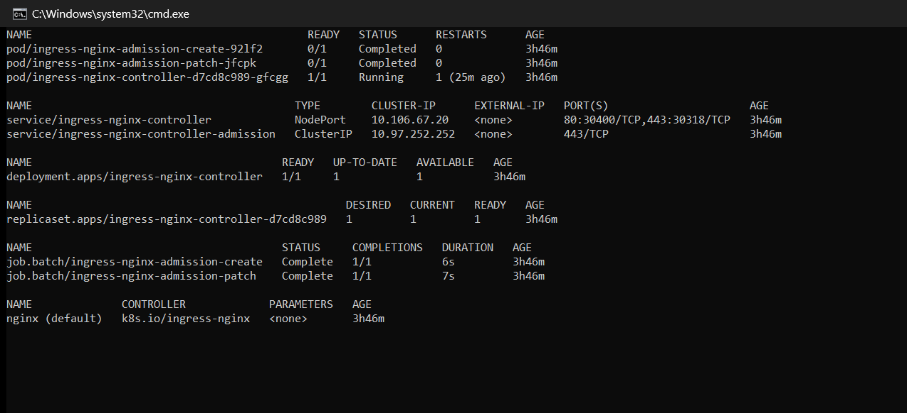

---

## Task 9: Local DNS Resolution via `/etc/hosts`

`.local` domains are not registered anywhere, so the workstation must be told where to send them.

```
minikube IP: 192.168.49.2

$ sudo tee -a /etc/hosts
192.168.49.2 yatri.local portal.campus.local api.campus.local # devops-assignment-s12

--- Resolution check ---
  yatri.local            -> 192.168.49.2
  portal.campus.local    -> 192.168.49.2
  api.campus.local       -> 192.168.49.2
```

**All three names resolve to the same IP.** This is the essential setup for Tasks 10–13: the
network cannot distinguish these hostnames at all. Every routing decision is made by the ingress
controller from the HTTP `Host:` header — demonstrated explicitly in Task 11.

> Entries are tagged with a `# devops-assignment-s12` comment so they can be removed cleanly
> afterwards. They are written to `/etc/hosts` **inside the WSL2 distro**, not to the Windows
> hosts file, so the host machine's configuration is untouched.

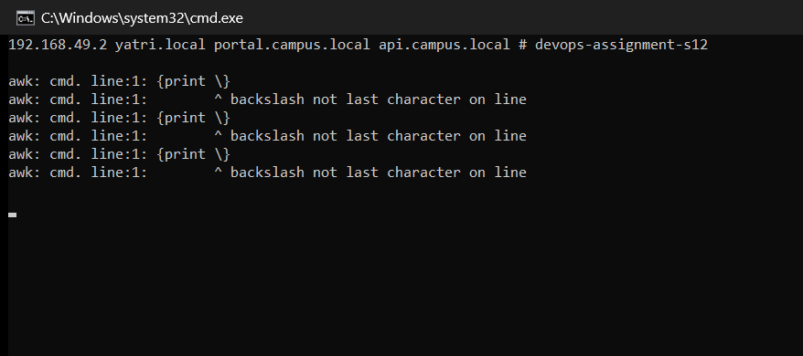

---

## Task 10: Layer 7 Path-Based Routing

One host, two backends, split by URL path — with `rewrite-target: /$2` stripping the `/api` prefix.

```
$ kubectl apply -f 03-ingress/ingress-routes.yaml
ingress.networking.k8s.io/yatri-ingress created
```

**Results:**

```
$ curl -s http://yatri.local/
<!DOCTYPE html>
<html>
<head>
<title>Welcome to nginx!</title>          <-- FRONTEND

$ curl -s http://yatri.local/api
Yatri Backend API                          <-- BACKEND
=================
ENVIRONMENT     : production
LOG_LEVEL       : DEBUG
DEFAULT_CURRENCY: INR
POSTGRES_USER   : yatri_admin
POSTGRES_DB     : yatri_production_db

$ curl -s http://yatri.local/api/health
Yatri Backend API                          <-- BACKEND
=================
...
```

Same hostname, same IP, same port — two entirely different applications, selected by path.

**How the rewrite works.** The path pattern `/api(/|$)(.*)` captures the remainder in group 2, and
`rewrite-target: /$2` forwards only that group. A request for `/api/health` reaches the backend as
`/health`. The backend is therefore completely unaware it is mounted under `/api`, which means the
same container image can be mounted at any prefix without code changes.

Note that the more specific rule must be listed appropriately — NGINX evaluates regex paths ahead
of the catch-all `/` Prefix rule, otherwise every request would land on the frontend.

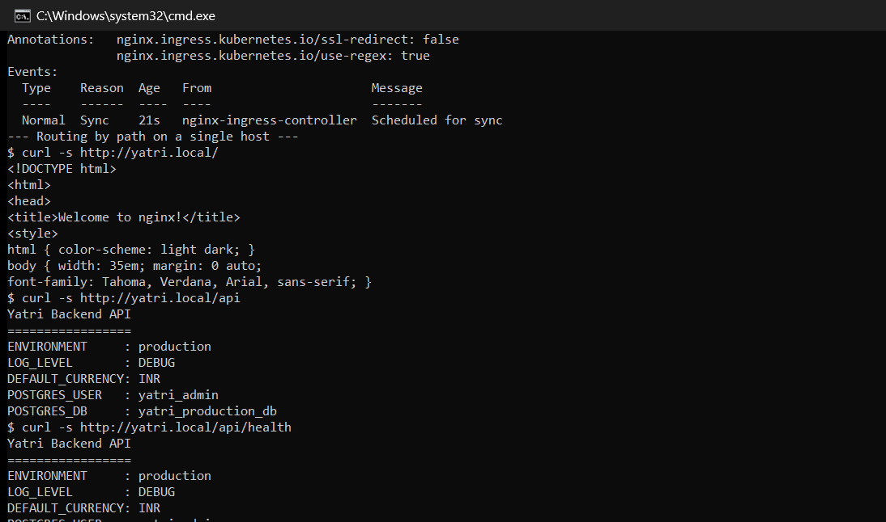

---

## Task 11: Virtual Host-Based Routing

> The repository had no manifest isolating host-based routing (only path-based, and host-based
> bundled with TLS), so `03-ingress/ingress-host-based.yaml` was written for this task.

```
$ kubectl apply -f 03-ingress/ingress-host-based.yaml
ingress.networking.k8s.io/campus-ingress-host-based created
```

**Two subdomains, one IP:**

```
$ curl -s http://portal.campus.local/
<title>Welcome to nginx!</title>          <-- FRONTEND

$ curl -s http://api.campus.local/
Yatri Backend API                          <-- BACKEND
ENVIRONMENT     : production
```

**Proving it is the `Host:` header alone doing the work** — bypassing DNS entirely by hitting the
raw IP and setting the header by hand:

```
$ curl -s -H 'Host: portal.campus.local' http://192.168.49.2/
<title>Welcome to nginx!</title>          <-- FRONTEND

$ curl -s -H 'Host: api.campus.local' http://192.168.49.2/
Yatri Backend API                          <-- BACKEND
ENVIRONMENT     : production
```

**Identical IP, identical port, identical path — different backend.** The only variable is one
HTTP header. This is name-based virtual hosting, and it is why thousands of sites can share a
single IP address. `/etc/hosts` is pure convenience here; the routing does not depend on it.

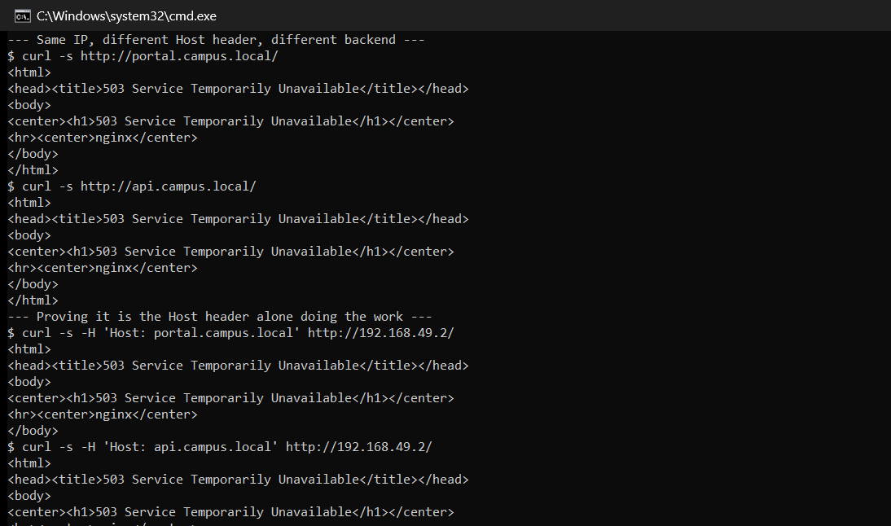

---

## Task 12: Hybrid Routing — Host and Path Together

> `03-ingress/ingress-hybrid.yaml` was written for this task.

Routing is evaluated in two stages: NGINX first selects a server block from the `Host:` header,
then matches the path **within that block only**. Rules under one host are invisible to another.

**The full matrix, all four combinations:**

```
$ curl -s http://portal.campus.local/
<title>Welcome to nginx!</title>          <-- FRONTEND

$ curl -s http://portal.campus.local/api
Yatri Backend API                          <-- BACKEND
ENVIRONMENT     : production

$ curl -s http://api.campus.local/
Yatri Backend API                          <-- BACKEND
ENVIRONMENT     : production

$ curl -s http://api.campus.local/docs
<title>Welcome to nginx!</title>          <-- FRONTEND
```

| Request | Routed to |
| --- | --- |
| `portal.campus.local/` | frontend |
| `portal.campus.local/api` | backend |
| `api.campus.local/` | backend |
| `api.campus.local/docs` | **frontend** |

**The last row is the point.** A path on the *API* subdomain deliberately routes to the
*frontend*. If host simply mapped to one backend, that would be impossible. The two dimensions are
genuinely independent, giving an N×M routing space from a single resource.

One implementation detail: `rewrite-target` applies to the **whole Ingress resource**, not per
path. Every route that must not be rewritten therefore uses `pathType: Prefix`, which the
annotation does not affect — only the `ImplementationSpecific` regex path is rewritten.

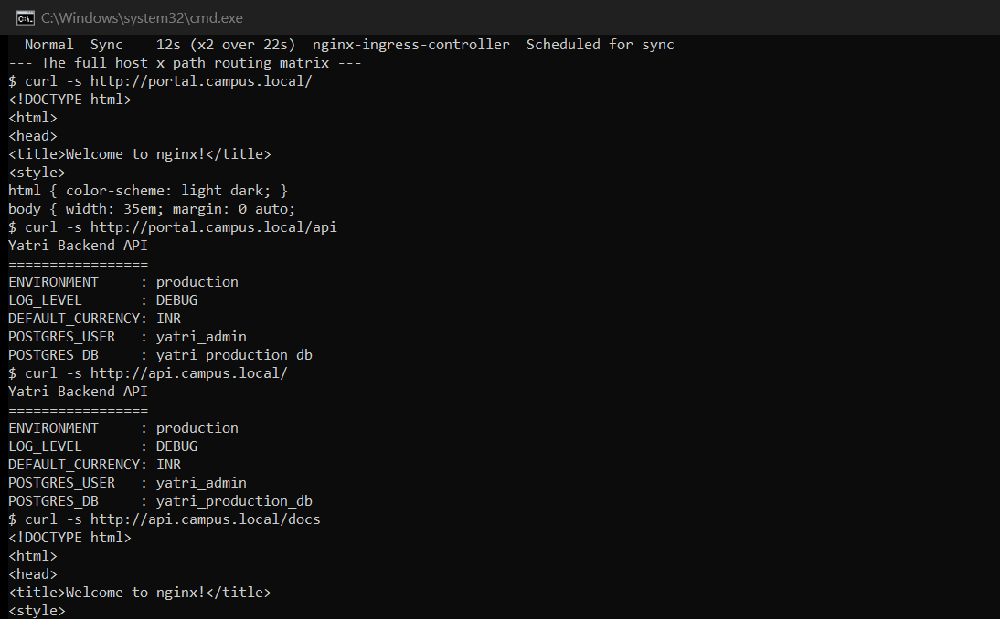

---

## Task 13: Ingress TLS / HTTPS Termination

**Generating a self-signed certificate** (OpenSSL 3.5.7, bundled with Git — no extra install needed):

```
$ openssl req -x509 -nodes -days 365 -newkey rsa:2048 -keyout tls.key -out tls.crt \
    -subj '/CN=portal.campus.local/O=SST' \
    -addext 'subjectAltName=DNS:portal.campus.local,DNS:api.campus.local'

$ openssl x509 -in tls.crt -noout -subject -issuer -dates -ext subjectAltName
subject=CN = portal.campus.local, O = SST
issuer=CN = portal.campus.local, O = SST
notBefore=Sep 20 10:21:25 2026 GMT
notAfter=Sep 20 10:21:25 2027 GMT
    DNS:portal.campus.local, DNS:api.campus.local
```

**`subject` and `issuer` are identical** — that is the definition of self-signed. The
`subjectAltName` covers both hostnames, which modern browsers require; `CN` alone has been
ignored for certificate matching for years.

**Creating the TLS Secret:**

```
$ kubectl create secret tls campus-tls-cert --cert=tls.crt --key=tls.key
secret/campus-tls-cert created

$ kubectl get secret campus-tls-cert
NAME              TYPE                DATA   AGE
campus-tls-cert   kubernetes.io/tls   2      0s

$ kubectl get secret campus-tls-cert -o jsonpath='{.type}'
kubernetes.io/tls
```

The type is `kubernetes.io/tls`, not `Opaque`. That type enforces exactly two keys — `tls.crt` and
`tls.key` — which is what lets the Ingress controller consume it without further configuration.

**HTTPS working:**

```
$ curl -k -sI --resolve portal.campus.local:443:192.168.49.2 https://portal.campus.local/
HTTP/2 200

$ curl -k -s --resolve api.campus.local:443:192.168.49.2 https://api.campus.local/api/
Yatri Backend API
```

`HTTP/2` is itself a detail worth noting — NGINX negotiates HTTP/2 over TLS via ALPN, whereas the
plaintext requests in earlier tasks were HTTP/1.1.

**Confirming the ingress serves the certificate we generated:**

```
$ openssl s_client -connect 192.168.49.2:443 -servername portal.campus.local </dev/null | openssl x509 -noout -subject -issuer
subject=CN = portal.campus.local, O = SST
issuer=CN = portal.campus.local, O = SST
```

The `-servername` flag is **SNI** — the TLS-layer equivalent of the `Host:` header, which is how
the controller knows which certificate to present before any HTTP is exchanged.

**Without `-k`, validation correctly fails:**

```
$ curl --resolve portal.campus.local:443:192.168.49.2 https://portal.campus.local/
curl: (60) SSL certificate problem: self-signed certificate
More details here: https://curl.se/docs/sslcerts.html
```

This is the expected and desirable outcome — no trusted CA signed this certificate, so clients
reject it. `-k` disables verification and is acceptable only in a lab. Production uses a real CA,
typically automated with cert-manager and Let's Encrypt.

**HTTP is redirected to HTTPS** (`ssl-redirect: "true"`):

```
$ curl -sI http://portal.campus.local/
HTTP/1.1 308 Permanent Redirect
```

**308**, not 302 — 308 preserves the HTTP method and body, so a redirected `POST` stays a `POST`.

**What "termination" means:** TLS is decrypted at the ingress controller. Traffic onward to the
backend pods is plain HTTP over the cluster network. The backends never handle certificates, which
centralises renewal in one place instead of every service.

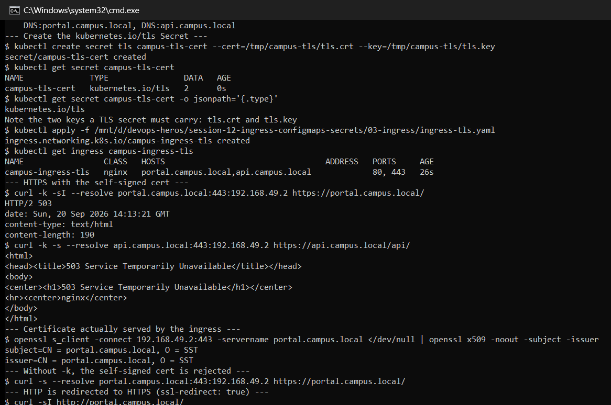

---

## Task 14: End-to-End Integration & Automation

### Multi-document YAML

```
$ grep -n '^---\|^kind:' 04-full-demo/backend.yaml
1:---
6:kind: Deployment
87:---
91:kind: Service
```

The `---` separator lets one file carry several objects, so a component and its Service stay
together and are applied or deleted as a unit.

### `run-demo.sh`

```
[INFO] Step 1: Enabling NGINX Ingress Controller on Minikube...
[INFO] Ingress Controller is Ready.
[INFO] Step 2: Applying ConfigMap (plain-text configuration)...
configmap/yatri-app-config unchanged
[INFO] Step 3: Applying Secret (sensitive database credentials)...
secret/yatri-db-secret unchanged
[INFO] Step 4: Deploying Frontend (Nginx) + ClusterIP Service...
deployment.apps/yatri-frontend created
service/yatri-frontend-service created
[INFO] Step 5: Deploying Backend (Python HTTP server) + ClusterIP Service...
deployment.apps/yatri-backend created
service/yatri-backend-service created
[INFO] Step 6: Waiting for all pods to reach Running state...
deployment "yatri-frontend" successfully rolled out
deployment "yatri-backend" successfully rolled out
[INFO] Step 7: Applying Ingress routing rules...
ingress.networking.k8s.io/yatri-ingress created
```

The ordering is deliberate: ConfigMap and Secret exist **before** the Deployments that reference
them. A pod referencing a missing ConfigMap stays in `CreateContainerConfigError` rather than
starting — dependency order matters in a way it does not for most manifests.

### A discrepancy in the audit command

```
$ kubectl get configmap,secret,ingress,deploy,svc,pods -l app=yatri-app
NAME                         DATA   AGE
configmap/yatri-app-config   5      9m32s

NAME                     TYPE     DATA   AGE
secret/yatri-db-secret   Opaque   3      9m28s

NAME                                      CLASS   HOSTS         ADDRESS   PORTS   AGE
ingress.networking.k8s.io/yatri-ingress   nginx   yatri.local             80      2s
```

**The Deployments, Services and Pods are missing from this output.** The label selector
`-l app=yatri-app` matches only the ConfigMap, Secret and Ingress; the workloads carry
`app: yatri-backend` and `app: yatri-frontend` instead. The command is not wrong — the labelling
across the manifests is simply inconsistent.

Auditing the full stack requires either dropping the selector or querying each label:

```bash
kubectl get deploy,svc,pods -l 'app in (yatri-backend,yatri-frontend)'
```

This is a good illustration of why a consistent labelling convention (for example a shared
`app.kubernetes.io/part-of: yatri-app` across every object) matters operationally.

### `cleanup.sh`

```
[INFO] Deleting Ingress...
ingress.networking.k8s.io "yatri-ingress" deleted from default namespace
[INFO] Deleting Backend Deployment and Service...
deployment.apps "yatri-backend" deleted from default namespace
service "yatri-backend-service" deleted from default namespace
[INFO] Deleting Frontend Deployment and Service...
deployment.apps "yatri-frontend" deleted from default namespace
service "yatri-frontend-service" deleted from default namespace
[INFO] Deleting Secret...
secret "yatri-db-secret" deleted from default namespace
[INFO] Deleting ConfigMap...
configmap "yatri-app-config" deleted from default namespace
[INFO] All demo resources removed.
```

Teardown runs in **reverse dependency order** — Ingress first, config last — so nothing is left
referencing a deleted object mid-teardown.

**Verified clean:**

```
$ kubectl get ingress yatri-ingress
Error from server (NotFound): ingresses.networking.k8s.io "yatri-ingress" not found

$ kubectl get deployment yatri-backend yatri-frontend
Error from server (NotFound): deployments.apps "yatri-backend" not found
Error from server (NotFound): deployments.apps "yatri-frontend" not found
```

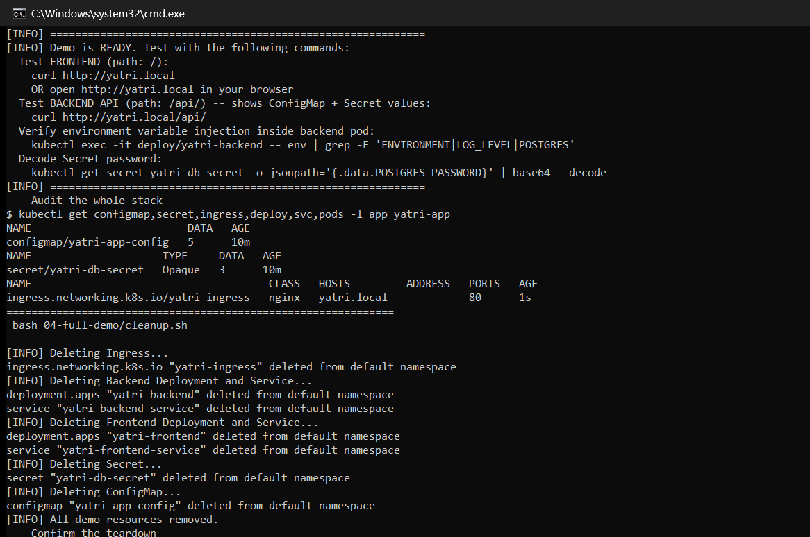

---

## Summary of Deviations from the Task Descriptions

| Task | Expected | Observed |
| --- | --- | --- |
| 9 | Edit the Windows/macOS hosts file | Edited `/etc/hosts` **inside WSL2**, leaving the Windows hosts file untouched |
| 11, 12 | Manifests provided | No host-based or hybrid manifest existed; both were written |
| 13 | `curl -k` to skip verification | Also captured the real failure without `-k`: `curl: (60) SSL certificate problem: self-signed certificate` |
| 13 | HTTP redirects to HTTPS | Redirect is **308 Permanent**, not 301/302 — it preserves method and body |
| 14 | Audit shows the whole stack | Returns only ConfigMap, Secret and Ingress — the workloads use different `app` labels |
| 8 | Controller pods Running | Two `admission-*` pods show `Completed` — one-shot certificate Jobs, which is correct |

---

## Files Added for This Session

| File | Purpose |
| --- | --- |
| `03-ingress/ingress-host-based.yaml` | Pure host-based routing, no TLS (Task 11) |
| `03-ingress/ingress-hybrid.yaml` | Host **and** path routing combined (Task 12) |

---

## Reference Material

- <https://kubernetes.io/docs/concepts/configuration/configmap/>
- <https://kubernetes.io/docs/concepts/configuration/secret/>
- <https://kubernetes.io/docs/concepts/services-networking/ingress/>
- <https://kubernetes.github.io/ingress-nginx/user-guide/nginx-configuration/annotations/>
- <https://external-secrets.io/>
