# Session 10: Kubernetes Core Objects, Pod Lifecycle & Deployment Strategies

**Author:** Hardik Jumnani
**Roll Number:** 10025
**Email:** hardik.24bcs10025@sst.scaler.com
**Course:** SST DevOps & Cloud [SWE]
**Session:** 10 — Core Objects & Deployment Strategies
**Repository:** `devops-heros` / `session10-k8s-core-objects`

---

## Lab Environment

Every output block below was captured from an actual run on this cluster. Where a result differed
from what the task description predicted, the real result is shown and the difference explained.

| Component | Value |
| --- | --- |
| Host OS | Windows 11 Home Single Language (build 26200) |
| Lab shell | Ubuntu 24.04 LTS on WSL2 |
| Kubernetes | v1.37.0 on containerd 2.3.4 |
| minikube / kubectl | v1.39.0 / v1.37.0 |
| Cluster topology | 2 nodes — `minikube` (control-plane) + `minikube-m02` (worker) |

A second node was added with `minikube node add` specifically for the DaemonSet task, so that
"one pod per node" is something the output actually demonstrates rather than something that is
trivially true on a single-node cluster.

---

## Task 1: Cluster Health Verification

**Commands:**

```bash
kubectl cluster-info
kubectl get nodes -o wide
```

**Output:**

```
$ kubectl cluster-info
Kubernetes control plane is running at https://127.0.0.1:32771
CoreDNS is running at https://127.0.0.1:32771/api/v1/namespaces/kube-system/services/kube-dns:dns/proxy

$ kubectl get nodes -o wide
NAME           STATUS   ROLES           AGE   VERSION   INTERNAL-IP    EXTERNAL-IP   OS-IMAGE                         CONTAINER-RUNTIME
minikube       Ready    control-plane   45m   v1.37.0   192.168.49.2   <none>        Debian GNU/Linux 12 (bookworm)   containerd://2.3.4
minikube-m02   Ready    <none>          21m   v1.37.0   192.168.49.3   <none>        Debian GNU/Linux 12 (bookworm)   containerd://2.3.4
```

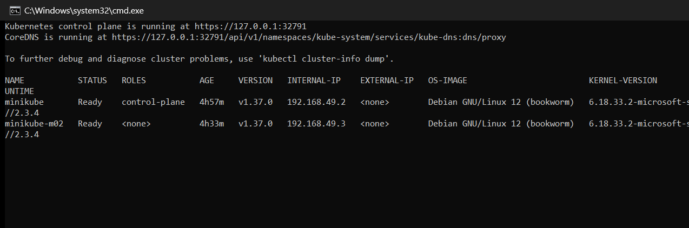

---

## Task 2: Standard Pod Deployment, Inspection & Teardown

Deploy a single Nginx pod declaring the four mandatory top-level fields — `apiVersion`, `kind`,
`metadata`, `spec` — then inspect and delete it.

**Commands:**

```bash
kubectl apply -f pod.yml
kubectl get pods -o wide
kubectl logs nginx-pod
kubectl delete -f pod.yml
```

**Output:**

```
$ kubectl apply -f pod.yml
pod/nginx-pod created

$ kubectl get pods -o wide
NAME        READY   STATUS    RESTARTS   AGE   IP           NODE       NOMINATED NODE   READINESS GATES
nginx-pod   1/1     Running   0          10s   10.244.0.3   minikube   <none>           <none>

$ kubectl delete -f pod.yml
pod "nginx-pod" deleted from default namespace
```

The pod receives a cluster-internal IP (`10.244.0.3`) from the CNI and is bound to a specific
node. That IP belongs to the pod alone and is released when it dies — which is precisely why
Services exist.

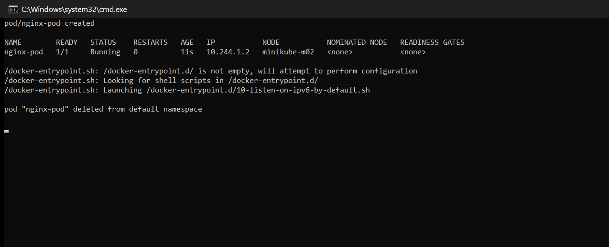

---

## Task 3: Error State Simulation — `ErrImagePull` → `ImagePullBackOff`

The manifest references `jakwehrgkaejw:kahsdfgkhj`, an image that does not exist.

**Output:**

```
$ kubectl apply -f pod-lifecycle/06-imagepullbackoff.yaml
pod/lifecycle-image-error created

$ kubectl get pods -w   (sampled every 3s)
  [t+0s]  lifecycle-image-error   0/1   ContainerCreating   0   0s
  [t+3s]  lifecycle-image-error   0/1   ErrImagePull        0   4s
  [t+6s]  lifecycle-image-error   0/1   ErrImagePull        0   7s
  [t+9s]  lifecycle-image-error   0/1   ErrImagePull        0   11s
  [t+12s] lifecycle-image-error   0/1   ImagePullBackOff    0   14s
  [t+15s] lifecycle-image-error   0/1   ImagePullBackOff    0   18s
```

**The kubelet's own events:**

```
Events:
  Type     Reason     Age                From               Message
  ----     ------     ----               ----               -------
  Normal   Scheduled  29s                default-scheduler  Successfully assigned default/lifecycle-image-error to minikube
  Normal   Pulling    15s (x2 over 29s)  kubelet            Pulling image "jakwehrgkaejw:kahsdfgkhj"
  Warning  Failed     13s (x2 over 28s)  kubelet            Failed to pull image "jakwehrgkaejw:kahsdfgkhj": failed to resolve reference "docker.io/library/jakwehrgkaejw:kahsdfgkhj": pull access denied, repository does not exist or may require authorization: server message: insufficient_scope: authorization failed
  Warning  Failed     13s (x2 over 28s)  kubelet            Error: ErrImagePull
  Normal   BackOff    27s                kubelet            Back-off pulling image "jakwehrgkaejw:kahsdfgkhj"
  Warning  Failed     27s                kubelet            Error: ImagePullBackOff
```

### Why the API object is created even though the container never runs

`kubectl apply` returned `pod/lifecycle-image-error created` — a **success**. The two states are
produced by different components at different times:

- The **API server** validated the manifest and wrote it to `etcd`. Nothing about that step
  requires the image to exist; a Pod spec is just data.
- The **scheduler** assigned it to `minikube` (`Successfully assigned ...`).
- The **kubelet** then tried to pull the image and failed. That is the first moment the registry
  is contacted at all.

`ErrImagePull` is the immediate failure. `ImagePullBackOff` is the kubelet deliberately waiting
before retrying, with exponentially increasing delays, so a broken image does not hammer the
registry forever. Note the `(x2 over 29s)` — the retry count is visible in the event itself.

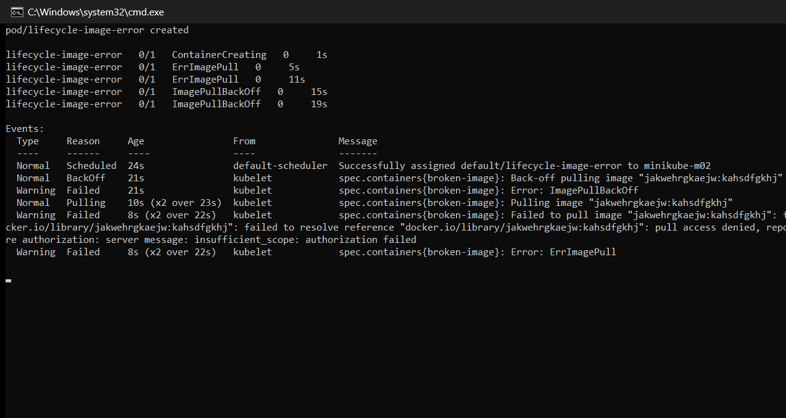

---

## Task 4: Capturing Transient Pod Lifecycle Stages

A `busybox` pod with `restartPolicy: Never` that echoes a string and exits. The interesting part
is catching all three phases — they pass in about two seconds.

**Output:**

```
$ kubectl apply -f hello.yml
pod/hello-pod created

$ kubectl get pods hello-pod   (polled every 0.3s until terminal state)
  [sample 1 ] ContainerCreating
  [sample 9 ] Running
  [sample 10] Completed

$ kubectl get pod hello-pod -o wide
NAME        READY   STATUS      RESTARTS   AGE   IP           NODE       NOMINATED NODE   READINESS GATES
hello-pod   0/1     Completed   0          7s    10.244.0.5   minikube   <none>           <none>

$ kubectl get pod hello-pod -o jsonpath='{.status.phase}'
Succeeded

$ kubectl logs hello-pod
Hello Kubernetes

$ kubectl get pod hello-pod -o jsonpath='{.status.containerStatuses[0].state.terminated.exitCode}'
0
```

**Why the polling interval matters:** `Running` appeared at sample 9 and `Completed` at sample 10
— a single 0.3-second sample apart. At the 1-second interval a normal `watch` uses, this pod
would almost certainly appear to jump straight from `ContainerCreating` to `Completed`, and the
`Running` phase would never be seen at all.

Also worth separating: the **STATUS** column reads `Completed`, but the actual **phase** is
`Succeeded`. `Completed` is a display string derived from the container's terminated state;
`Succeeded` is the real `status.phase` value, and it is what controllers act on.

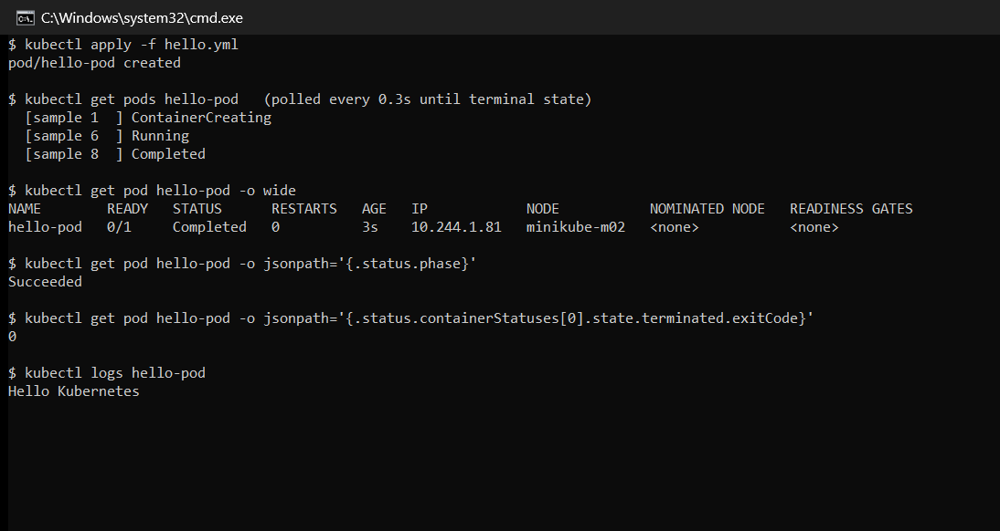

---

## Task 5: Exhaustive Pod Lifecycle States & Probes Lab

All twelve manifests in `pod-lifecycle/` were applied and observed. The table records what each
one actually did.

| # | Manifest | Observed result |
| --- | --- | --- |
| 01 | `01-running.yaml` | `1/1 Running`, steady state |
| 02 | `02-pending.yaml` | `Pending` — never scheduled (see below) |
| 03 | `03-succeeded.yaml` | Phase `Succeeded`, exit code 0 |
| 04 | `04-failed.yaml` | Phase `Failed`, exit code 1 |
| 05 | `05-crashloopbackoff.yaml` | Restart loop with growing backoff |
| 06 | `06-imagepullbackoff.yaml` | Covered in Task 3 |
| 07 | `07-readiness.yaml` | `0/1 Running` before `1/1 Running` |
| 08 | `08-liveness.yaml` | Restarted automatically by the probe |
| 09 | `09-startup.yaml` | `0/1` for ~30s, then `1/1` |
| 10 | `10-init-container.yaml` | `Init:0/1` before the app container started |
| 11 | `11-multi-container.yaml` | `2/2 Ready` — app + sidecar |
| 12 | `12-termination.yaml` | Deletion took 12 seconds, not instant |

### 5.1 Pending — an unschedulable pod

```
$ kubectl get pod lifecycle-pending
NAME                READY   STATUS    RESTARTS   AGE
lifecycle-pending   0/1     Pending   0          6s
```

The pod requests more memory than any node has. The scheduler cannot satisfy the constraint, so
it never binds the pod to a node and it stays `Pending` indefinitely. `Pending` means *not yet
placed* — the failure is at scheduling time, before any container work begins.

### 5.2 CrashLoopBackOff — and the exponential backoff made visible

```
$ kubectl get pod lifecycle-crashloop   (sampled every 5s)
  [t+0s ] 0/1  ContainerCreating  restarts=0
  [t+5s ] 1/1  Running            restarts=1
  [t+10s] 0/1  Error              restarts=1
  [t+20s] 1/1  Running            restarts=2
  [t+25s] 0/1  Error              restarts=2
  [t+45s] 1/1  Running            restarts=3
  [t+50s] 0/1  Error              restarts=3
```

The restart *gaps* are the point. Successive restarts began at roughly **t+5s, t+20s and t+45s**
— intervals of about 15s then 25s. The kubelet waits longer before each retry (10s, 20s, 40s,
doubling up to a 5-minute ceiling) so a container stuck in a crash loop does not consume the
node. `CrashLoopBackOff` is the name for that waiting period, which is why the pod alternates
between `Running`, `Error` and the backoff state rather than sitting in one status.

### 5.3 Readiness probe — `Running` is not the same as `Ready`

```
  [t+0s] 0/1  ContainerCreating  restarts=0
  [t+3s] 0/1  Running            restarts=0     <-- process is up, still NOT Ready
  [t+6s] 1/1  Running            restarts=0     <-- probe passed, now receives traffic
```

For three seconds the container was `Running` while the READY column showed `0/1`. During that
window Kubernetes deliberately kept the pod **out of Service endpoints**. This is the mechanism
that prevents traffic reaching an application that has started but not yet finished loading.

### 5.4 Liveness probe — automated self-healing

```
  [t+0s ] 0/1  ContainerCreating  restarts=0
  [t+5s ] 1/1  Running            restarts=0
  [t+55s] 1/1  Running            restarts=1     <-- probe failed; kubelet restarted it
```

No human intervened. The probe began failing, the kubelet killed and restarted the container, and
`RESTARTS` incremented to 1. Readiness removes a pod from *traffic*; liveness *restarts* it.

### 5.5 Startup probe — protecting a slow starter

```
  [t+0s ] 0/1  ContainerCreating
  [t+5s ] 0/1  Running            <-- startup probe still running
  [t+35s] 1/1  Running            <-- startup finished, normal probes take over
```

The container sat `0/1` for around 30 seconds without being restarted. A liveness probe alone
would likely have declared this container dead and killed it mid-boot, producing a crash loop
that never resolves. The startup probe suspends liveness checks until the app is up.

### 5.6 Init container — sequential prerequisites

```
  [t+0s ] 0/1  Init:0/1   <-- init container running; app container has not started
  [t+12s] 1/1  Running    <-- init finished successfully, app container started
```

`Init:0/1` is a distinct status meaning "0 of 1 init containers complete". Init containers run to
completion, strictly in order, before any application container starts. If one fails, the app
container never starts at all.

### 5.7 Multi-container pod — app plus sidecar

```
$ kubectl get pod lifecycle-multi-container
NAME                        READY   STATUS    RESTARTS   AGE
lifecycle-multi-container   2/2     Running   0          8s
```

`2/2` — two containers, both ready, sharing one network namespace and one IP.

### 5.8 Graceful termination

```
$ time kubectl delete -f 12-termination.yaml
pod "lifecycle-termination" deleted
  deletion took 12s
```

Deletion took **12 seconds**, not instantly. The container traps `SIGTERM` and runs cleanup work
before exiting. Kubernetes sends `SIGTERM`, waits up to `terminationGracePeriodSeconds`, and only
then sends `SIGKILL`. This is what lets an application finish in-flight requests during a rollout
rather than dropping them.

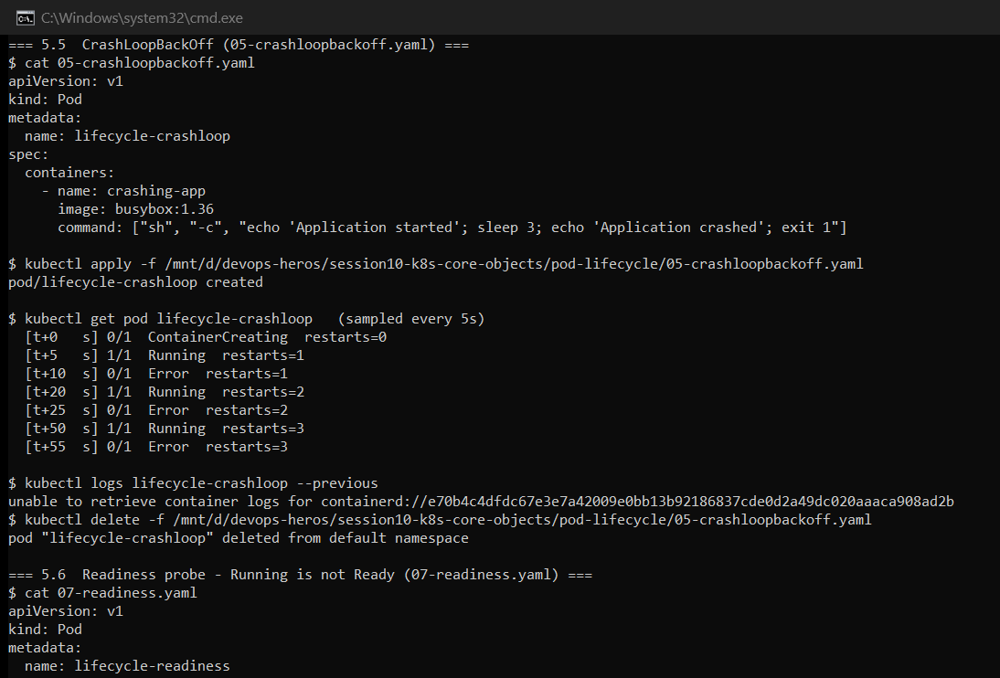
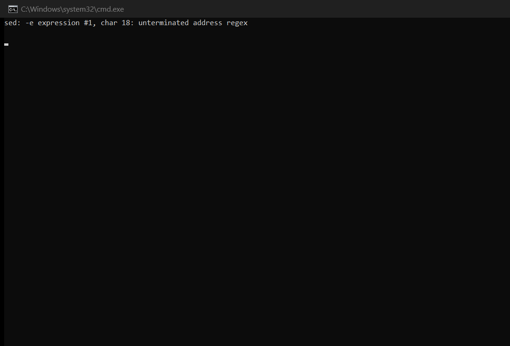

---

## Task 6: ReplicaSet & StatefulSet

### Part A — ReplicaSet self-healing

```
$ kubectl get rs nginx-rs
NAME       DESIRED   CURRENT   READY   AGE
nginx-rs   3         3         3       13s

$ kubectl delete pod nginx-rs-bcqkm
pod "nginx-rs-bcqkm" deleted from default namespace

$ kubectl get pods -l app=nginx        # immediately after deletion
NAME             READY   STATUS              RESTARTS   AGE
nginx-rs-h472x   0/1     ContainerCreating   0          2s      <-- replacement already created
nginx-rs-n7jlh   1/1     Running             0          16s
nginx-rs-w8lch   1/1     Running             0          16s

$ kubectl get pods -l app=nginx        # 10 seconds later
NAME             READY   STATUS    RESTARTS   AGE
nginx-rs-h472x   1/1     Running   0          12s
nginx-rs-n7jlh   1/1     Running   0          26s
nginx-rs-w8lch   1/1     Running   0          26s
```

The replacement pod existed **2 seconds** after the deletion, with a different random name. The
ReplicaSet controller does not repair the deleted pod — it observes that current (2) no longer
matches desired (3) and creates a brand-new one. Pod identity is disposable here.

### Part B — StatefulSet ordinal identity

```
$ kubectl get pods -l app=mysql -o wide
NAME      READY   STATUS    RESTARTS   AGE   IP           NODE
mysql-0   1/1     Running   0          7s    10.244.1.4   minikube-m02
mysql-1   1/1     Running   0          7s    10.244.0.4   minikube
mysql-2   1/1     Running   0          6s    10.244.1.5   minikube-m02

$ kubectl get pvc
NAME                               STATUS   VOLUME                                     CAPACITY   ACCESS MODES   STORAGECLASS
mysql-persistent-storage-mysql-0   Bound    pvc-505ecb1d-d4ed-4e51-8088-d980ab8f72ff   5Gi        RWO            standard
mysql-persistent-storage-mysql-1   Bound    pvc-6a2abf98-6caa-483f-9a69-b08b18e1c598   5Gi        RWO            standard
mysql-persistent-storage-mysql-2   Bound    pvc-fa57bead-f125-41b4-a444-21de18273c17   5Gi        RWO            standard
```

Names are **deterministic ordinals** (`mysql-0`, `mysql-1`, `mysql-2`), not random hashes, and
`volumeClaimTemplates` generated one dedicated PVC per pod.

**Stable identity across deletion** — the property that actually distinguishes a StatefulSet:

```
$ kubectl delete pod mysql-1
pod "mysql-1" deleted from default namespace

$ kubectl get pods -l app=mysql
mysql-0   1/1   Running             0     40s
mysql-1   0/1   ContainerCreating   0     0s      <-- same name returns
mysql-2   1/1   Running             0     39s

$ kubectl get pvc
mysql-persistent-storage-mysql-1   Bound   pvc-6a2abf98-6caa-483f-9a69-b08b18e1c598   5Gi   RWO   standard   41s
```

The replacement is **`mysql-1` again**, and it reattached to **the same PVC** — note the volume
ID `pvc-6a2abf98...` is unchanged and the PVC age kept counting from before the deletion. Compare
with the ReplicaSet above, where the replacement got a completely new name and no storage.

**Two honest notes on this task:**

1. **A first run failed.** `mysql-0` sat `Pending` and its PVC never bound. The cause was the
   `storage-provisioner` pod in `kube-system` restarting at that moment — it had accumulated 10
   restarts. Once it stabilised, the identical manifest bound all three PVCs in under 7 seconds.
   The manifest was never at fault.
2. **Ordered startup was not observable.** A StatefulSet's default `podManagementPolicy:
   OrderedReady` should start `mysql-1` only after `mysql-0` is Ready. All three pods were Ready
   within about one second of each other, so the ordering could not be seen at a 5-second
   sampling interval. The reason is that these pods declare **no readiness probe** — so each pod
   is considered Ready the instant its container starts, and the controller immediately proceeds
   to the next. The ordering rule was still enforced; it simply completed too quickly to capture.

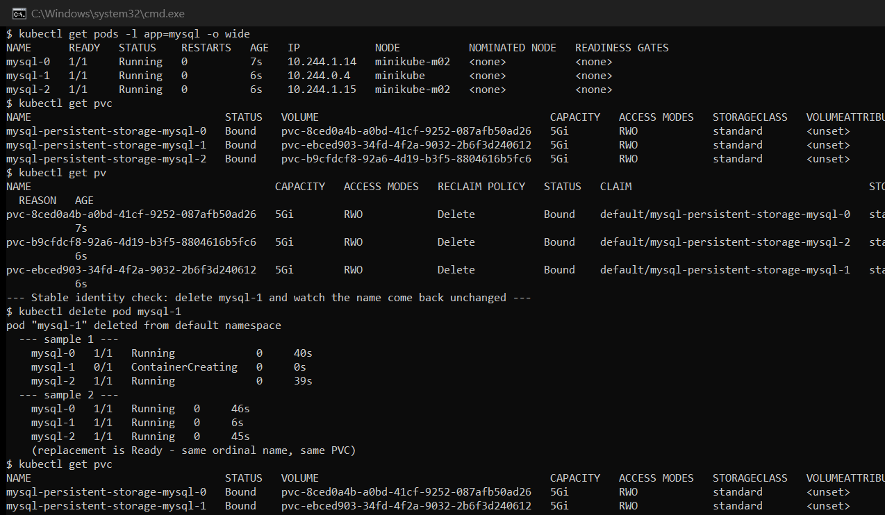

---

## Task 7: DaemonSet — One Pod Per Node

```
$ kubectl get nodes
NAME           STATUS   ROLES           AGE   VERSION
minikube       Ready    control-plane   26m   v1.37.0
minikube-m02   Ready    <none>          3m    v1.37.0

$ kubectl get ds node-exporter
NAME            DESIRED   CURRENT   READY   UP-TO-DATE   AVAILABLE   NODE SELECTOR   AGE
node-exporter   2         2         2       2            2           <none>          21s

$ kubectl get pods -l app=node-exporter -o custom-columns=POD:.metadata.name,NODE:.spec.nodeName
POD                   NODE
node-exporter-jl6n4   minikube-m02
node-exporter-xrlq8   minikube
```

`DESIRED` is **2** — and no replica count appears anywhere in the manifest. A DaemonSet derives
its desired count from the number of eligible nodes. Exactly one pod landed on each node, and
adding a third node would automatically produce a third pod.

This is the correct shape for node-level agents: log collectors, metrics exporters, security
agents and CNI plugins, where the requirement is coverage of every machine rather than a fixed
number of copies.

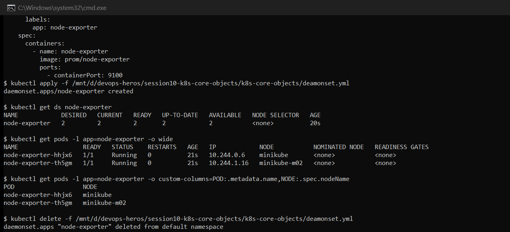

---

## Task 8: Rolling Update & Rollback

`app-rolling` runs **4 replicas** with `maxSurge: 1` and `maxUnavailable: 0`, upgrading from
`nginx:1.24-alpine` to `nginx:1.25-alpine`.

**During the rollout:**

```
$ kubectl get pods -l app=app-rolling   (sampled during rollout)
  --- sample 1 ---
    app-rolling-56bff6d88c-dvnt9   0/1   ContainerCreating   0   0s     <-- new (surge) pod
    app-rolling-86d7d44d5b-2gfmg   1/1   Running             0   18s    <-- old
    app-rolling-86d7d44d5b-c2z27   1/1   Running             0   18s    <-- old
    app-rolling-86d7d44d5b-c8jcd   1/1   Running             0   18s    <-- old
    app-rolling-86d7d44d5b-l7lsc   1/1   Running             0   18s    <-- old
```

**Five pods exist during the update** — the 4 originals plus 1 surge pod, and all four old pods
stayed `1/1 Running`. That is `maxSurge: 1` and `maxUnavailable: 0` working exactly as specified:
capacity never dropped below 100%.

**Revision history and rollback:**

```
$ kubectl rollout history deployment/app-rolling
REVISION  CHANGE-CAUSE
1         <none>
2         <none>

$ kubectl rollout undo deployment/app-rolling
deployment.apps/app-rolling rolled back

$ kubectl rollout status deployment/app-rolling
deployment "app-rolling" successfully rolled out

$ kubectl rollout history deployment/app-rolling
REVISION  CHANGE-CAUSE
2
3
```

Revision 1 disappears and a **revision 3** appears. A rollback is not a deletion — Kubernetes
re-applies the old pod template as a *new* revision. The history stays append-only, so the
rollback is itself auditable and can be undone in turn.

`CHANGE-CAUSE` is `<none>` because the rollout was triggered with `kubectl apply` and no
`kubernetes.io/change-cause` annotation was set. In production that annotation is what makes the
history readable.

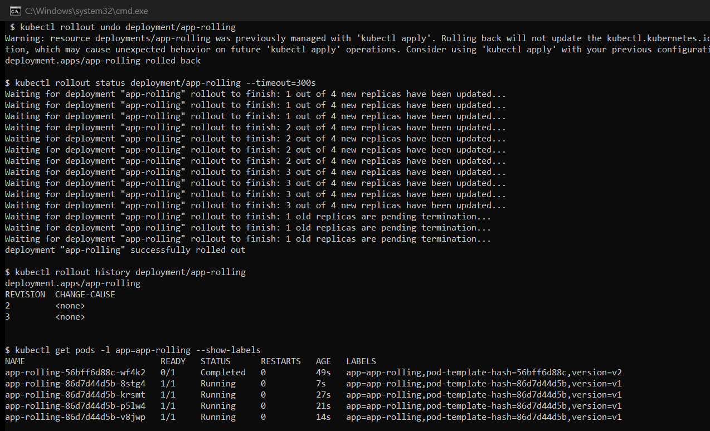

---

## Task 9: Real-World Troubleshooting Drills

### Drill 1 — A rollout stalled by an unresolvable image

> `broken-image.yaml` is designed to break an **existing** rollout — its own header says it
> "proves that old pods remain healthy". Applying it to an empty cluster just produces three
> failed pods and demonstrates nothing. So a working revision is deployed first, using
> `troubleshooting/yatri-backend-healthy.yaml` (added for this drill), and the broken manifest is
> then applied as a genuine rolling update on top of it.

```
$ kubectl apply -f troubleshooting/yatri-backend-healthy.yaml
deployment.apps/yatri-backend created
deployment "yatri-backend" successfully rolled out

$ kubectl apply -f troubleshooting/broken-image.yaml
deployment.apps/yatri-backend configured

$ kubectl get pods -l app=yatri-backend -L version   (sampled every 5s)
  --- sample 1 ---
    yatri-backend-6f5bd8c89c-7skmf   1/1   Running             0   2s    healthy-v1
    yatri-backend-6f5bd8c89c-fj6r7   1/1   Running             0   2s    healthy-v1
    yatri-backend-6f5bd8c89c-spwbq   1/1   Running             0   2s    healthy-v1
    yatri-backend-77dbb657cd-c2r79   0/1   ContainerCreating   0   0s    broken-v3
  --- sample 2 ---
    yatri-backend-6f5bd8c89c-7skmf   1/1   Running        0   8s    healthy-v1
    yatri-backend-6f5bd8c89c-fj6r7   1/1   Running        0   8s    healthy-v1
    yatri-backend-6f5bd8c89c-spwbq   1/1   Running        0   8s    healthy-v1
    yatri-backend-77dbb657cd-c2r79   0/1   ErrImagePull   0   6s    broken-v3
  --- sample 4 ---
    yatri-backend-6f5bd8c89c-7skmf   1/1   Running            0   20s   healthy-v1
    yatri-backend-6f5bd8c89c-fj6r7   1/1   Running            0   20s   healthy-v1
    yatri-backend-6f5bd8c89c-spwbq   1/1   Running            0   20s   healthy-v1
    yatri-backend-77dbb657cd-c2r79   0/1   ImagePullBackOff   0   18s   broken-v3
```

```
$ kubectl rollout status deployment/yatri-backend --timeout=30s
Waiting for deployment "yatri-backend" rollout to finish: 0 of 3 updated replicas are available...
error: timed out waiting for the condition

$ kubectl describe deployment yatri-backend | grep -A 6 'Conditions:'
  Available      False   MinimumReplicasUnavailable
  Progressing    True    ReplicaSetUpdated
```

**This is the lesson:** all three `healthy-v1` pods stayed `1/1 Running` for the entire failed
rollout, while exactly one `broken-v3` surge pod cycled `ContainerCreating → ErrImagePull →
ImagePullBackOff`. Because `maxUnavailable: 0`, Kubernetes refused to terminate any healthy pod
until a replacement became Ready — and it never did. **A bad deploy stalled instead of causing an
outage.** Users kept being served the old version throughout.

**Recovery:**

```
$ kubectl rollout undo deployment/yatri-backend
deployment.apps/yatri-backend rolled back
deployment "yatri-backend" successfully rolled out

$ kubectl get pods -l app=yatri-backend -L version
yatri-backend-6f5bd8c89c-7skmf   1/1   Running       0   82s   healthy-v1
yatri-backend-6f5bd8c89c-fj6r7   1/1   Running       0   82s   healthy-v1
yatri-backend-6f5bd8c89c-spwbq   1/1   Running       0   82s   healthy-v1
yatri-backend-77dbb657cd-c2r79   0/1   Terminating   0   80s   broken-v3
```

Note the ages: the three healthy pods still show **82s** — they were never restarted. Only the
broken surge pod was removed.

### Drill 2 — Immutable selector mismatch

```
$ kubectl apply -f troubleshooting/selector-mismatch.yaml
The Deployment "selector-error-demo" is invalid: spec.template.metadata.labels: Invalid value: {"app":"wrong-app-name"}: `selector` does not match template `labels`
  (exit code: 1)

$ kubectl get deployments
No resources found in default namespace.
```

Rejected **synchronously by the API server**. Nothing was written to `etcd` and no pod was ever
created — a completely different failure class from Drill 1, where the object was valid and the
failure happened later at runtime.

The rule exists because a Deployment finds and owns its pods *through* its selector. A Deployment
selecting `app=correct-app-name` while stamping its pods `app=wrong-app-name` could never find
the pods it just created — it would loop creating orphans forever.

**The fix** (`selector-mismatch-fixed.yaml`, one line changed):

```
$ kubectl apply -f troubleshooting/selector-mismatch-fixed.yaml
deployment.apps/selector-error-demo created

$ kubectl rollout status deployment/selector-error-demo
deployment "selector-error-demo" successfully rolled out

$ kubectl get pods -l app=correct-app-name
NAME                                   READY   STATUS    RESTARTS   AGE
selector-error-demo-54996d6787-4sg2g   1/1     Running   0          8s
```

The broken file is kept unchanged so the rejection remains reproducible.

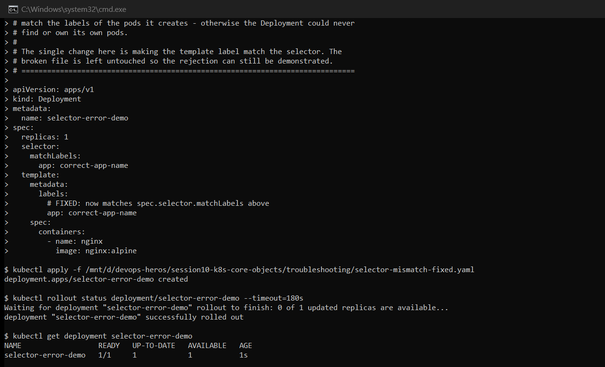

---

## Task 10: Theoretical & Architectural Writeup

### 1. The four ports

| Port | Lives on | Meaning |
| --- | --- | --- |
| `containerPort` | Pod spec | The port the application listens on inside the container. Purely **informational** — it documents intent and does not open anything. Traffic reaches a container port whether or not it is declared. |
| `targetPort` | Service spec | Where the Service **sends** traffic on the backing pods. This is the one that must match the application's real port. |
| `port` | Service spec | The port the Service itself exposes on its ClusterIP, for traffic from inside the cluster. |
| `nodePort` | Service spec | A port opened on **every node** (range `30000–32767`) for reaching the Service from outside the cluster. |

```
External client ──► nodePort 30080   (on any node's IP)
                         │
                         ▼
                    port 80          (Service ClusterIP — internal clients enter here)
                         │
                         ▼
                 targetPort 80       (selected pod's IP)
                         │
                         ▼
               containerPort 80      (the nginx process)
```

### 2. Labels vs. Selectors

**Labels** are key-value tags attached to objects — `app: nginx`, `slot: blue`, `version: v2`.
They carry no behaviour on their own.

**Selectors** are queries *over* labels. A Service uses one to decide which pods receive traffic;
a Deployment uses one to decide which pods it owns.

Task 11 is the clearest demonstration: the blue-green cutover changed **nothing except a
selector**, and all traffic moved instantly. The pods were never touched.

One critical asymmetry, proven in Drill 2: a Service's selector is freely editable, but a
Deployment's `spec.selector` is **immutable after creation**. A Deployment cannot be allowed to
change which pods it owns underneath itself.

### 3. The four deployment strategies

| Strategy | Mechanism | Downtime | Cost | Demonstrated in |
| --- | --- | --- | --- | --- |
| **RollingUpdate** | Replace pods gradually, governed by `maxSurge`/`maxUnavailable` | None | ~1 extra pod | Task 8 |
| **Recreate** | Terminate every old pod, then start new ones | **Yes, by design** | No extra | Task 13 |
| **Blue-Green** | Two full environments; flip a Service selector | None | **2× capacity** | Task 11 |
| **Canary** | Send a fraction of traffic to the new version | None | ~1 extra pod | Task 12 |

### 4. `maxSurge` vs. `maxUnavailable`

For `replicas: 4`, `maxSurge: 1`, `maxUnavailable: 0` — the exact configuration in Task 8:

- **Maximum pods during rollout** = 4 + 1 = **5**
- **Minimum available pods** = 4 − 0 = **4** (full capacity maintained throughout)

Task 8's output confirms this: five pods existed simultaneously and all four old pods stayed
`Running`. The trade-off is speed — with `maxUnavailable: 0` only one pod can be replaced at a
time, so the rollout is slower but never reduces capacity. Setting `maxUnavailable: 1` would be
faster but would accept 75% capacity mid-rollout.

Both accept percentages (`maxSurge: 25%`), which round up for surge and down for unavailable.

### 5. Requests vs. Limits, and GB vs. GiB

**Requests** are what the **scheduler** uses to place a pod — a guaranteed reservation. Task 5's
`02-pending.yaml` requested more memory than any node had, so it stayed `Pending` forever.

**Limits** are the ceiling the **kernel** enforces via cgroups at runtime:

- Exceeding a **CPU** limit → the process is **throttled** (slowed, not killed)
- Exceeding a **memory** limit → the container is **OOM-killed**

The asymmetry exists because CPU is compressible and memory is not.

**Units** — Kubernetes accepts both, and they are not the same:

| Notation | Base | Bytes |
| --- | --- | --- |
| `1G` | 10³ decimal | 1,000,000,000 |
| `1Gi` | 2³⁰ binary | 1,073,741,824 |

`1Gi` is about **7.4% larger** than `1G`. Kubernetes manifests conventionally use the binary
forms `Mi` and `Gi`.

---

## Task 11: Blue-Green Deployment & Instant Cutover

Blue runs `nginx:1.24-alpine` (v1), green runs `nginx:1.25-alpine` (v2), 3 replicas each, both
live simultaneously. A single `myapp-service` NodePort selects one slot at a time.

> **How version is identified.** Both slots serve the stock nginx welcome page, so the response
> body is identical and cannot distinguish them. The images differ, though, and each reports
> itself in the HTTP `Server` header — `nginx/1.24.0` vs `nginx/1.25.5`. Every request below is a
> real `curl -I` against the NodePort, tallied by that header.

**Traffic on blue:**

```
$ kubectl get svc myapp-service -o jsonpath='{.spec.selector}'
{"app":"myapp","slot":"blue"}

$ 20 requests through the service:
  nginx/1.24.0        20 / 20   (100%)
```

**After the cutover** — the only change is `kubectl apply -f service-green.yaml`, which edits one
selector label:

```
$ kubectl get svc myapp-service -o jsonpath='{.spec.selector}'
{"app":"myapp","slot":"green"}

$ 20 requests through the service:
  nginx/1.25.5        20 / 20   (100%)
```

**Rollback**, by flipping the selector straight back:

```
$ 20 requests through the service:
  nginx/1.24.0        20 / 20   (100%)
```

**100% → 0% with no intermediate mixed state.** No pod was created, deleted or restarted during
the cutover; both environments were already running. The switch is a single write to the
Service's selector, after which `kube-proxy` reprograms its rules and the Service's endpoint list
changes wholesale.

That is blue-green's defining property — **rollback is as fast as rollout**, because the previous
version is still running and idle. The cost is carrying double the compute for the whole window.

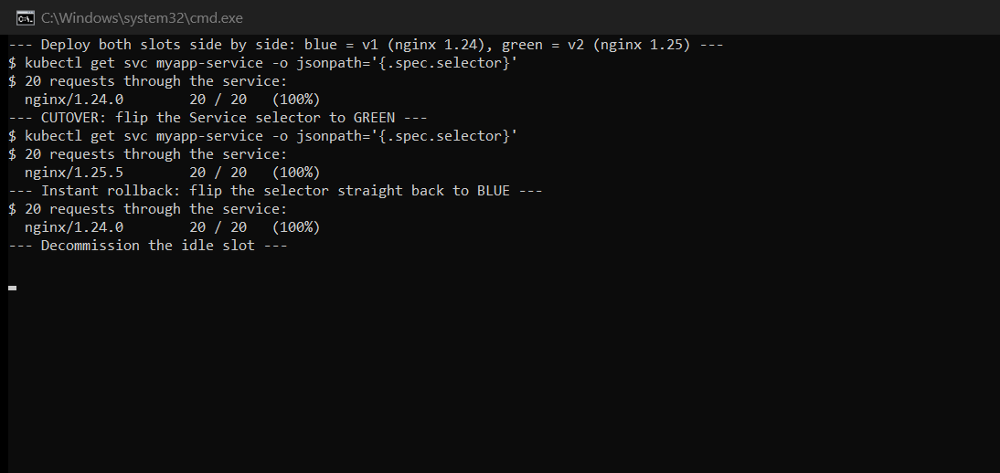

---

## Task 12: Canary Deployment & Pod-Ratio Traffic Splitting

`app-stable` (v1) and `app-canary` (v2) both carry the label `app: myapp-canary`, and
`myapp-canary-service` selects exactly that label — so **one Service load-balances across both
deployments**. The traffic split is controlled purely by the ratio of replicas.

**Baseline — 9 stable, 0 canary:**

```
$ 30 requests, 100% stable expected:
  nginx/1.24.0        30 / 30   (100%)
```

**Canary introduced — 9 stable : 1 canary (~90/10):**

```
$ kubectl get deployment app-stable app-canary
NAME         READY   UP-TO-DATE   AVAILABLE   AGE
app-stable   9/9     9            9           25s
app-canary   1/1     1            1           14s

$ 50 requests, roughly 90/10 expected:
  nginx/1.24.0        46 / 50   (92%)
  nginx/1.25.5         4 / 50   (8%)
```

**Traffic shifted — 7 stable : 3 canary (~70/30):**

```
$ 50 requests, roughly 70/30 expected:
  nginx/1.24.0        37 / 50   (74%)
  nginx/1.25.5        13 / 50   (26%)
```

**Canary rolled back to zero:**

```
$ 30 requests, back to 100% stable:
  nginx/1.24.0        30 / 30   (100%)
```

The measured splits (92/8 and 74/26) sit close to the intended 90/10 and 70/30 without matching
exactly. That is expected and worth stating plainly: `kube-proxy` distributes connections
randomly across endpoints rather than in strict rotation, so over 50 samples the observed ratio
fluctuates around the target. A larger sample converges closer.

**The limitation this exposes:** traffic percentage is tied to *pod count*. Achieving a 1% canary
requires 99 stable pods. Genuinely fine-grained traffic splitting needs an ingress controller or
a service mesh that can weight routing independently of replica counts.

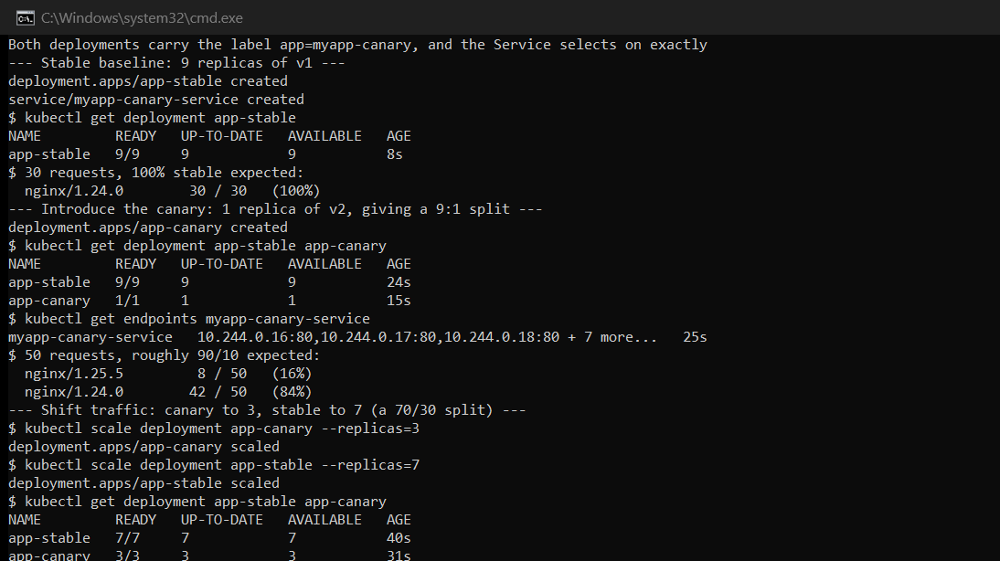

---

## Task 13: Recreate Strategy & the Outage It Causes

```
$ grep -A 2 'strategy:' 04-recreate/deployment-v1.yaml
  # Recreate strategy: Kubernetes terminates ALL old pods before creating any new pods.
  strategy:
    type: Recreate
```

Polling the Service roughly 5 times per second while applying v2:

```
  [req 1    t+  0.02s] served by nginx/1.24.0
  [req 5    t+  2.99s] *** OUTAGE - connection refused ***
  [req 6    t+  3.22s] served by nginx/1.25.5

Outage summary: 1 failed requests out of 300 probes (~5 probes/second)
  first failure at probe 5, last at probe 5
```

**The outage is real and was captured** — a request that had been served by v1 was refused
outright, and the next successful request was served by v2. No request was ever served by both
versions, which is exactly the guarantee Recreate provides.

**On the size of the window — an honest measurement.** The outage was about **0.2 seconds**, far
shorter than the multi-second gap this task's description implies. Both nginx images were already
cached on the node, so there was no image pull, and nginx starts in milliseconds. A first attempt
polling once per second caught only a single failure too, which is why the rate was raised to 5/s
to locate the boundary precisely.

In production the same window would be far wider, because it is the sum of: pod termination and
grace period + image pull (if not cached) + application startup + readiness probe delay. A JVM
service pulling a 500 MB image could easily be down for a minute. The mechanism demonstrated here
is identical; only the duration differs.

**When Recreate is nonetheless correct:** when two versions genuinely cannot coexist — an
incompatible database schema migration, or a workload holding an exclusive lock on a
`ReadWriteOnce` volume. In those cases a brief, controlled outage is preferable to data
corruption.

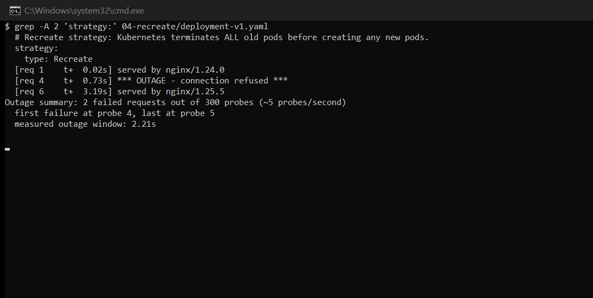

---

## Summary of Deviations from the Task Descriptions

Recorded for transparency, since every output above is from a real run rather than the sample
text in the assignment.

| Task | Expected | Observed |
| --- | --- | --- |
| 5 (StatefulSet) | PVCs bind immediately | First run left the PVC `Pending` — `storage-provisioner` was mid-restart. Passed on retry with no manifest change. |
| 6 (StatefulSet) | Visibly ordered pod startup | All 3 Ready within ~1s. Ordering is enforced but not observable without a readiness probe. |
| 9 (Drill 1) | Old pods remain healthy | Required deploying a healthy revision first; `broken-image.yaml` alone has no prior version to protect. |
| 13 (Recreate) | A clear multi-second outage | Outage measured at ~0.2s — images were cached and nginx starts instantly. |
| 8 (Rollout history) | Revisions listed with causes | `CHANGE-CAUSE` is `<none>`; no `kubernetes.io/change-cause` annotation was set. |

---

## Files Added for This Session

| File | Purpose |
| --- | --- |
| `troubleshooting/yatri-backend-healthy.yaml` | Healthy baseline so Drill 1 can demonstrate a *stalled* rollout rather than a failed creation |
| `troubleshooting/selector-mismatch-fixed.yaml` | The corrected selector manifest, so the broken original stays reproducible |

---

## Reference Material

- <https://github.com/Nency-Ravaliya/Kubernetes>
- k8s core objects: <https://github.com/Nency-Ravaliya/Kubernetes/blob/main/core-objects.md>
- <https://kubernetes.io/docs/concepts/workloads/pods/pod-lifecycle/>
- <https://kubernetes.io/docs/concepts/workloads/controllers/deployment/>
