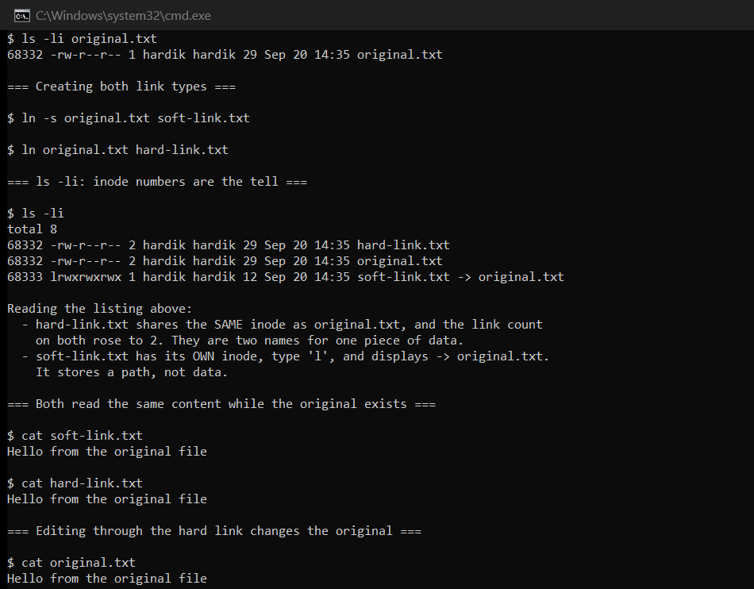
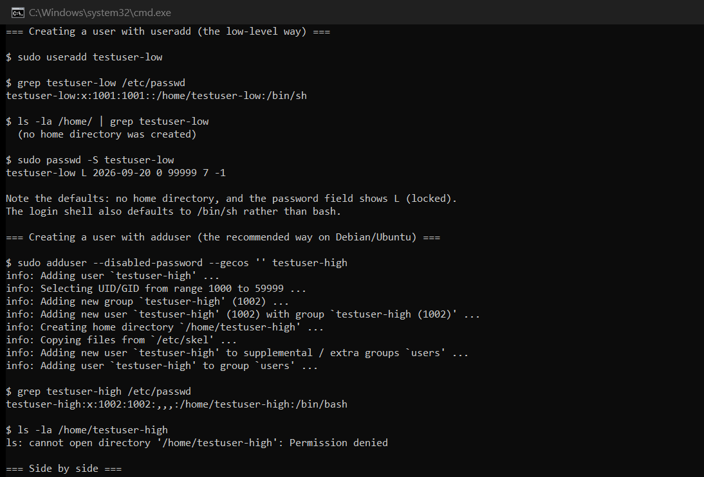
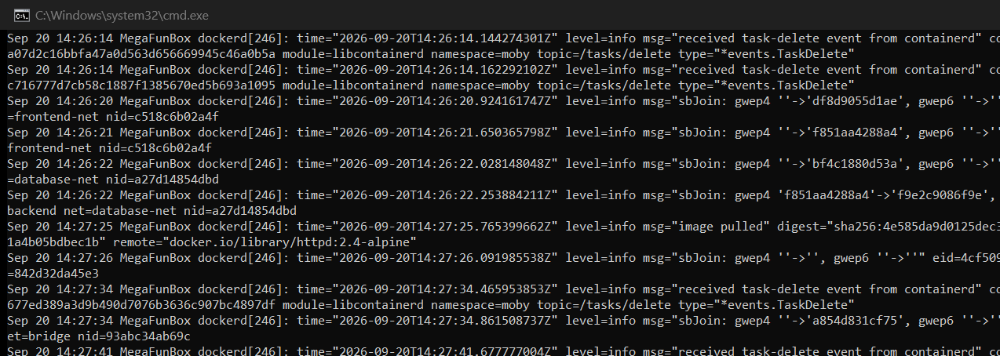
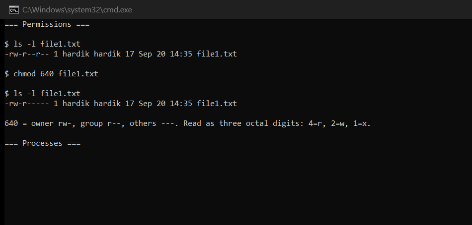

# Session 2: Linux Fundamentals

**Author:** Hardik Jumnani
**Roll Number:** 10025
**Email:** hardik.24bcs10025@sst.scaler.com
**Course:** SST DevOps & Cloud [SWE]
**Repository:** `devops-heros` / `session2-linux`

---

## Lab Environment

Every output block below is real terminal output from this machine.

| Component | Value |
| --- | --- |
| OS | Ubuntu 24.04 LTS on WSL2 |
| Kernel | 6.18.33.2-microsoft-standard-WSL2 |
| Init system | systemd (PID 1) |
| Shell | bash |

---

## Task 1: Soft Links & Hard Links

### Setup

```
$ cat original.txt
Hello from the original file

$ ls -li original.txt
68332 -rw-r--r-- 1 hardik hardik 29 Sep 20 14:13 original.txt
```

The leading number `68332` is the **inode** — the filesystem's actual identifier for the data.
A filename is just a directory entry pointing at an inode.

### Creating both

```
$ ln -s original.txt soft-link.txt      # soft (symbolic) link
$ ln original.txt hard-link.txt         # hard link
```

### The listing that explains everything

```
$ ls -li
total 8
68332 -rw-r--r-- 2 hardik hardik 29 Sep 20 14:13 hard-link.txt
68332 -rw-r--r-- 2 hardik hardik 29 Sep 20 14:13 original.txt
68333 lrwxrwxrwx 1 hardik hardik 12 Sep 20 14:13 soft-link.txt -> original.txt
```

Three things to read off this:

1. **`hard-link.txt` and `original.txt` share inode `68332`.** They are not copies — they are two
   names for the same data.
2. **The link count went from 1 to 2** (second column). The inode now knows two names refer to it.
3. **`soft-link.txt` has its own inode `68333`**, file type `l`, and its size is **12 bytes** —
   exactly the length of the string `original.txt`. A symlink stores a *path*, not data.

### Writing through the hard link

```
$ echo 'Appended via the hard link' >> hard-link.txt
$ cat original.txt
Hello from the original file
Appended via the hard link
```

Editing via either name changes the same underlying data.

### Deleting the original — where they diverge

```
$ rm original.txt

$ ls -li
total 4
68332 -rw-r--r-- 1 hardik hardik 56 Sep 20 14:13 hard-link.txt
68333 lrwxrwxrwx 1 hardik hardik 12 Sep 20 14:13 soft-link.txt -> original.txt

$ cat soft-link.txt
cat: soft-link.txt: No such file or directory
  exit code: 1

$ cat hard-link.txt
Hello from the original file
Appended via the hard link
```

**This is the whole difference.** The hard link still works — the link count simply dropped back
to 1, and data is only freed when it reaches **0**. The soft link is now **dangling**: it faithfully
points at the path `original.txt`, which no longer exists.

Note the symlink's own size stayed at 12 bytes — it never knew or cared what it pointed to.

### The limitations of hard links

```
$ ln /tmp/link-lab/hard-link.txt /dev/shm/cross-fs-link
ln: failed to create hard link '/dev/shm/cross-fs-link' => '/tmp/link-lab/hard-link.txt': Invalid cross-device link

$ ln /tmp/link-lab /tmp/dir-hard-link
ln: /tmp/link-lab: hard link not allowed for directory

$ ln -s /tmp/link-lab /tmp/dir-soft-link
lrwxrwxrwx 1 hardik hardik 13 Sep 20 14:13 /tmp/dir-soft-link -> /tmp/link-lab
```

Hard links **cannot cross filesystems** (inode numbers are only unique within one filesystem) and
**cannot target directories** (that would allow loops in the directory tree). Soft links do both
happily, because they only store a path string.

### Summary — the interview answer

| | **Hard link** | **Soft (symbolic) link** |
| --- | --- | --- |
| What it is | Another name for the same inode | A file containing a path |
| Inode | **Same** as the target | **Its own** |
| Survives target deletion | **Yes** | **No** — becomes dangling |
| Across filesystems | **No** | **Yes** |
| Can point to a directory | **No** | **Yes** |
| Size | Same as target | Length of the path string |
| Command | `ln target name` | `ln -s target name` |

**In one line:** a hard link is another *name* for the data; a soft link is a *pointer to a name*.



---

## Task 2: `adduser` vs `useradd`

### They are not the same kind of program

```
$ type useradd
useradd is /usr/sbin/useradd

$ type adduser
adduser is /usr/sbin/adduser
```

`useradd` is a **compiled binary** from the `shadow-utils` package — the low-level POSIX tool.
`adduser` is a **Perl script** that wraps `useradd` with Debian/Ubuntu-friendly defaults.

### Creating a user with `useradd`

```
$ sudo useradd testuser-low

$ grep testuser-low /etc/passwd
testuser-low:x:1001:1001::/home/testuser-low:/bin/sh

$ ls -la /home/ | grep testuser-low
  (no home directory was created)

$ sudo passwd -S testuser-low
testuser-low L 2026-09-20 0 99999 7 -1
```

Three problems, visible in that output:

- `/etc/passwd` **lists** `/home/testuser-low`, but the directory was never created
- The login shell defaulted to **`/bin/sh`**, not bash
- `passwd -S` reports **`L`** — the account is locked and cannot log in

### Creating a user with `adduser`

```
$ sudo adduser --disabled-password --gecos '' testuser-high
info: Adding user `testuser-high' ...
info: Adding new group `testuser-high' (1002) ...
info: Adding new user `testuser-high' (1002) with group `testuser-high (1002)' ...
info: Creating home directory `/home/testuser-high' ...
info: Adding new user `testuser-high' to supplemental / extra groups `users' ...
info: Adding user `testuser-high' to group `users' ...
```

Every step it narrates is one `useradd` did not do: it created a matching **group**, created and
populated the **home directory** from `/etc/skel`, and added the user to supplemental groups.

### Side by side

```
  useradd          testuser-low:x:1001:1001::/home/testuser-low:/bin/sh
  adduser          testuser-high:x:1002:1002:,,,:/home/testuser-high:/bin/bash
```

The difference is in the last two fields: a real home directory that exists, and `/bin/bash`
instead of `/bin/sh`.

### Which to use

**On Ubuntu/Debian, `adduser` is the recommended command for interactive use** — it produces a
usable account in one step, with the distribution's conventions applied.

**`useradd` is what you script against.** It is POSIX-standard and present on every Linux
distribution, and its behaviour does not vary between them. `adduser` is Debian-family-specific
and does not exist on RHEL/CentOS. Scripts that must be portable use `useradd` with explicit
flags:

```bash
useradd -m -s /bin/bash -G sudo username    # -m creates the home dir, -s sets the shell
```

### Cleanup

```
$ sudo userdel -r testuser-low
$ sudo deluser --remove-home testuser-high
info: Removing user `testuser-high' ...

$ grep -c 'testuser' /etc/passwd
0
```

Both test accounts removed.



---

## Task 3: `journalctl`

### What it is

`systemd` captures the stdout/stderr of every unit it starts, plus kernel messages, into a single
**structured binary journal**. `journalctl` is the query tool for that journal. It replaces
hunting through separate plain-text files under `/var/log`.

```
$ systemctl is-system-running
running
```

### Why these commands need `sudo`

```
$ id -nG
hardik sudo docker

$ journalctl -n 3 --no-pager    (as the normal user)
-- No entries --
```

An unprivileged account sees only its **own user journal** — which is empty here, hence
`-- No entries --`. Reading the *system* journal requires root, or membership of the
`systemd-journal` / `adm` group, which this account does not have. This is worth knowing because
the empty result looks like a broken journal rather than a permissions boundary.

```
$ sudo journalctl --disk-usage
Archived and active journals take up 235.3M in the file system.
```

### Logs for a specific service

```
$ sudo journalctl -u docker.service -n 12 --no-pager
Sep 20 14:18:47 MegaFunBox dockerd[246]: time="..." level=error msg="unexpected error getting ingest status of \"layer-sha256:6b37362b...\": context canceled" ...
Sep 20 14:18:50 MegaFunBox dockerd[246]: time="..." level=info msg="sbJoin: gwep4 ''->'3943125de272', gwep6 ''->''"
Sep 20 14:18:54 MegaFunBox dockerd[246]: 2026/09/20 14:18:54 http2: server: error reading preface from client @: read unix /run/docker.sock->@: read: connection reset by peer
Sep 20 14:18:57 MegaFunBox dockerd[246]: time="..." level=warning msg="healthcheck failed" actualDuration="272.396µs" ... timeout=15s
```

These are genuinely live entries — they were produced by the Docker image builds for Session 6/7
running at that moment.

### Filtering by priority

```
$ sudo journalctl -p warning -n 8 --no-pager
Sep 20 09:20:40 MegaFunBox systemd-journald[59]: File /var/log/journal/505a946ae9404973989f9eb8bf75f8e9/user-1000.journal corrupted or uncleanly shut down, renaming and replacing.
```

Priorities follow syslog levels: `emerg`, `alert`, `crit`, `err`, `warning`, `notice`, `info`,
`debug`. Passing one shows that level **and everything more severe**.

### Why "structured" matters

The journal is not text — each entry carries indexed metadata fields:

```
$ sudo journalctl -u docker.service -n 1 -o json-pretty --no-pager
{
    "_SYSTEMD_UNIT" : "docker.service",
    "PRIORITY" : "4",
    "_PID" : "246",
    "_COMM" : "dockerd",
    "MESSAGE" : "...",
    "_BOOT_ID" : "...",
    ...
}
```

Because unit, priority, PID and boot are **indexed fields** rather than text to be parsed,
filtering by them is fast and exact — no fragile `grep` patterns against log formats that change.

### The flags worth memorising

| Flag | Purpose |
| --- | --- |
| `-u <unit>` | One service only |
| `-f` | Follow live, like `tail -f` |
| `-n <count>` | Last N entries |
| `-p <priority>` | `err`, `warning`, `crit` … |
| `-b` | Current boot only (`-b -1` for the previous one) |
| `--since` / `--until` | Time window — accepts `"30 min ago"`, `"2026-09-20 10:00"` |
| `--no-pager` | Don't open `less` — essential in scripts |
| `--disk-usage` | How much space the journal occupies |
| `--vacuum-time=7d` | Delete entries older than 7 days |



---

## Task 4: Linux Command Cheat Sheet

Commands practised with real output.

### Navigation & inspection

```
$ pwd
/tmp/cheatsheet-lab

$ whoami
hardik

$ id
uid=1000(hardik) gid=1000(hardik) groups=1000(hardik),27(sudo),988(docker)

$ hostname
MegaFunBox

$ uname -a
Linux MegaFunBox 6.18.33.2-microsoft-standard-WSL2 #1 SMP ... x86_64 GNU/Linux
```

### Files & directories

| Command | Purpose |
| --- | --- |
| `ls -lah` | Long listing, all files, human-readable sizes |
| `ls -li` | Include inode numbers — used throughout Task 1 |
| `cp src dst` | Copy |
| `mv src dst` | Move **or** rename — the same operation |
| `mkdir -p a/b/c` | Create nested directories, no error if they exist |
| `rm -r` / `rm -f` | Recursive / force |
| `cat`, `head -n`, `tail -n` | Whole file / first N / last N lines |
| `wc -l` | Count lines |

```
$ wc -l /etc/passwd
38 /etc/passwd
```

### Searching

```
$ grep -c bash /etc/passwd
3

$ find /tmp/cheatsheet-lab -type f
/tmp/cheatsheet-lab/file1.txt
/tmp/cheatsheet-lab/renamed.txt

$ which bash
/usr/bin/bash
```

`grep` searches **inside** files; `find` searches **for** files by name, type, size or age;
`which` locates an executable on `$PATH`.

### Permissions

```
$ ls -l file1.txt
-rw-r--r-- 1 hardik hardik 17 Sep 20 14:13 file1.txt

$ chmod 640 file1.txt

$ ls -l file1.txt
-rw-r----- 1 hardik hardik 17 Sep 20 14:13 file1.txt
```

Read the mode as three octal digits — **owner, group, others** — where `4=read`, `2=write`,
`1=execute`, summed:

- `6` = 4+2 = `rw-`
- `4` = `r--`
- `0` = `---`

So `640` is owner read/write, group read-only, others nothing — visible in the change from
`-rw-r--r--` to `-rw-r-----`.

### Processes, disk and memory

```
$ ps aux | head -4          # every process, all users
$ top -bn1 | head -5        # live view; -bn1 makes it batch-mode and scriptable
$ df -h /                   # free space per filesystem
$ du -sh <dir>              # size of one directory tree
$ free -h                   # RAM and swap
```

`df` reports what the *filesystem* says is free; `du` adds up what *files* occupy. They disagree
when deleted files are still held open by a running process.

### Pipes & redirection

```
$ cat /etc/passwd | grep -c ':'
38

$ ls > listing.txt          # > truncates and writes
$ echo 'appended' >> listing.txt   # >> appends
```

| Operator | Effect |
| --- | --- |
| `\|` | Send stdout of one command into stdin of the next |
| `>` | Redirect stdout to a file, **overwriting** |
| `>>` | Redirect stdout to a file, **appending** |
| `2>` | Redirect stderr |
| `&>` | Redirect both stdout and stderr |

### Archiving

```
$ tar -czf archive.tar.gz file1.txt renamed.txt
$ ls -lh archive.tar.gz
-rw-r--r-- 1 hardik hardik 179 Sep 20 14:13 archive.tar.gz

$ tar -tzf archive.tar.gz
file1.txt
renamed.txt
```

Flags: `c`=create, `x`=extract, `t`=list, `z`=gzip, `f`=filename, `v`=verbose.



---

## Reference Material

- `basic-linux.pdf`, `ad-linux.pdf`, `Linux Networking Cheat Sheet.pdf` (in this folder)
- <https://man7.org/linux/man-pages/man1/ln.1.html>
- <https://man7.org/linux/man-pages/man8/useradd.8.html>
- <https://man7.org/linux/man-pages/man1/journalctl.1.html>
