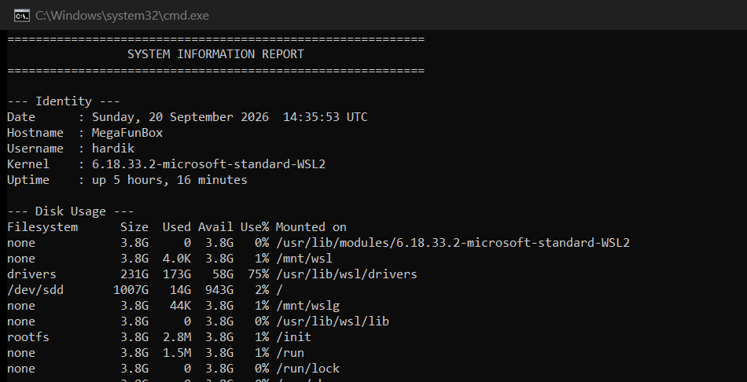
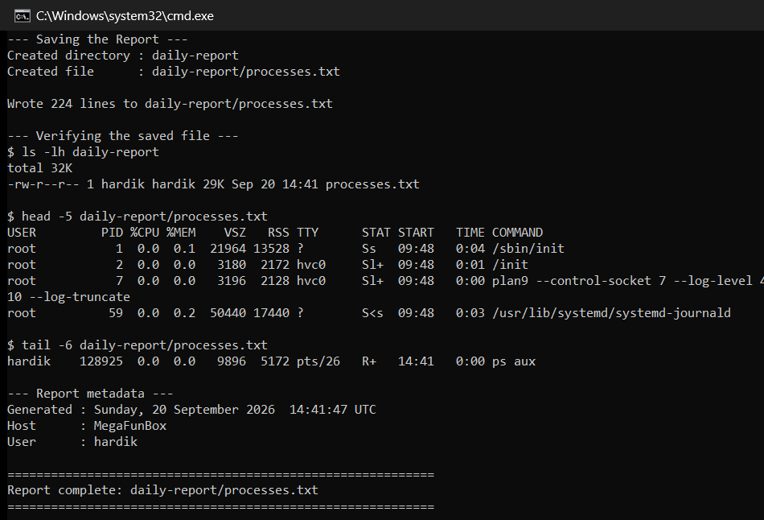

# Session 3: Shell Scripting

**Author:** Hardik Jumnani
**Roll Number:** 10025
**Email:** hardik.24bcs10025@sst.scaler.com
**Course:** SST DevOps & Cloud [SWE]
**Repository:** `devops-heros` / `session3-shell-scripting`

---

## Task: System Information Script

**Script:** [`system-info.sh`](./system-info.sh)

A script that reports system information, asks the user where to store a process snapshot,
and writes that snapshot to a file.

### Requirements coverage

| Requirement | Where it is met |
| --- | --- |
| Prints the current date | `CURRENT_DATE=$(date '+%A, %d %B %Y  %H:%M:%S %Z')` |
| Prints the hostname | `HOST_NAME=$(hostname)` |
| Prints the username | `USER_NAME=$(whoami)` |
| Prints the disk usage | `df -h` |
| Prints the running processes | `ps aux --sort=-%mem \| head -11` |
| Uses variables | `CURRENT_DATE`, `HOST_NAME`, `USER_NAME`, `ROOT_USAGE`, `REPORT_DIR`, … |
| Takes user input | `read -p "Enter a name for the report directory: " REPORT_DIR` |
| Creates a directory | `mkdir -p "$REPORT_DIR"` |
| Creates a file | `touch "$REPORT_FILE"` |
| `>` output redirection | `ps aux > "$REPORT_FILE"` |

---

## Running It

```bash
bash system-info.sh
```

The run below was driven non-interactively by piping the answer into `read -p`, so the
transcript is reproducible:

```bash
echo "daily-report" | bash system-info.sh
```

---

## Actual Output

```
===========================================================
                 SYSTEM INFORMATION REPORT
===========================================================

--- Identity ---
Date      : Sunday, 20 September 2026  14:14:02 UTC
Hostname  : MegaFunBox
Username  : hardik
Kernel    : 6.18.33.2-microsoft-standard-WSL2
Uptime    : up 4 hours, 55 minutes

--- Disk Usage ---
Filesystem      Size  Used Avail Use% Mounted on
none            3.8G     0  3.8G   0% /usr/lib/modules/6.18.33.2-microsoft-standard-WSL2
drivers         231G  169G   63G  73% /usr/lib/wsl/drivers
/dev/sdd       1007G   10G  946G   2% /
rootfs          3.8G  2.8M  3.8G   1% /init
C:\             231G  169G   63G  73% /mnt/c
D:\             245G   17G  228G   7% /mnt/d

Root filesystem is 2% full.

--- Top 10 Processes by Memory ---
USER         PID %CPU %MEM    VSZ   RSS TTY      STAT START   TIME COMMAND
root       63690  8.8  4.4 1625616 350348 ?      Ssl  13:40   3:00 kube-apiserver --advertise-address=192.168.49.2 ...
root       63697  3.3  1.5 1406672 122932 ?      Ssl  13:40   1:08 kube-controller-manager ...
root         246  0.2  1.3 3061388 104300 ?      Ssl  09:48   0:40 /usr/bin/dockerd -H fd:// --containerd=/run/containerd/containerd.sock
root       63227  4.1  1.2 2497008 98380 ?       Ssl  13:40   1:24 /var/lib/minikube/binaries/v1.37.0/kubelet ...
root       63654  4.7  1.2 11838436 95160 ?      Ssl  13:40   1:37 etcd --advertise-client-urls=https://192.168.49.2:2379 ...
root       63070  2.2  0.9 3188584 76832 ?       Ssl  13:39   0:45 /usr/bin/containerd
root       63661  1.2  0.8 1312592 65416 ?       Ssl  13:40   0:24 kube-scheduler ...
65532      64240  0.3  0.8 1335768 63196 ?       Ssl  13:40   0:06 /coredns -conf /etc/coredns/Corefile

Total running processes: 164

--- Saving the Report ---
Enter a name for the report directory: Created directory : daily-report
Created file      : daily-report/processes.txt

Wrote 166 lines to daily-report/processes.txt

--- Verifying the saved file ---
$ ls -lh daily-report
total 24K
-rw-r--r-- 1 hardik hardik 22K Sep 20 14:14 processes.txt

$ head -5 daily-report/processes.txt
USER         PID %CPU %MEM    VSZ   RSS TTY      STAT START   TIME COMMAND
root           1  0.0  0.1  21816 13280 ?        Ss   09:48   0:03 /sbin/init
root           2  0.0  0.0   3180  2208 hvc0     Sl+  09:48   0:01 /init
root           7  0.0  0.0   3196  2128 hvc0     Sl+  09:48   0:00 plan9 --control-socket 7 --log-level 4 ...
root          59  0.0  0.2  50440 16904 ?        S<s  09:48   0:02 /usr/lib/systemd/systemd-journald

$ tail -6 daily-report/processes.txt
hardik    117303  0.0  0.0   9724  5140 pts/2    R+   14:14   0:00 ps aux

--- Report metadata ---
Generated : Sunday, 20 September 2026  14:14:02 UTC
Host      : MegaFunBox
User      : hardik

===========================================================
Report complete: daily-report/processes.txt
===========================================================
```

---

## Screenshots





---

## Notes on the Implementation

### Variables capture once, not on every use

```bash
CURRENT_DATE=$(date '+%A, %d %B %Y  %H:%M:%S %Z')
```

`$( )` is **command substitution** — it runs the command and stores the result. Because the
value is captured once at the top, the timestamp printed in the report header and the one
written into the file footer are guaranteed identical. Calling `date` twice could straddle a
second boundary and produce two different values.

### Handling empty input

```bash
read -p "Enter a name for the report directory: " REPORT_DIR

if [ -z "$REPORT_DIR" ]; then
    REPORT_DIR="system-report-$(date +%Y%m%d-%H%M%S)"
    echo "No name entered - defaulting to: $REPORT_DIR"
fi
```

`-z` tests for an empty string. Without this, pressing Enter would make `mkdir ""` fail and the
script would continue into a broken state.

### `>` versus `>>`

```bash
ps aux > "$REPORT_FILE"      # truncates, then writes

{
    echo ""
    echo "--- Report metadata ---"
    echo "Generated : $CURRENT_DATE"
} >> "$REPORT_FILE"          # appends
```

A single `>` **truncates the file first**. Using `>` for the footer would have wiped the process
list that was just written. Grouping the footer `echo`s in `{ ... }` lets one `>>` apply to all of
them, rather than repeating the redirect on each line.

### Quoting every variable

`"$REPORT_DIR"` is quoted throughout. Unquoted, a directory name containing a space would be
split into multiple arguments — `mkdir -p my report` would silently create two directories named
`my` and `report`.

### `mkdir -p` and `touch`

`-p` creates parent directories as needed and, importantly, **does not error if the directory
already exists** — so re-running the script is safe.

`touch` creates the file empty if it does not exist and updates its timestamp if it does. Strictly
the `>` redirect would have created the file anyway; `touch` is used because the task asks for it
and it makes the intent explicit.

---

## Commands Demonstrated

| Command | Purpose in the script |
| --- | --- |
| `date` | Timestamp, and a unique suffix for the fallback directory name |
| `hostname` | Machine name |
| `whoami` | Current user |
| `uname -r` | Kernel release |
| `uptime -p` | Uptime in human-readable form |
| `df -h` | Disk usage per filesystem |
| `ps aux` | All running processes |
| `read -p` | Prompt for user input |
| `mkdir -p` | Create the report directory |
| `touch` | Create the report file |
| `echo` | All console output |
| `wc -l` | Count lines written |
| `awk` | Extract the use-percentage column from `df` |
| `>` / `>>` | Write / append to the report file |
