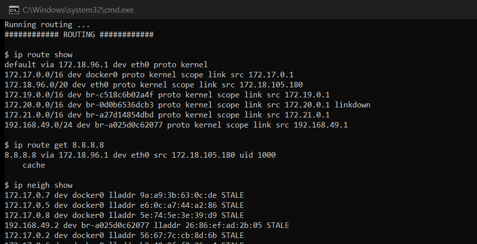
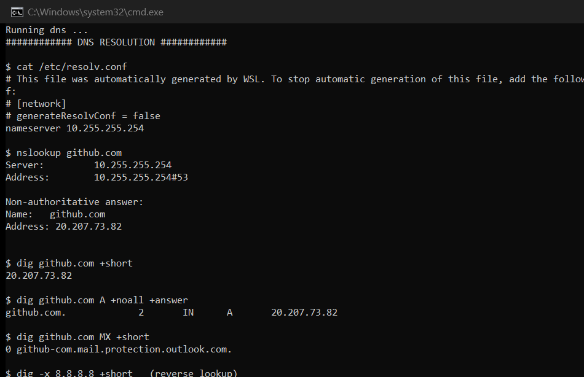
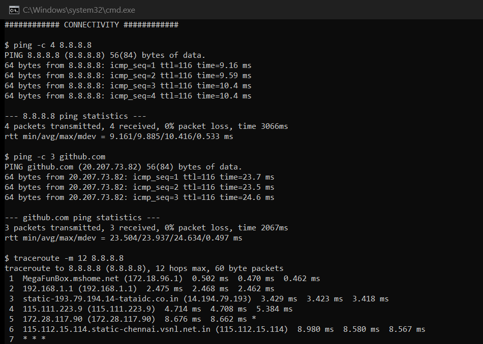
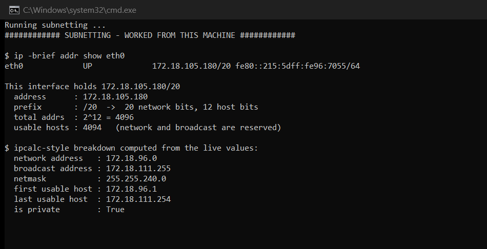

# Session 4: Networking Fundamentals

**Author:** Hardik Jumnani
**Roll Number:** 10025
**Email:** hardik.24bcs10025@sst.scaler.com
**Course:** SST DevOps & Cloud [SWE]
**Repository:** `devops-heros` / `session4-networking`

---

## Lab Environment

Every output block is real output from this machine.

| Component | Value |
| --- | --- |
| OS | Ubuntu 24.04 LTS on WSL2 |
| Primary interface | `eth0` — `172.18.105.180/20` |
| Default gateway | `172.18.96.1` |
| DNS resolver | `10.255.255.254` |

---

## 1. Interfaces & Addresses

### `ip addr show`

```
$ ip addr show
1: lo: <LOOPBACK,UP,LOWER_UP> mtu 65536 qdisc noqueue state UNKNOWN group default qlen 1000
    link/loopback 00:00:00:00:00:00 brd 00:00:00:00:00:00
    inet 127.0.0.1/8 scope host lo
    inet 10.255.255.254/32 brd 10.255.255.254 scope global lo
2: eth0: <BROADCAST,MULTICAST,UP,LOWER_UP> mtu 1280 qdisc mq state UP group default qlen 1000
    link/ether 00:15:5d:96:70:55 brd ff:ff:ff:ff:ff:ff
    inet 172.18.105.180/20 brd 172.18.111.255 scope global eth0
    inet6 fe80::215:5dff:fe96:7055/64 scope link
3: docker0: <NO-CARRIER,BROADCAST,MULTICAST,UP> mtu 1500 qdisc noqueue state DOWN group default
    link/ether b6:f5:56:fe:39:a5 brd ff:ff:ff:ff:ff:ff
    inet 172.17.0.1/16 brd 172.17.255.255 scope global docker0
4: br-a025d0c62077: <BROADCAST,MULTICAST,UP,LOWER_UP> mtu 1500 qdisc noqueue state UP group default
    link/ether 8a:c2:7e:ce:5e:ce brd ff:ff:ff:ff:ff:ff
    inet 192.168.49.1/24 brd 192.168.49.255 scope global br-a025d0c62077
45: vethfb460b7@if2: <BROADCAST,MULTICAST,UP,LOWER_UP> mtu 1500 qdisc noqueue master br-a025d0c62077 state UP
```

**What I understood:** `ip addr` lists every network interface and the addresses bound to it.
Reading this machine's output:

- **`lo`** — the loopback. Traffic to `127.0.0.1` never leaves the host.
- **`eth0`** — the real interface, holding `172.18.105.180/20`. `link/ether` is the MAC address
  (Layer 2); `inet` is the IP (Layer 3). Note the **MTU of 1280**, lower than the usual 1500
  because this is a WSL2 virtual NIC.
- **`docker0`** — Docker's default bridge. It shows `NO-CARRIER ... state DOWN` because no
  container is currently attached to the *default* bridge.
- **`br-a025d0c62077`** — a user-defined bridge, `UP` and carrying traffic. This is the
  `minikube` network from the Kubernetes sessions.
- **`vethfb460b7@if2`** — a **veth pair**, one end in the host, the other inside a container.
  `master br-a025d0c62077` shows which bridge it is plugged into. This is literally how a
  container gets attached to a network.

`inet6 fe80::/64` addresses are **link-local** — auto-generated, valid only on the directly
attached segment, never routed.

---

## 2. Routing

```
$ ip route show
default via 172.18.96.1 dev eth0 proto kernel
172.17.0.0/16 dev docker0 proto kernel scope link src 172.17.0.1 linkdown
172.18.96.0/20 dev eth0 proto kernel scope link src 172.18.105.180
192.168.49.0/24 dev br-a025d0c62077 proto kernel scope link src 192.168.49.1
```

**What I understood:** The routing table tells the kernel which interface to send a packet out of.
It is evaluated **most-specific-prefix first**, with `default` as the last resort.

- Anything inside `172.18.96.0/20` is **directly reachable** on `eth0` — no router needed.
- Anything inside `192.168.49.0/24` goes to the minikube bridge. This is exactly why
  `192.168.49.2` was reachable from WSL in Session 11 but not from a Docker Desktop host on
  macOS/Windows — there, this route does not exist.
- Everything else goes **via `172.18.96.1`**, the default gateway.

```
$ ip route get 8.8.8.8
8.8.8.8 via 172.18.96.1 dev eth0 src 172.18.105.180 uid 1000
    cache
```

`ip route get` asks the kernel to *decide* a route without sending anything — it names the
gateway, the interface and the source address it would use. Far more precise than reading the
table by eye.

```
$ ip neigh show
192.168.49.2 dev br-a025d0c62077 lladdr 26:86:ef:ad:2b:05 STALE
192.168.49.3 dev br-a025d0c62077 lladdr 9a:24:42:61:90:8a STALE
172.18.96.1 dev eth0 lladdr 00:15:5d:94:5c:cc REACHABLE
```

This is the **ARP cache** — the IP→MAC mapping table, the bridge between Layer 3 and Layer 2.
The gateway is `REACHABLE` (recently confirmed); the two minikube nodes are `STALE` (the entry is
still valid but not recently verified).

---



---

## 3. DNS Resolution

```
$ cat /etc/resolv.conf
# This file was automatically generated by WSL...
nameserver 10.255.255.254

$ nslookup github.com
Server:		10.255.255.254
Address:	10.255.255.254#53

Non-authoritative answer:
Name:	github.com
Address: 20.207.73.82
```

**What I understood:** `/etc/resolv.conf` names the resolver to ask. *Non-authoritative* means
this answer came from a cache, not from the domain's own authoritative nameserver.

```
$ dig github.com +short
20.207.73.82

$ dig github.com A +noall +answer
github.com.		6	IN	A	20.207.73.82

$ dig github.com MX +short
0 github-com.mail.protection.outlook.com.

$ dig -x 8.8.8.8 +short
dns.google.
```

`dig` is the more precise tool — it can query specific record types and shows the **TTL**. The
`6` above is seconds remaining before the cached record expires, which is why a second query a
moment later can return a different value.

| Record | Purpose |
| --- | --- |
| `A` | Hostname → IPv4 |
| `AAAA` | Hostname → IPv6 |
| `MX` | Mail servers (the `0` is priority — lower wins) |
| `CNAME` | Alias to another name |
| `PTR` | Reverse: IP → hostname (`dig -x`) |

The MX result is worth noting: GitHub's mail is handled by **Outlook**, which reveals that DNS
answers describe *delegation*, not ownership.

---



---

## 4. Connectivity Testing

```
$ ping -c 4 8.8.8.8
64 bytes from 8.8.8.8: icmp_seq=1 ttl=116 time=10.5 ms
64 bytes from 8.8.8.8: icmp_seq=2 ttl=116 time=11.2 ms
64 bytes from 8.8.8.8: icmp_seq=3 ttl=116 time=10.7 ms
64 bytes from 8.8.8.8: icmp_seq=4 ttl=116 time=23.5 ms

--- 8.8.8.8 ping statistics ---
4 packets transmitted, 4 received, 0% packet loss, time 3102ms
rtt min/avg/max/mdev = 10.525/13.994/23.547/5.520 ms
```

**What I understood:** `ping` sends ICMP echo requests. The useful fields:

- **`time`** — round-trip latency. The jump to 23.5 ms on the fourth packet is ordinary jitter.
- **`ttl=116`** — Time To Live, decremented by each router. Google's default is 128, so
  `128 − 116 = 12` routers were crossed.
- **`0% packet loss`** — the headline number. Loss matters far more than latency for diagnosis.

```
$ ping -c 3 github.com
PING github.com (20.207.73.82) 56(84) bytes of data.
rtt min/avg/max/mdev = 21.146/21.598/21.902/0.325 ms
```

Pinging a **name** tests DNS *and* connectivity together. If this fails but `ping 8.8.8.8` works,
the fault is DNS, not the network.

### traceroute — seeing the path

```
$ traceroute -m 12 8.8.8.8
traceroute to 8.8.8.8 (8.8.8.8), 12 hops max, 60 byte packets
 1  MegaFunBox.mshome.net (172.18.96.1)  3.662 ms  0.424 ms  0.418 ms
 2  192.168.1.1 (192.168.1.1)  8.169 ms  8.163 ms  8.158 ms
 3  static-193.79.194.14-tataidc.co.in (14.194.79.193)  8.113 ms  5.365 ms  5.337 ms
 4  115.111.223.9 (115.111.223.9)  5.389 ms *  5.379 ms
 5  172.28.117.90 (172.28.117.90)  12.030 ms  12.016 ms  12.001 ms
 6  115.112.15.114.static-chennai.vsnl.net.in (115.112.15.114)  11.777 ms  11.743 ms  11.718 ms
 7  * * *
 8  dns.google (8.8.8.8)  10.146 ms  10.140 ms  10.135 ms
```

**What I understood:** `traceroute` sends packets with deliberately increasing TTLs. Each router
that decrements TTL to zero replies with "time exceeded", revealing itself. The real path here:

1. The WSL virtual gateway
2. The home router (`192.168.1.1`)
3. **Tata IDC** — the ISP's edge
4–6. ISP backbone, routing through **Chennai**
7. `* * *` — a router that **does not reply to ICMP**. This is normal and does not mean a
   problem; many routers deprioritise or drop ICMP.
8. Destination reached

Three timings per hop because three probes are sent. Latency does **not** increase monotonically
(hop 5 is 12 ms, hop 8 is 10 ms) — each figure is the round trip *to that hop*, and routers
often deprioritise replies to probes while forwarding real traffic quickly.

---



---

## 5. Ports & Sockets

```
$ ss -tuln | head
Netid  State   Recv-Q  Send-Q   Local Address:Port    Peer Address:Port
tcp    LISTEN  0       4096     127.0.0.1:32776       0.0.0.0:*
tcp    LISTEN  0       4096     0.0.0.0:3006          0.0.0.0:*
```

**What I understood:** `ss` lists sockets. Flags: `-t` TCP, `-u` UDP, `-l` listening only,
`-n` numeric (skip DNS lookups, so it returns instantly).

The **Local Address** matters more than it looks:

- `127.0.0.1:32776` — bound to loopback only, **unreachable from other machines**
- `0.0.0.0:3006` — bound to all interfaces, reachable from the network

That distinction is the single most common cause of "it works locally but not remotely".

```
$ nc -zv github.com 443
Connection to github.com (20.207.73.82) 443 port [tcp/https] succeeded!

$ nc -zv github.com 23
  (no output - the connection did not succeed)
```

`nc -z` tests whether a port accepts a TCP connection without sending data. Port 443 is open;
port 23 (telnet) is not. This distinguishes **"host unreachable"** from **"host is up but that
service is not listening"** — `ping` cannot tell them apart.

`netstat` shows the same information; `ss` is its faster modern replacement.

---

## 6. HTTP

```
$ curl -sI https://github.com | head -8
HTTP/2 200
date: Sun, 20 Sep 2026 14:15:42 GMT
content-type: text/html; charset=utf-8
content-language: en-US
etag: W/"559a743be4725efeb04ed6e17011144b"
cache-control: max-age=0, private, must-revalidate
strict-transport-security: max-age=31536000; includeSubdomains; preload
```

**What I understood:** `-I` requests headers only (a `HEAD` request). Notable:

- **`HTTP/2`** — negotiated over TLS via ALPN
- **`strict-transport-security`** — HSTS; the browser will refuse plain HTTP to this domain for
  a year
- **`etag`** / **`cache-control`** — caching validators

```
$ curl -s -o /dev/null -w 'code=%{http_code} ip=%{remote_ip} time=%{time_total}s\n' https://github.com
code=200 ip=20.207.73.82 time=0.243490s
```

`-w` extracts specific fields, which makes `curl` scriptable for monitoring — status code,
resolved IP and total time in one line.

---

## 7. Subnetting — Worked From This Machine's Address

```
$ ip -brief addr show eth0
eth0             UP             172.18.105.180/20 fe80::215:5dff:fe96:7055/64
```

Taking the live value `172.18.105.180/20`:

| Property | Value | How |
| --- | --- | --- |
| Address | `172.18.105.180` | — |
| Prefix | `/20` | 20 network bits |
| Host bits | **12** | 32 − 20 |
| Total addresses | **4096** | 2¹² |
| Usable hosts | **4094** | 2¹² − 2 |
| Netmask | `255.255.240.0` | 20 ones, then zeros |
| Network address | `172.18.96.0` | First address in the block |
| Broadcast address | `172.18.111.255` | Last address in the block |
| First usable host | `172.18.96.1` | Network + 1 |
| Last usable host | `172.18.111.254` | Broadcast − 1 |
| Private range | **Yes** | Inside `172.16.0.0/12` |

Computed against the live interface:

```
  network address   : 172.18.96.0
  broadcast address : 172.18.111.255
  netmask           : 255.255.240.0
  first usable host : 172.18.96.1
  last usable host  : 172.18.111.254
  is private        : True
```

**Why 2ⁿ − 2:** two addresses in every subnet are reserved — the **network address** (all host
bits 0) identifies the subnet itself, and the **broadcast address** (all host bits 1) reaches
every host on it. Neither can be assigned to a machine.

**Why the third octet is 96 and not 105:** a `/20` means the mask covers 20 bits — the first two
octets plus the top 4 bits of the third. `105` in binary is `01101001`; masking to the top 4 bits
gives `0110 0000` = **96**. The block therefore spans `172.18.96.0` – `172.18.111.255`, which is
exactly what the routing table showed earlier as `172.18.96.0/20`.



### Address classes (legacy) and private ranges

| Class | First octet | Default mask | Notes |
| --- | --- | --- | --- |
| A | 1–126 | `255.0.0.0` (/8) | 127 reserved for loopback |
| B | 128–191 | `255.255.0.0` (/16) | |
| C | 192–223 | `255.255.255.0` (/24) | |
| D | 224–239 | — | Multicast |
| E | 240–255 | — | Experimental |

Classes are historical. Modern networking uses **CIDR**, where the prefix length is explicit and
arbitrary — which is how this machine gets a `/20`, a size no class provides.

**Private ranges** (RFC 1918), not routable on the public internet:

| Range | CIDR | Seen on this machine |
| --- | --- | --- |
| `10.0.0.0` – `10.255.255.255` | `10.0.0.0/8` | `10.255.255.254` (WSL resolver) |
| `172.16.0.0` – `172.31.255.255` | `172.16.0.0/12` | `172.18.105.180` (eth0), `172.17.0.1` (docker0) |
| `192.168.0.0` – `192.168.255.255` | `192.168.0.0/16` | `192.168.49.1` (minikube bridge), `192.168.1.1` (home router) |

All three private ranges appear on this one machine — which is exactly why NAT exists, and why
the traceroute above crosses from `172.18.x` through `192.168.1.1` before reaching public
addresses.

---

## Command Summary

| Command | Purpose |
| --- | --- |
| `ip addr show` | Interfaces and their addresses |
| `ip -brief addr` | Condensed one-line-per-interface view |
| `ip route show` | Routing table |
| `ip route get <ip>` | Which route the kernel *would* use |
| `ip neigh show` | ARP cache (IP → MAC) |
| `ping -c N <host>` | Reachability and latency |
| `traceroute <host>` | The router path to a destination |
| `nslookup` / `dig` | DNS resolution; `dig` is more precise |
| `dig -x <ip>` | Reverse DNS |
| `ss -tuln` | Listening sockets |
| `nc -zv host port` | Test whether one TCP port is open |
| `curl -sI <url>` | HTTP response headers |
| `curl -w` | Extract specific timing/status fields |

---

## Reference Material

- [`ip.md`](./ip.md) — session notes on IP addressing and subnetting
- [`resources.md`](./resources.md) — linked repositories
- <https://man7.org/linux/man-pages/man8/ip.8.html>
- <https://datatracker.ietf.org/doc/html/rfc1918>
