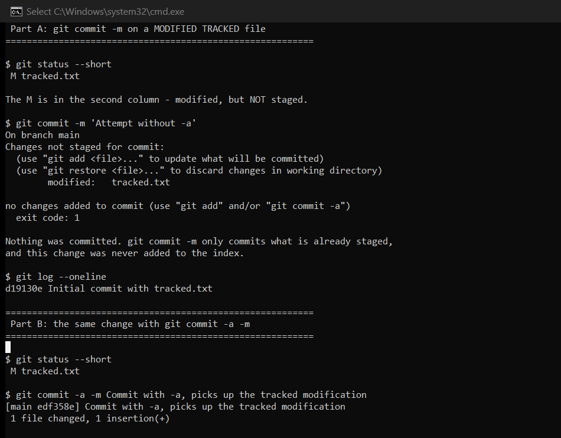
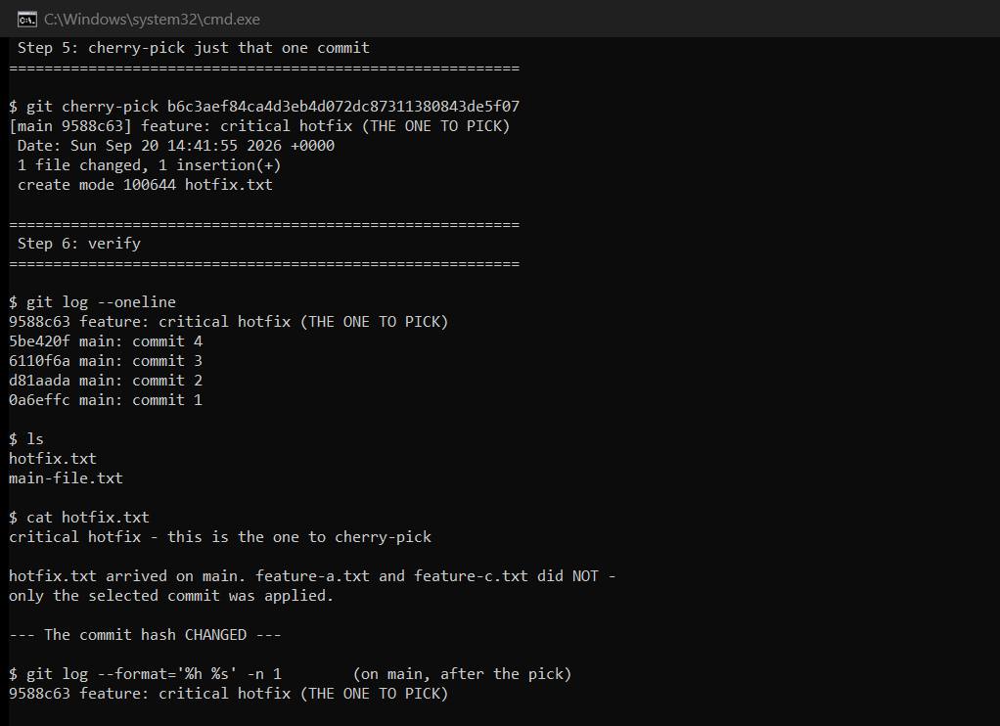

# Session 5: Git & GitHub

**Author:** Hardik Jumnani
**Roll Number:** 10025
**Email:** hardik.24bcs10025@sst.scaler.com
**Course:** SST DevOps & Cloud [SWE]
**Repository:** `devops-heros` / `session5-git-github`

---

## Lab Environment

All commands were run in a throwaway repository under `/tmp/git-lab`, so nothing here touched
this submission repo. Every output block is real terminal output.

| Component | Value |
| --- | --- |
| git | 2.55.0 |
| OS | Ubuntu 24.04 LTS on WSL2 |

---

## Task 1: `git commit -a -m` vs `git commit -m`

### The three states a file can be in

Understanding this task requires the three-area model:

```
   Working Directory  ──git add──▶  Staging Area (Index)  ──git commit──▶  Repository
    (your edits)                      (what will be                        (permanent
                                       committed)                           history)
```

`git commit` only ever packages **what is in the staging area**. The `-a` flag changes what gets
put there first.

### Part A — `git commit -m` on a modified tracked file

```
$ git log --oneline
f12f45d Initial commit with tracked.txt

$ git status --short
 M tracked.txt
```

The `M` is in the **second column**, meaning *modified in the working directory but not staged*.
(First column = staged changes, second = unstaged.)

```
$ git commit -m 'Attempt without -a'
no changes added to commit (use "git add" and/or "git commit -a")

$ git log --oneline
f12f45d Initial commit with tracked.txt
```

**Nothing was committed.** The history is unchanged. The edit existed on disk but was never
staged, and `git commit -m` commits only the index. Git's own error message names both fixes.

### Part B — the identical change with `-a`

```
$ git status --short
 M tracked.txt

$ git commit -a -m "Commit with -a, picks up the tracked modification"
 1 file changed, 1 insertion(+)

$ git log --oneline
8cc3b10 Commit with -a, picks up the tracked modification
f12f45d Initial commit with tracked.txt
```

Committed successfully, with **no `git add` at all**. `-a` automatically staged the modification
and then committed it in one step.

### Part C — the limit of `-a`: it ignores untracked files

This is the part that catches people out.

```
$ git status --short
 M tracked.txt
?? untracked.txt
```

Two different markers:

- `M` — `tracked.txt` is modified, and git already tracks it
- `??` — `untracked.txt` is a file git has **never seen**

```
$ git commit -a -m "Second -a commit"
 1 file changed, 1 insertion(+)

$ git status --short
?? untracked.txt
```

**Only 1 file changed.** `tracked.txt` was committed; `untracked.txt` was left behind and is
still untracked.

```
$ git add untracked.txt
$ git commit -m "Explicitly add the untracked file"
 1 file changed, 1 insertion(+)

$ git status --short
        (clean)

$ git log --oneline
9a5e344 Explicitly add the untracked file
5623d7a Second -a commit
8cc3b10 Commit with -a, picks up the tracked modification
f12f45d Initial commit with tracked.txt
```

### Summary

| | `git commit -m` | `git commit -a -m` |
| --- | --- | --- |
| Commits staged changes | Yes | Yes |
| Auto-stages **modified** tracked files | No | **Yes** |
| Auto-stages **deleted** tracked files | No | **Yes** |
| Auto-stages **untracked** (new) files | No | **No** |
| Requires `git add` first | Yes | Only for new files |

**`-a` is not "commit everything".** It means *stage changes to files git already tracks, then
commit*. A brand-new file always requires an explicit `git add`.

**Why this matters in practice:** habitually using `git commit -a -m` feels efficient, but it
commits **every** modified tracked file — including debug edits in unrelated files you had
forgotten about. Staging deliberately with `git add` keeps commits focused, which is what makes
a history reviewable and `git revert` useful.

---



---

## Task 2: Git Cherry-Pick

### Step 1 — four commits on `main`

```
$ git log --oneline
f39a8a5 main: commit 4
6957e52 main: commit 3
874a015 main: commit 2
6e9509f main: commit 1
```

### Step 2 — a feature branch with three commits

```
$ git checkout -b feature
Switched to a new branch 'feature'

$ git log --oneline
<hash> feature: add feature-c (NOT wanted on main)
<hash> feature: critical hotfix (THE ONE TO PICK)
<hash> feature: add feature-a (NOT wanted on main)
f39a8a5 main: commit 4
6957e52 main: commit 3
874a015 main: commit 2
6e9509f main: commit 1
```

The scenario: the middle commit is an urgent fix that must reach `main` **now**, while the other
two are unfinished feature work that must not.

### Step 3 — identify the commit

```
$ git log --oneline --grep='critical hotfix'
09d2db0 feature: critical hotfix (THE ONE TO PICK)

$ git show --stat 09d2db0
commit 09d2db0...
    feature: critical hotfix (THE ONE TO PICK)

 hotfix.txt | 1 +
 1 file changed, 1 insertion(+)
```

`--grep` searches commit messages. `git show --stat` confirms exactly what the commit touches
before it gets applied elsewhere.

### Step 4 — back on `main`, which does not have it

```
$ git checkout main
$ git log --oneline
f39a8a5 main: commit 4
6957e52 main: commit 3
874a015 main: commit 2
6e9509f main: commit 1

$ ls
main-file.txt
```

None of the feature files exist here.

### Step 5 — cherry-pick just that commit

```
$ git cherry-pick 09d2db0
[main 21ab5f5] feature: critical hotfix (THE ONE TO PICK)
 Date: Sun Sep 20 14:16:00 2026 +0000
 1 file changed, 1 insertion(+)
 create mode 100644 hotfix.txt
```

### Step 6 — verify

```
$ git log --oneline
21ab5f5 feature: critical hotfix (THE ONE TO PICK)
f39a8a5 main: commit 4
6957e52 main: commit 3
874a015 main: commit 2
6e9509f main: commit 1

$ ls
hotfix.txt
main-file.txt

$ cat hotfix.txt
critical hotfix - this is the one to cherry-pick
```

**`hotfix.txt` is on `main`. `feature-a.txt` and `feature-c.txt` are not.** Exactly one commit
crossed over.

### The hash changed — and that is the important detail

```
$ git log --format='%h %s' -n 1                                      # on main, after the pick
21ab5f5 feature: critical hotfix (THE ONE TO PICK)

$ git log --format='%h %s' feature --grep='critical hotfix' -n 1     # the original
09d2db0 feature: critical hotfix (THE ONE TO PICK)
```

**`09d2db0` → `21ab5f5`.** Same message, same file, same content — different commit.

Cherry-pick does not *move* a commit. It takes the **diff** that commit introduced and replays it
as a brand-new commit on the current branch. A commit's hash is derived from its content **and
its parent**, so a different parent necessarily produces a different hash.

Practical consequence: if the `feature` branch is later merged into `main`, git sees two distinct
commits carrying identical changes. It usually resolves this cleanly, but it can surface as a
conflict — which is why cherry-picking is for genuine exceptions (urgent hotfixes, backporting to
a release branch) rather than a routine alternative to merging.

### Both branches side by side

```
$ git log --oneline --graph --all
* 21ab5f5 (HEAD -> main) feature: critical hotfix (THE ONE TO PICK)
| * <hash> (feature) feature: add feature-c (NOT wanted on main)
| * 09d2db0 feature: critical hotfix (THE ONE TO PICK)
| * <hash> feature: add feature-a (NOT wanted on main)
|/
* f39a8a5 main: commit 4
* 6957e52 main: commit 3
* 874a015 main: commit 2
* 6e9509f main: commit 1
```

The graph shows the divergence plainly: both branches now carry the hotfix, as **two separate
commits**, while the other feature work stays on `feature` alone.



### Cherry-pick vs merge vs rebase

| | What it does | History shape |
| --- | --- | --- |
| **cherry-pick** | Replays **selected** commits | New commits, new hashes |
| **merge** | Combines **all** commits from a branch | Preserves history, adds a merge commit |
| **rebase** | Replays **all** commits onto a new base | Linear history, all hashes change |

**Useful flags:**

| Flag | Effect |
| --- | --- |
| `-n` / `--no-commit` | Apply the changes but leave them staged, so you can edit first |
| `-x` | Append "cherry picked from commit …" to the message — good for auditability |
| `A^..B` | Pick a **range** of commits |
| `--continue` / `--abort` | Resume or back out after resolving a conflict |

---

## Commands Demonstrated

| Command | Purpose |
| --- | --- |
| `git init -b main` | New repository with `main` as the default branch |
| `git add <file>` | Stage a change |
| `git commit -m` | Commit staged changes only |
| `git commit -a -m` | Auto-stage modified/deleted tracked files, then commit |
| `git status --short` | Compact state view — column 1 staged, column 2 unstaged |
| `git log --oneline` | Condensed history |
| `git log --grep=` | Search commit messages |
| `git log --graph --all` | Visualise branch topology |
| `git show --stat` | What a commit changed |
| `git checkout -b` | Create and switch to a branch |
| `git cherry-pick <hash>` | Replay one commit onto the current branch |

---

## Reference Material

- [`resources.md`](./resources.md)
- <https://git-scm.com/docs/git-cherry-pick>
- <https://git-scm.com/docs/git-commit>
