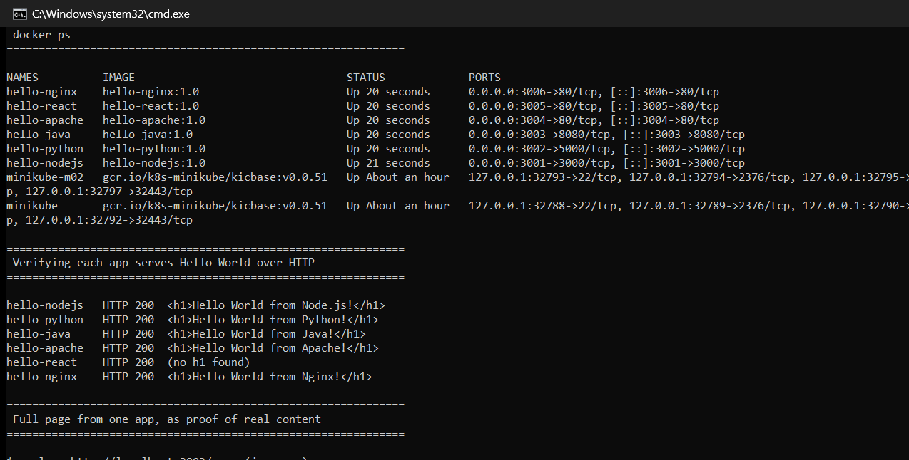
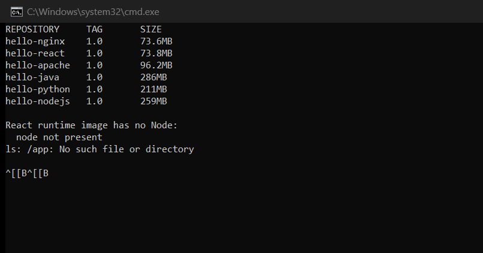

# Sessions 6–7: Docker Fundamentals

**Author:** Hardik Jumnani
**Roll Number:** 10025
**Email:** hardik.24bcs10025@sst.scaler.com
**Course:** SST DevOps & Cloud [SWE]
**Repository:** `devops-heros` / `session6-7-docker`

> **Docker Images / multi-stage build** is documented separately in
> [`multi-stage-dockerfile/README.md`](./multi-stage-dockerfile/README.md).

---

## Lab Environment

Every output block is real output from this machine.

| Component | Value |
| --- | --- |
| Docker Engine | 29.8.1 |
| Host | Ubuntu 24.04 LTS on WSL2 |

---

## Task: Hello World Applications

Six containerised web applications, one per required folder.

| Folder | Stack | Base image | Host port |
| --- | --- | --- | --- |
| [`nodejs-app`](./nodejs-app) | Node.js + Express | `node:24-alpine` | 3001 |
| [`python-app`](./python-app) | Python + Flask | `python:3.11-slim` | 3002 |
| [`java-app`](./java-app) | Java, JDK HTTP server | `eclipse-temurin:21` | 3003 |
| [`Apache-app`](./Apache-app) | Apache httpd | `httpd:2.4-alpine` | 3004 |
| [`React-app`](./React-app) | React + Vite → nginx | `node:24` → `nginx:1.27` | 3005 |
| [`nginx-app`](./nginx-app) | Static site | `nginx:1.27-alpine` | 3006 |

---

## Building

```bash
docker build -t hello-nodejs:1.0 ./nodejs-app
docker build -t hello-python:1.0 ./python-app
docker build -t hello-java:1.0   ./java-app
docker build -t hello-apache:1.0 ./Apache-app
docker build -t hello-react:1.0  ./React-app
docker build -t hello-nginx:1.0  ./nginx-app
```

All six built with **no errors**.

---

## Running

```bash
docker run -d --name hello-nodejs -p 3001:3000 hello-nodejs:1.0
docker run -d --name hello-python -p 3002:5000 hello-python:1.0
docker run -d --name hello-java   -p 3003:8080 hello-java:1.0
docker run -d --name hello-apache -p 3004:80   hello-apache:1.0
docker run -d --name hello-react  -p 3005:80   hello-react:1.0
docker run -d --name hello-nginx  -p 3006:80   hello-nginx:1.0
```

### `docker ps`

```
NAMES          IMAGE              STATUS          PORTS
hello-nginx    hello-nginx:1.0    Up 20 seconds   0.0.0.0:3006->80/tcp, [::]:3006->80/tcp
hello-react    hello-react:1.0    Up 20 seconds   0.0.0.0:3005->80/tcp, [::]:3005->80/tcp
hello-apache   hello-apache:1.0   Up 20 seconds   0.0.0.0:3004->80/tcp, [::]:3004->80/tcp
hello-java     hello-java:1.0     Up 21 seconds   0.0.0.0:3003->8080/tcp, [::]:3003->8080/tcp
hello-python   hello-python:1.0   Up 21 seconds   0.0.0.0:3002->5000/tcp, [::]:3002->5000/tcp
hello-nodejs   hello-nodejs:1.0   Up 21 seconds   0.0.0.0:3001->3000/tcp, [::]:3001->3000/tcp
```

Note that the **container port differs per stack** (3000, 5000, 8080, 80) while the host ports
are chosen to avoid collisions. `-p host:container` is what decouples them — the application
inside never needs to know which host port it was published on.

---

## Verification — Hello World over HTTP

```
hello-nodejs   HTTP 200  <h1>Hello World from Node.js!</h1>
hello-python   HTTP 200  <h1>Hello World from Python!</h1>
hello-java     HTTP 200  <h1>Hello World from Java!</h1>
hello-apache   HTTP 200  <h1>Hello World from Apache!</h1>
hello-react    HTTP 200  (no h1 found)
hello-nginx    HTTP 200  <h1>Hello World from Nginx!</h1>
```

A full page, to show the responses are real:

```
$ curl -s http://localhost:3003/     (java-app)
<!DOCTYPE html>
<html>
  <head><title>Java on Docker</title></head>
  <body style="font-family: sans-serif; text-align: center; padding-top: 3rem;">
    <h1>Hello World from Java!</h1>
    <p>Served by the JDK HTTP server inside a Docker container.</p>
    <p>Hostname: 0f3e06f60398</p>
  </body>
</html>
```

The hostname `0f3e06f60398` is the container ID — proof this was served from inside the
container rather than from the host.



### Why React shows no `<h1>`

All six return **HTTP 200**, but React is a single-page app: it renders in the browser, so the
served HTML contains only a mount point.

```
$ curl -s http://localhost:3005/
<!DOCTYPE html>
<html lang="en">
  <head>
    <title>React on Docker</title>
    <script type="module" crossorigin src="/assets/index-BWDauUZ9.js"></script>
  </head>
  <body>
    <div id="root"></div>
  </body>
</html>
```

The heading is created by JavaScript after the bundle loads. Confirming the content is genuinely
there by fetching the bundle:

```
$ curl -s http://localhost:3005/assets/index-BWDauUZ9.js | grep -o 'Hello World from React'
Hello World from React
```

In a browser the page renders **Hello World from React!** normally. `curl` simply does not
execute JavaScript — this is a property of SPAs, not a fault in the container.

---

## Image Sizes — and What They Show

```
REPOSITORY     TAG    SIZE
hello-nginx    1.0    73.6MB
hello-react    1.0    73.8MB
hello-apache   1.0    96.2MB
hello-java     1.0    286MB
hello-python   1.0    211MB
hello-nodejs   1.0    259MB
```

The interesting comparison is **`hello-react` (73.8 MB) against `hello-nodejs` (259 MB)** —
React is by far the heavier application, yet its image is **72% smaller**.

The reason is the multi-stage build. React's Dockerfile uses Node only to *compile*, then copies
just the built assets into an nginx image:

```dockerfile
# ---- Stage 1: build the static bundle ----
FROM node:24-alpine AS builder
WORKDIR /app
COPY package*.json ./
RUN npm install
COPY . .
RUN npm run build

# ---- Stage 2: serve the built assets ----
FROM nginx:1.27-alpine
COPY --from=builder /app/dist /usr/share/nginx/html
```

Proof that Node and `node_modules` are genuinely absent from the runtime image:

```
$ docker exec hello-react ls /app
ls: /app: No such file or directory

$ docker exec hello-react which node
  node is not installed in the runtime image

$ docker exec hello-react ls -R /usr/share/nginx/html
/usr/share/nginx/html:
50x.html
assets
index.html

/usr/share/nginx/html/assets:
index-BWDauUZ9.js
```

`java-app` uses the same technique — the JDK compiles, but the runtime image ships only a JRE, so
the compiler is not present in production.



---

## Notes on the Dockerfiles

### Layer caching — why manifests are copied first

```dockerfile
COPY package*.json ./
RUN npm install --omit=dev
COPY server.js ./
```

Each instruction produces a cached layer, invalidated only when its inputs change. Copying
`package.json` **before** the source means editing `server.js` does not invalidate the
`npm install` layer, so rebuilds skip dependency resolution entirely. Reversing these two lines
would re-run `npm install` on every source edit.

### Corrections made to `python-app`

The original `python-app` in this repository would not have satisfied the task:

```dockerfile
# original
FROM python:3.11-slim
RUN apt update && apt install -y pip3 python3   # already present in the base image
COPY requirements.txt .                          # this file did not exist -> build failure
CMD ["python", "app.py"]
```

…and `app.py` was a single `print("Hello World from Docker!")`, which exits immediately and
serves no webpage, whereas the task requires **Hello World displayed on a webpage**.

Both were fixed: `app.py` is now a Flask HTTP service, `requirements.txt` exists, and the
redundant `apt install` (which re-installed Python into a Python image) was removed.

### Why `java-app` avoids a build tool

A Spring Boot application would require Maven or Gradle to resolve dependencies on every build.
Using `com.sun.net.httpserver` from the JDK keeps the build to a single `javac` invocation with
no network dependency resolution — and still demonstrates a real compiled-language container.

### Base image choice

`-alpine` variants are used where available. `nginx:1.27-alpine` is **73.6 MB** against roughly
190 MB for the Debian-based tag. `python:3.11-slim` is used rather than Alpine because Python
wheels are built against glibc; Alpine uses musl, which forces packages to compile from source.

---

## Command Summary

| Command | Purpose |
| --- | --- |
| `docker build -t name:tag ./dir` | Build an image from a Dockerfile |
| `docker run -d --name n -p h:c img` | Run detached, with a published port |
| `docker ps` | Running containers |
| `docker ps -a` | Including stopped ones |
| `docker images` | Local images |
| `docker exec <c> <cmd>` | Run a command inside a running container |
| `docker logs <c>` | Container stdout/stderr |
| `docker rm -f <c>` | Force-remove a container |
| `docker history ` | Per-layer size breakdown |

---

## Reference Material

- `docker-basic-cmd.pdf`, `docker-advance-cmd.pdf`, `docker-interview-qa.pdf` (this folder)
- [`docker.md`](./docker.md)
- <https://docs.docker.com/build/building/multi-stage/>
