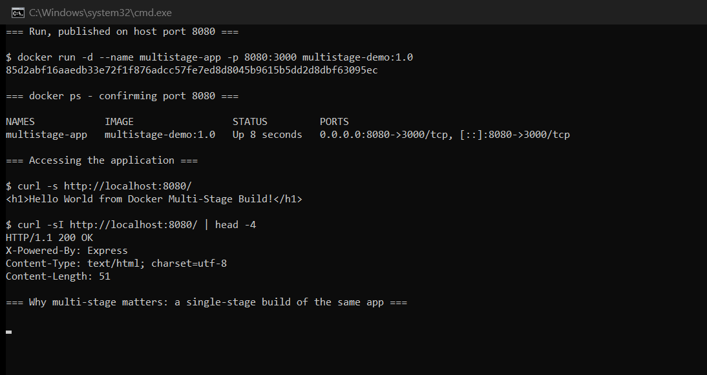

# Docker Images & Multi-Stage Builds

**Author:** Hardik Jumnani
**Enrollment / Roll Number:** 10025
**Email:** hardik.24bcs10025@sst.scaler.com
**Course:** SST DevOps & Cloud [SWE]
**Repository:** `devops-heros` / `session6-7-docker/multi-stage-dockerfile`

---

## Lab Environment

Every output block is real output from this machine.

| Component | Value |
| --- | --- |
| Docker Engine | 29.8.1 |
| Host | Ubuntu 24.04 LTS on WSL2 |

---

## Task 1: Run the Multi-Stage Dockerfile

### The Dockerfile

```dockerfile
# -------------------------
# Stage 1: Build
# -------------------------
FROM node:24-alpine AS builder
WORKDIR /app
COPY package*.json ./
RUN npm install
COPY . .

# -------------------------
# Stage 2: Production
# -------------------------
FROM node:24-alpine AS production
WORKDIR /app
COPY --from=builder /app/package*.json ./
RUN npm install --omit=dev
COPY --from=builder /app/server.js ./
EXPOSE 3000
CMD ["npm", "start"]
```

Two `FROM` lines means two stages. Only the **last** stage becomes the final image; the `builder`
stage is discarded once the build finishes. `COPY --from=builder` is what reaches back into the
earlier stage to retrieve specific artifacts.

### Build

```
$ docker build -t multistage-demo:1.0 ./multi-stage-dockerfile
...
#13 naming to docker.io/library/multistage-demo:1.0 done
```

### Run on port 8080

```
$ docker run -d --name multistage-app -p 8080:3000 multistage-demo:1.0
```

### `docker ps` — confirming port 8080

```
NAMES            IMAGE                 STATUS         PORTS
multistage-app   multistage-demo:1.0   Up 8 seconds   0.0.0.0:8080->3000/tcp, [::]:8080->3000/tcp
```

The application listens on **3000 inside the container**, published to **8080 on the host**.
`-p 8080:3000` maps between them, so the requirement to reach it on 8080 is met without editing
the application.

### Accessing the application

```
$ curl -s http://localhost:8080/
<h1>Hello World from Docker Multi-Stage Build!</h1>

$ curl -sI http://localhost:8080/ | head -4
HTTP/1.1 200 OK
X-Powered-By: Express
Content-Type: text/html; charset=utf-8
```

The expected message is returned, with **HTTP 200**. `X-Powered-By: Express` confirms it is the
Node application answering rather than a proxy.

---

## Task 2: Documentation

| Field | Value |
| --- | --- |
| **Name** | Hardik Jumnani |
| **Enrollment number** | 10025 |
| **Application output** | `<h1>Hello World from Docker Multi-Stage Build!</h1>` (HTTP 200) |
| **Port** | Host `8080` → container `3000`, confirmed in `docker ps` |
| **Image** | `multistage-demo:1.0` |



> The command output above is the primary evidence; the screenshot mirrors it.

---

## Comparing Against a Single-Stage Build

To measure what the second stage actually saves, the same application was built single-stage:

```dockerfile
FROM node:24-alpine
WORKDIR /app
COPY package*.json ./
RUN npm install
COPY . .
EXPOSE 3000
CMD ["npm", "start"]
```

```
REPOSITORY          TAG    SIZE
multistage-demo     1.0    253MB
singlestage-demo    1.0    259MB
```

**Only 6 MB saved — about 2%.** That is an honest and useful result, not a good advertisement for
multi-stage builds, and it is worth explaining rather than hiding.

### Why the saving is small here

Both stages use the **same base image** (`node:24-alpine`), and the application's only dependency
is Express. The second stage therefore re-installs almost exactly what the first stage had; the
6 MB is just the dev-dependency tree and npm cache that `--omit=dev` skips.

Multi-stage builds pay off when the **build toolchain is genuinely different from the runtime**:

| Case | Build stage needs | Runtime needs | Saving |
| --- | --- | --- | --- |
| This Node app | Node + all deps | Node + prod deps | **6 MB (2%)** |
| React (`../React-app`) | Node + 200 MB `node_modules` | nginx + static files | **185 MB (72%)** |
| Java (`../java-app`) | JDK (compiler) | JRE only | ~90 MB |
| Go | Full Go toolchain | A single static binary | ~300 MB |

The React app in this repository is the honest demonstration — **73.8 MB against 259 MB** for the
much simpler Node app, because its runtime image contains no Node at all:

```
$ docker exec hello-react which node
  node is not installed in the runtime image
```

### The layers of the multi-stage image

```
$ docker history multistage-demo:1.0 --format 'table {{.Size}}\t{{.CreatedBy}}' | head
SIZE      CREATED BY
0B        CMD ["npm" "start"]
0B        EXPOSE map[3000/tcp:{}]
1.1kB     COPY /app/server.js ./ # buildkit
3.6MB     RUN /bin/sh -c npm install --omit=dev # buildkit
...
```

`COPY` and `RUN` create sized layers; metadata instructions such as `CMD`, `EXPOSE`, `ENV` and
`WORKDIR` contribute **0 B** — they only write to the image manifest.

### The security angle, which matters more than size

A single-stage image ships the **entire build environment** into production: compilers, package
managers, dev dependencies and often source code and build-time secrets. Every one of those is
attack surface that serves no runtime purpose.

Multi-stage guarantees that only what you explicitly `COPY --from` reaches the final image — so a
leaked `.npmrc` token or a compiler in the build stage simply does not exist in production.

---

## Task 3: Deploying Three Application Types

Three different runtimes, each containerised and verified — Node.js, Python and Java. Full
detail is in [`../README.md`](../README.md).

```
NAMES          IMAGE              STATUS          PORTS
hello-java     hello-java:1.0     Up 21 seconds   0.0.0.0:3003->8080/tcp
hello-python   hello-python:1.0   Up 21 seconds   0.0.0.0:3002->5000/tcp
hello-nodejs   hello-nodejs:1.0   Up 21 seconds   0.0.0.0:3001->3000/tcp
```

Verified over HTTP:

```
hello-nodejs   HTTP 200  <h1>Hello World from Node.js!</h1>
hello-python   HTTP 200  <h1>Hello World from Python!</h1>
hello-java     HTTP 200  <h1>Hello World from Java!</h1>
```

| Runtime | Base image | Size | Notes |
| --- | --- | --- | --- |
| Node.js | `node:24-alpine` | 259 MB | Express, `npm install --omit=dev` |
| Python | `python:3.11-slim` | 211 MB | Flask; slim over Alpine so wheels install pre-built |
| Java | `eclipse-temurin:21` | 286 MB | **Multi-stage**: JDK compiles, JRE runs |

The Java image is the second real multi-stage example here:

```dockerfile
# ---- Stage 1: compile ----
FROM eclipse-temurin:21-jdk-alpine AS builder
WORKDIR /build
COPY HelloWorld.java .
RUN javac HelloWorld.java

# ---- Stage 2: run on a JRE only ----
FROM eclipse-temurin:21-jre-alpine
WORKDIR /app
COPY --from=builder /build/HelloWorld.class .
EXPOSE 8080
CMD ["java", "HelloWorld"]
```

Only the compiled `.class` file crosses the stage boundary. The `.java` source and `javac` never
reach the runtime image.

---

## Summary

| Requirement | Status |
| --- | --- |
| Build the multi-stage image | Done — `multistage-demo:1.0` |
| Run a container from it | Done — `multistage-app` |
| Access the application | Done — HTTP 200 |
| Displays the expected message | Done — `Hello World from Docker Multi-Stage Build!` |
| Verify with `docker ps` | Done |
| Running on port 8080 | Done — `0.0.0.0:8080->3000/tcp` |
| `.md` with name and enrollment number | This file |
| Deploy 3 application types | Done — Node.js, Python, Java |

**The measured finding:** multi-stage saved only 2% on this particular app, because both stages
share a base image and the dependency tree is trivial. It saved **72%** on the React app, where
the build toolchain and the runtime genuinely differ. Multi-stage is worth reaching for when
those two environments diverge — not automatically.

---

## Reference Material

- <https://docs.docker.com/build/building/multi-stage/>
- <https://docs.docker.com/develop/develop-images/dockerfile_best-practices/>
