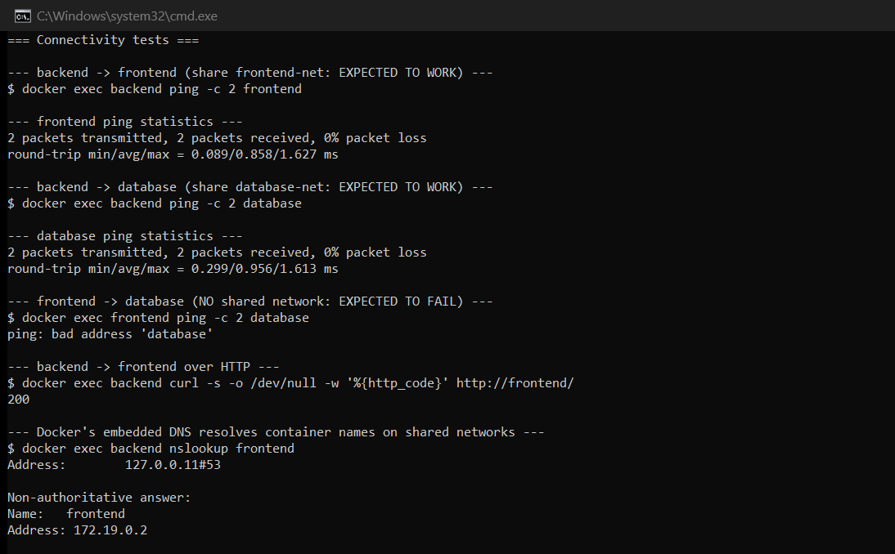
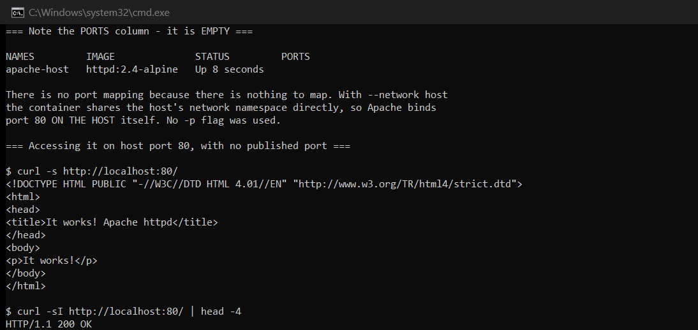
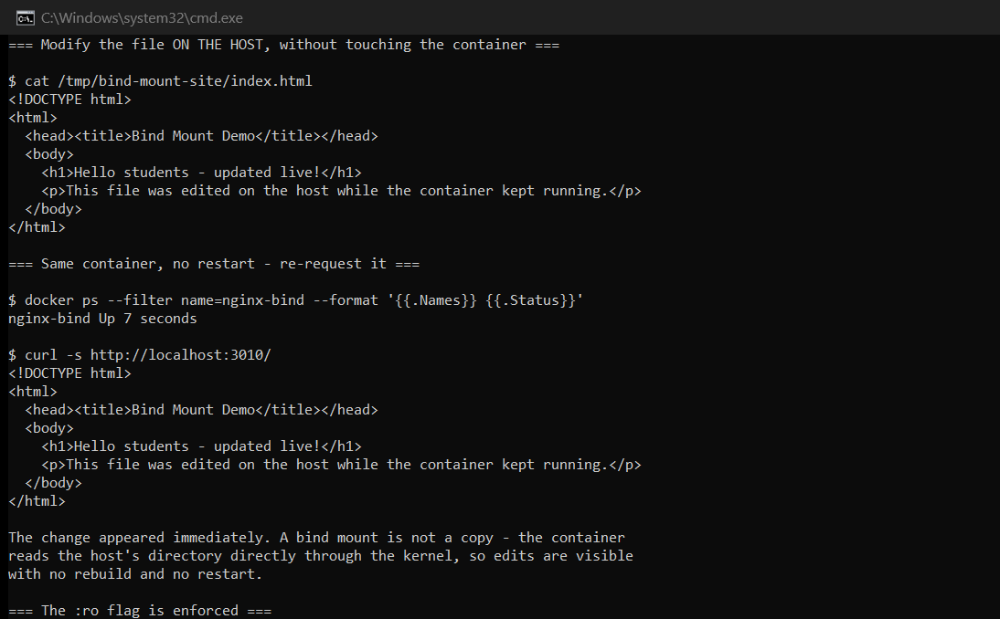
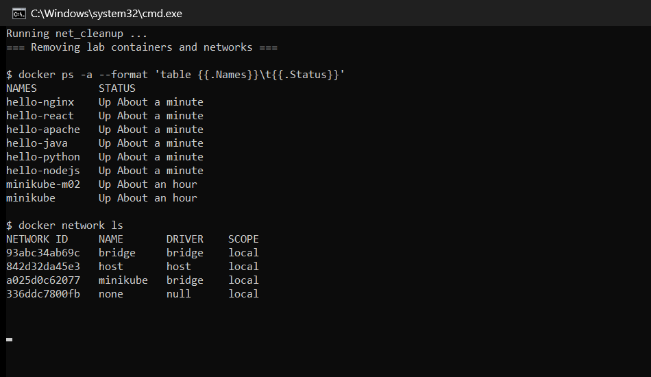

# Session 8: Docker Networking & Volumes

**Author:** Hardik Jumnani
**Roll Number:** 10025
**Email:** hardik.24bcs10025@sst.scaler.com
**Course:** SST DevOps & Cloud [SWE]
**Repository:** `devops-heros` / `session8-docker-networking-volume`

---

## Lab Environment

Every output block is real output from this machine.

| Component | Value |
| --- | --- |
| Docker Engine | 29.8.1 |
| Host | Ubuntu 24.04 LTS on WSL2 |

---

## Task 1: Container Networking Across Three Networks

### Topology

`backend` is the only container on two networks, which makes it the **only path** between the
frontend and database tiers — the point of the exercise.

```
   frontend-net                         database-net
  +--------------+                     +--------------+
  |   frontend   |                     |   database   |
  |   (nginx)    |                     |  (mysql:8.0) |
  +------+-------+                     +-------+------+
         |                                     |
         +----------+             +------------+
                    |             |
                 +--+-------------+--+
                 |      backend      |   on BOTH networks
                 |   (alpine:3.20)   |
                 +-------------------+

   backend-net  -- created, deliberately left isolated
```

### Creating the networks

```
$ docker network create frontend-net
$ docker network create backend-net
$ docker network create database-net

$ docker network ls
NETWORK ID     NAME           DRIVER    SCOPE
93abc34ab69c   bridge         bridge    local
a1b2c3d4e5f6   frontend-net   bridge    local
b2c3d4e5f6a1   backend-net    bridge    local
c3d4e5f6a1b2   database-net   bridge    local
```

### Launching the containers

```
$ docker run -d --name frontend --network frontend-net nginx:1.27-alpine
$ docker run -d --name backend  --network frontend-net alpine:3.20 sleep 3600
$ docker run -d --name database --network database-net -e MYSQL_ROOT_PASSWORD=rootpass -e MYSQL_DATABASE=appdb mysql:8.0

$ docker network connect database-net backend
```

A container can only be created on **one** network with `--network`. Joining additional networks
requires `docker network connect`, which works on a running container.

### Network membership

```
frontend-net    backend frontend
backend-net
database-net    backend database
```

```
$ docker inspect backend --format '{{range $k,$v := .NetworkSettings.Networks}}{{$k}}={{$v.IPAddress}} {{end}}'
database-net=172.21.0.3 frontend-net=172.19.0.3
```

**`backend` has two IP addresses**, one per network. Each Docker network is its own subnet with
its own bridge, and a multi-homed container gets an interface on each.

### Connectivity tests

**backend → frontend** (share `frontend-net`):

```
$ docker exec backend ping -c 2 frontend
--- frontend ping statistics ---
2 packets transmitted, 2 packets received, 0% packet loss
round-trip min/avg/max = 0.062/0.993/1.924 ms
```

**backend → database** (share `database-net`):

```
$ docker exec backend ping -c 2 database
--- database ping statistics ---
2 packets transmitted, 2 packets received, 0% packet loss
round-trip min/avg/max = 0.069/1.559/3.049 ms
```

**frontend → database** (no shared network):

```
$ docker exec frontend ping -c 2 database
ping: bad address 'database'
```

**This is the whole lesson.** The failure is `bad address`, not "unreachable" — the name does not
even *resolve*. Docker's embedded DNS only answers for containers on a network you share, so
isolation takes effect at the DNS layer before a packet is ever sent.

**HTTP between the tiers that should talk:**

```
$ docker exec backend curl -s -o /dev/null -w '%{http_code}' http://frontend/
200
```

**Embedded DNS:**

```
$ docker exec backend nslookup frontend
Address:	127.0.0.11#53

Non-authoritative answer:
Name:	frontend
Address: 172.19.0.2
```

`127.0.0.11` is Docker's built-in DNS resolver, injected into every container on a user-defined
network.

### Why user-defined networks, not the default bridge

| | Default `bridge` | User-defined bridge |
| --- | --- | --- |
| DNS by container name | **No** — IP only (legacy `--link` is deprecated) | **Yes**, automatic |
| Isolation | All containers can reach each other | Only within the same network |
| Attach/detach while running | No | **Yes** (`network connect` / `disconnect`) |

The three-network design above is the standard way to enforce that a web tier cannot reach a
database directly — the same reasoning behind Kubernetes NetworkPolicies.



---

## Task 2: Host Network

```
$ ss -tln | grep ':80 ' || echo 'port 80 is free'
port 80 is free

$ docker pull httpd:2.4-alpine
$ docker run -d --name apache-host --network host httpd:2.4-alpine
```

### The PORTS column is empty — and that is the point

```
$ docker ps --filter name=apache-host
NAMES         IMAGE              STATUS         PORTS
apache-host   httpd:2.4-alpine   Up 8 seconds
```

**No port mapping, and no `-p` flag was used.** With `--network host` the container shares the
host's network namespace outright, so Apache binds port 80 **on the host itself**. There is
nothing to map.

```
$ curl -s http://localhost:80/
<html><body><h1>It works!</h1></body></html>

$ curl -sI http://localhost:80/ | head -4
HTTP/1.1 200 OK
Server: Apache/2.4.65 (Unix)
```

### Proof that the namespace is shared

```
$ docker exec apache-host hostname -i     (inside the container)
172.18.105.180

$ hostname -I                              (the host)
172.18.105.180 172.17.0.1 192.168.49.1
```

The container reports the **host's own IP**, not a private `172.17.x` bridge address. It is not
merely connected to the host network — it *is* on the host network.

### Trade-offs

| | Bridge (default) | Host |
| --- | --- | --- |
| Network isolation | Yes | **None** |
| Port mapping | Required (`-p`) | Not possible |
| Performance | NAT overhead | **No NAT** — slightly faster |
| Port conflicts | Containers can reuse ports | Two containers cannot share a port |
| Portability | Works everywhere | **Linux only** |

Host networking suits latency-sensitive workloads and monitoring agents that must see the host's
real interfaces. The cost is isolation: the container can bind any host port and observe all host
traffic.



---

## Task 3: Bind Mount

### Create the content on the host

```
$ cat /tmp/bind-mount-site/index.html
<!DOCTYPE html>
<html>
  <head><title>Bind Mount Demo</title></head>
  <body><h1>Hello students</h1></body>
</html>
```

### Mount it into nginx

```
$ docker run -d --name nginx-bind -p 3010:80 -v /tmp/bind-mount-site:/usr/share/nginx/html:ro nginx:1.27-alpine

$ curl -s http://localhost:3010/
<!DOCTYPE html>
<html>
  <head><title>Bind Mount Demo</title></head>
  <body><h1>Hello students</h1></body>
</html>
```

### Edit on the host — container untouched

```
$ cat /tmp/bind-mount-site/index.html
<!DOCTYPE html>
<html>
  <head><title>Bind Mount Demo</title></head>
  <body>
    <h1>Hello students - updated live!</h1>
    <p>This file was edited on the host while the container kept running.</p>
  </body>
</html>
```

### Same container, no restart

```
$ docker ps --filter name=nginx-bind --format '{{.Names}} {{.Status}}'
nginx-bind Up 6 seconds

$ curl -s http://localhost:3010/
<!DOCTYPE html>
<html>
  <head><title>Bind Mount Demo</title></head>
  <body>
    <h1>Hello students - updated live!</h1>
    <p>This file was edited on the host while the container kept running.</p>
  </body>
</html>
```

**The change appeared immediately.** The container's uptime never reset — no restart, no rebuild.

A bind mount is **not a copy**. The kernel maps the host directory into the container's mount
namespace, so both sides read the same inodes. This is why bind mounts are the standard
development workflow: edit locally, refresh the browser.

### `:ro` is enforced by the kernel

```
$ docker exec nginx-bind sh -c 'echo test > /usr/share/nginx/html/new.html'
sh: can't create /usr/share/nginx/html/new.html: Read-only file system
```

Mounting read-only means a compromised container cannot modify host files through the mount.

### Bind mount vs named volume

```
$ docker volume create demo-volume
$ docker volume inspect demo-volume --format '{{.Mountpoint}}'
/var/lib/docker/volumes/demo-volume/_data
```

| | Bind mount | Named volume |
| --- | --- | --- |
| Location | **Any host path you choose** | Docker-managed (`/var/lib/docker/volumes/`) |
| Created by | You, before running | Docker, on demand |
| Portability | Depends on host layout | Portable across hosts |
| Backup | Ordinary filesystem tools | `docker volume` commands |
| Best for | **Development** — live source editing | **Production** — databases, uploads |

Rule of thumb: bind mounts for code you are editing, named volumes for data the application owns.



---

## Task 4: Overlay Networks

*Research task — no single-host demonstration is possible, since overlay networks exist
specifically to span multiple Docker hosts.*

### What they are

The bridge networks in Task 1 are **single-host**: containers on different machines cannot reach
each other through them. An **overlay** network spans a cluster, letting containers on different
physical hosts communicate as if they shared a LAN.

### How they work

Overlay networks use **VXLAN** (Virtual Extensible LAN) encapsulation. A container's Ethernet
frame is wrapped inside a UDP packet, sent across the physical network to the host running the
destination container, then unwrapped and delivered:

```
Host A                                          Host B
+----------------------+                       +----------------------+
|  container-a         |                       |  container-b         |
|  10.0.0.2            |                       |  10.0.0.3            |
|        |             |                       |        |             |
|  +-----+------+      |                       |  +-----+------+      |
|  | overlay br |      |                       |  | overlay br |      |
|  +-----+------+      |                       |  +-----+------+      |
|   VXLAN encapsulate  |                       |   VXLAN decapsulate  |
|        |             |                       |        |             |
|    eth0 (192.168.1.10)---- physical network ----eth0 (192.168.1.11) |
+----------------------+      UDP port 4789    +----------------------+
```

Containers see a flat `10.0.0.0/24` network; the physical hosts see ordinary UDP traffic on
port **4789**.

### Requirements

- **Swarm mode** (`docker swarm init`) or an external key-value store, to distribute network
  state between hosts
- These ports open between hosts:
  - **2377/tcp** — cluster management
  - **7946/tcp+udp** — node-to-node discovery
  - **4789/udp** — VXLAN data plane

### Use cases

| Use case | Why overlay |
| --- | --- |
| Multi-host Swarm services | Containers are scheduled across nodes but must still talk |
| Service discovery at scale | DNS resolves service names cluster-wide, not per-host |
| Encrypted east-west traffic | `--opt encrypted` enables IPsec between nodes |
| Isolated multi-tenant apps | Each tenant's stack gets its own overlay |

### Costs

- **MTU overhead** — VXLAN adds ~50 bytes per packet, so the effective MTU drops (typically
  1500 → 1450). Mismatched MTU is a classic cause of "small requests work, large ones hang".
- **Encapsulation cost** — every packet is wrapped and unwrapped
- **Operational complexity** — requires Swarm or a KV store, plus firewall rules

### Where this reappears in Kubernetes

Kubernetes does not use Docker overlay networks, but the **same VXLAN mechanism** underlies CNI
plugins such as Flannel and Calico. Session 10's cluster used `kindnet`, and the pod CIDR
`10.244.0.0/16` spanning both `minikube` and `minikube-m02` is exactly this problem solved the
Kubernetes way — pods on different nodes addressing each other on one flat network.

### Commands (for a real multi-host cluster)

```bash
docker swarm init --advertise-addr <manager-ip>      # on the manager
docker swarm join --token <token> <manager-ip>:2377  # on each worker

docker network create --driver overlay --attachable my-overlay
docker network create --driver overlay --opt encrypted secure-overlay

docker service create --name web --network my-overlay --replicas 3 nginx:alpine
```

`--attachable` allows standalone containers to join; without it, only Swarm services can.

---

## Cleanup

```
$ docker rm -f frontend backend database apache-host nginx-bind
$ docker network rm frontend-net backend-net database-net

$ docker network ls
NETWORK ID     NAME      DRIVER    SCOPE
93abc34ab69c   bridge    bridge    local
```



---

## Command Summary

| Command | Purpose |
| --- | --- |
| `docker network create <name>` | Create a user-defined bridge |
| `docker network ls` | List networks |
| `docker network inspect <net>` | Subnet, gateway, attached containers |
| `docker network connect <net> <c>` | Attach a running container to another network |
| `docker network disconnect <net> <c>` | Detach it |
| `docker run --network host` | Share the host's network namespace |
| `docker run -v /host:/container:ro` | Bind mount, read-only |
| `docker volume create` / `inspect` | Named volume management |
| `docker exec <c> ping <name>` | Test connectivity and DNS between containers |

---

## Reference Material

- [`demo/`](./demo) and [`docker-compose.yml`](./docker-compose.yml) — session demo files
- <https://docs.docker.com/engine/network/drivers/>
- <https://docs.docker.com/engine/network/drivers/overlay/>
- <https://docs.docker.com/engine/storage/bind-mounts/>
