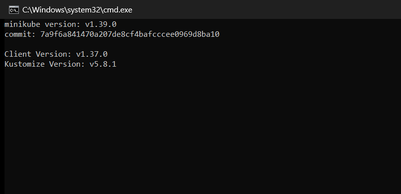
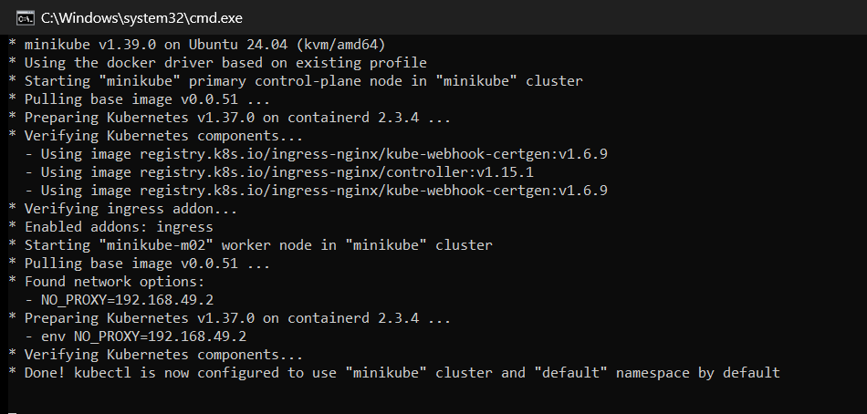
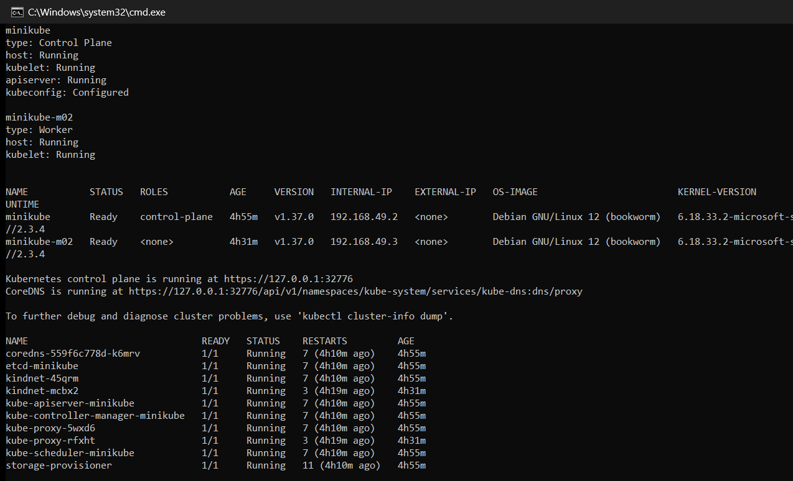
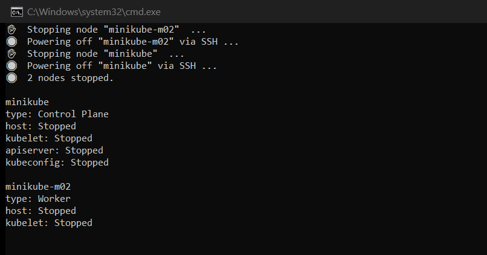

# Session 9: Kubernetes Fundamentals & Cluster Architecture

**Author:** Hardik Jumnani
**Roll Number:** 10025
**Email:** hardik.24bcs10025@sst.scaler.com
**Course:** SST DevOps & Cloud [SWE]
**Session:** 09 — Kubernetes Fundamentals
**Repository:** `devops-heros` / `session9-k8s`

---

## Lab Environment

Every command below was executed on this setup, and every block under **Output** is the actual
terminal output from that run — nothing is copied from the assignment brief or reproduced from
memory.

| Component | Value |
| --- | --- |
| Host OS | Windows 11 Home Single Language (build 26200) |
| Lab shell | Ubuntu 24.04 LTS on WSL2 (kernel 6.18.33.2-microsoft-standard-WSL2) |
| Container runtime | Docker Engine 29.8.1 (installed inside the WSL2 distro) |
| minikube | v1.39.0 |
| kubectl | v1.37.0 |
| Kubernetes | v1.37.0 on containerd 2.3.4 |
| minikube driver | `docker` |

Docker Engine runs directly inside the WSL2 distribution rather than via Docker Desktop, which
keeps the whole lab confined to a single disposable Linux environment.

---

## Task 1: Minikube & CLI Installation Verification

Verify that minikube and the Kubernetes CLI are installed and report their versions.

**Commands:**

```bash
minikube version
kubectl version --client
```

**Output:**

```
$ minikube version
minikube version: v1.39.0
commit: 7a9f6a841470a207de8cf4bafcccee0969d8ba10

$ kubectl version --client
Client Version: v1.37.0
Kustomize Version: v5.8.1
```

**Screenshot:**



---

## Task 2: Starting the Minikube Kubernetes Cluster

Initialise the local single-node Kubernetes cluster using the Docker driver.

**Command:**

```bash
minikube start
```

**Output:**

```
$ minikube start
* minikube v1.39.0 on Ubuntu 24.04 (kvm/amd64)
* Automatically selected the docker driver. Other choices: none, ssh
* Using Docker driver with root privileges
* Starting "minikube" primary control-plane node in "minikube" cluster
* Pulling base image v0.0.51 ...
* Downloading Kubernetes v1.37.0 preload ...
* Preparing Kubernetes v1.37.0 on containerd 2.3.4 ...
* Configuring CNI (Container Networking Interface) ...
* Verifying Kubernetes components...
  - Using image gcr.io/k8s-minikube/storage-provisioner:v5
* Enabled addons: storage-provisioner, default-storageclass
* Done! kubectl is now configured to use "minikube" cluster and "default" namespace by default
```

> The image-pull progress bar frames (a 507.61 MiB `kicbase` download) have been collapsed for
> readability. Every remaining line is verbatim. The `*` bullets are minikube's ASCII output —
> it prints emoji only when attached to an interactive terminal.

**Screenshot:**



---

## Task 3: Verifying Cluster Status & Node Health

Inspect the control plane, confirm the node reaches `Ready`, and locate the API server and
CoreDNS endpoints.

**Commands:**

```bash
minikube status
kubectl get nodes -o wide
kubectl cluster-info
kubectl get pods -n kube-system
```

**Output:**

```
$ minikube status
minikube
type: Control Plane
host: Running
kubelet: Running
apiserver: Running
kubeconfig: Configured

$ kubectl get nodes -o wide
NAME       STATUS   ROLES           AGE   VERSION   INTERNAL-IP    EXTERNAL-IP   OS-IMAGE                         KERNEL-VERSION                              CONTAINER-RUNTIME
minikube   Ready    control-plane   39s   v1.37.0   192.168.49.2   <none>        Debian GNU/Linux 12 (bookworm)   6.18.33.2-microsoft-standard-WSL2 (amd64)   containerd://2.3.4

$ kubectl cluster-info
Kubernetes control plane is running at https://127.0.0.1:32771
CoreDNS is running at https://127.0.0.1:32771/api/v1/namespaces/kube-system/services/kube-dns:dns/proxy

To further debug and diagnose cluster problems, use 'kubectl cluster-info dump'.

$ kubectl get pods -n kube-system
NAME                               READY   STATUS    RESTARTS   AGE
coredns-559f6c778d-k6mrv           1/1     Running   0          30s
etcd-minikube                      1/1     Running   0          37s
kindnet-45qrm                      1/1     Running   0          30s
kube-apiserver-minikube            1/1     Running   0          38s
kube-controller-manager-minikube   1/1     Running   0          37s
kube-proxy-5wxd6                   1/1     Running   0          30s
kube-scheduler-minikube            1/1     Running   0          37s
storage-provisioner                1/1     Running   0          35s
```

### Observations

- **The node is not `Ready` immediately.** Checked 21 seconds after start it still reported
  `NotReady`; it only became `Ready` once the CNI plugin (`kindnet`) finished initialising and
  the node's network was usable. A node is `Ready` only when the kubelet *and* the pod network
  are both functional.
- **The `kube-system` namespace is where the theory becomes visible.** Every control-plane
  component from Task 5 is running here as an actual pod: `etcd-minikube`,
  `kube-apiserver-minikube`, `kube-scheduler-minikube`, `kube-controller-manager-minikube`,
  alongside the per-node agents `kube-proxy` and `kindnet`.
- **The API server is reachable on `127.0.0.1:32771`, not on the node IP `192.168.49.2`.** The
  Docker driver places the cluster on an isolated bridge network and publishes the API server to
  a mapped localhost port. This is the same isolation that makes `<NodeIP>:<NodePort>` unreachable
  from the host — examined in detail in Session 11.

**Screenshot:**



---

## Task 4: Stopping the Minikube Cluster

Gracefully shut the cluster down to release system resources.

**Commands:**

```bash
minikube stop
minikube status
```

**Output:**

```
$ minikube stop
* Stopping node "minikube"  ...
* 1 node stopped.

$ minikube status
minikube
type: Control Plane
host: Stopped
kubelet: Stopped
apiserver: Stopped
kubeconfig: Stopped
```

> Worth noting: after a stop, `kubeconfig` reports **`Stopped`**, not `Configured`. The kubeconfig
> file still exists on disk, but minikube reports the context as no longer pointing at a running
> cluster. `minikube start` restores it without re-downloading anything.

**Screenshot:**



---

## Task 5: Kubernetes Cluster Architecture & Component Analysis

A Kubernetes cluster splits into a **control plane** that decides what should be running, and
**worker nodes** that actually run it. The control plane never runs workloads itself; it records
intent and continuously drives reality toward it.

```
+-------------------------------------------------------------------------+
|                          CONTROL PLANE (MASTER)                         |
|                                                                         |
|   +--------------+      +------------------+      +----------------+    |
|   |     etcd     |<---->|  kube-apiserver  |<---->| kube-scheduler |    |
|   | state store  |      |   the only door  |      |   placement    |    |
|   +--------------+      +---------+--------+      +----------------+    |
|                                   |                                     |
|                                   v                                     |
|                     +--------------------------+                        |
|                     |  kube-controller-manager |                        |
|                     |    reconciliation loops  |                        |
|                     +--------------------------+                        |
+-----------------------------------+-------------------------------------+
                                    |
                    +---------------+---------------+
                    v                               v
      +---------------------------+   +---------------------------+
      |        WORKER NODE        |   |        WORKER NODE        |
      |  +---------+ +----------+ |   |  +---------+ +----------+ |
      |  | kubelet | |kube-proxy| |   |  | kubelet | |kube-proxy| |
      |  +----+----+ +-----+----+ |   |  +----+----+ +-----+----+ |
      |       |            |      |   |       |            |      |
      |       v            v      |   |       v            v      |
      |  +----------------------+ |   |  +----------------------+ |
      |  |  CRI  (containerd)   | |   |  |  CRI  (containerd)   | |
      |  +----------+-----------+ |   |  +----------+-----------+ |
      |             v             |   |             v             |
      |     +-----+     +-----+   |   |     +-----+     +-----+   |
      |     | Pod |     | Pod |   |   |     | Pod |     | Pod |   |
      |     +-----+     +-----+   |   |     +-----+     +-----+   |
      +---------------------------+   +---------------------------+
```

### Control Plane Components

| Component | Role |
| --- | --- |
| **kube-apiserver** | The single entry point. Every `kubectl` command, controller and kubelet talks through it, and it handles authentication, authorisation and validation. **No component reads or writes `etcd` directly** — everything goes through the API server. |
| **etcd** | Distributed, consistent key-value store holding the entire cluster state: every object spec, status, ConfigMap and Secret. If `etcd` is lost, the cluster is lost — which is why it is backed up in production. |
| **kube-scheduler** | Watches for Pods with no assigned node and picks one, weighing resource requests, node affinity/anti-affinity, taints and tolerations. It only *writes the decision*; it never starts the container. |
| **kube-controller-manager** | Runs the reconciliation loops that compare **desired state vs. current state** and act on any difference. Includes the Node controller (detects unreachable nodes and evicts), the ReplicaSet controller (maintains replica counts) and the EndpointSlice controller (keeps Service endpoints pointing at live Pod IPs). |

### Worker Node Components

| Component | Role |
| --- | --- |
| **kubelet** | The agent on every node. Receives PodSpecs from the API server, instructs the runtime to pull images and start containers, runs liveness/readiness/startup probes, and reports status back. |
| **kube-proxy** | Maintains the `iptables`/IPVS rules that make Service virtual IPs work, load-balancing traffic across the healthy Pods behind a Service. |
| **Container Runtime (CRI)** | Actually runs containers. This cluster uses **containerd 2.3.4**; the Docker daemon is no longer used directly by modern Kubernetes. |
| **Pod** | The smallest deployable unit. One or more containers sharing a network namespace (one IP, one port space) and volumes. Usually one application container plus optional init or sidecar containers. |

### How a `kubectl apply` Actually Flows

1. `kubectl` sends the manifest to the **kube-apiserver**, which authenticates and validates it.
2. The API server persists the object in **etcd**. At this moment the object exists but nothing is running.
3. The **scheduler** notices a Pod with no node assigned and binds it to one.
4. That node's **kubelet** sees the assignment and tells **containerd** to pull the image and start the container.
5. The **controller-manager** keeps watching, recreating the Pod if it dies.

This is why a Pod referencing a non-existent image still gets created successfully as an API
object while its container never runs — the API server's job (step 2) succeeded, and the failure
happens later at step 4. That exact failure is demonstrated in Session 10.

---

## Reference Material

- <https://kubernetes.io/docs/tutorials/kubernetes-basics/>
- <https://kubernetes.io/docs/concepts/architecture/>
- <https://minikube.sigs.k8s.io/docs/start/>
- <https://github.com/Nency-Ravaliya/Kubernetes>
